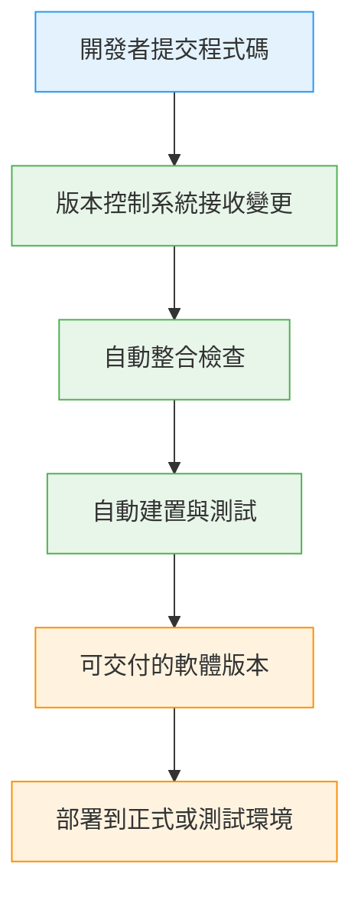

:::tip My tip
寫程式本身不難，難的是「很多人一起寫的時候，要穩定交付」

所以，CI / CD / Continuous Deployment是
- 設計一套流程
- 讓專案「即使人會犯錯，也不會整個炸掉」
:::

## 為什麼要學 CI/CD
- 多人協作容易出錯
- 人類行為不可靠
- 大型專案需要流程保證品質

### CI（持續整合）跟 CD（持續交付 / 部署）
其實是說明了：
- 人會犯錯
- 每個團隊風格不一樣
- 專案時程壓力大
- Bug一定會出現

寫程式，需要依靠流程來確保我們寫出的程式能夠保持穩定的品質並持續運作不炸！

## CI/CD 是為了解決什麼需求
真實世界的痛點：
1) 多人協作
- 每個人 coding style 不一樣
- 合併就爆炸

2) Bug 不是有沒有，而是：
- 什麼時候發現
- 在誰的機器上爆

3) 專案管理壓力
- 時程要準
- 品質要穩
- 人還會請假、生病、離職

> CI/CD 解決的是：
> 把「不可靠的人類行為」轉換成「可重複、可預期的流程」

## CI/CD 技術概念拆解
我喜歡問這三個Do what / How / Why問題，
所以以下筆記也以這樣做筆記延伸：

### 1) Do what（在做什麼）
- 每次有人改 code
- 自動做一連串檢查

**確保：**
- code 可以被整合
- 專案隨時可以交付
- 不靠人工手動部署

### 2) How to do（怎麼做）
流程可能會長這樣：

1️⃣ 開發者寫 code

2️⃣ 推到版本控制系統

3️⃣ 系統自動：
- 檢查
- 建置
- 測試

4️⃣ 通過後：
- 準備交付
- 或直接部署

這一整個流程設計。

### 3) Why this way（為什麼要這樣）
- 人會忘記跑測試
- 人會在本機成功，線上失敗
- 人會「我這邊沒問題」

但是流程不會！！！

> CI/CD 的本質是：
> 把信任從人，轉移到系統

## 好的工程師的價值
- 不只寫功能
- 設計可交付流程
- 確保專案成功落地

## 流程總覽
- Do what：自動把多人程式碼變成穩定版本
- How：靠版本控制觸發自動流程
- Why：避免人工整合與部署失誤

