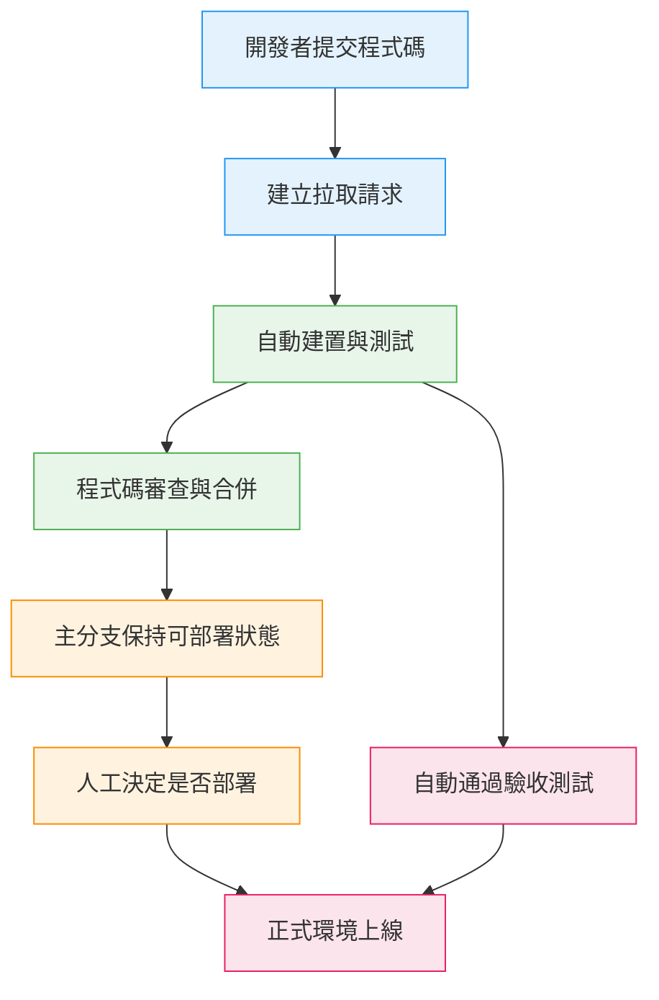
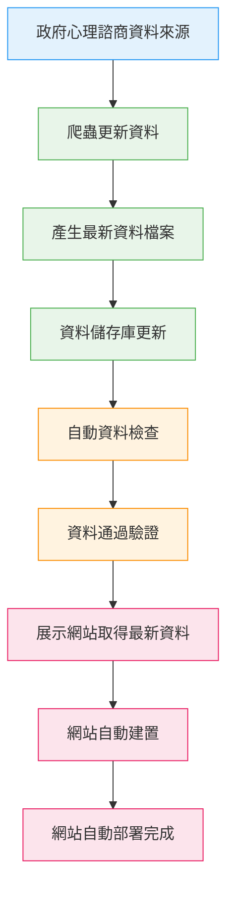

## 本篇筆記主要是在理解：
- 定義什麼是 Continuous Integration（CI）
- 解釋 Continuous Delivery（CD）是在 CI 上多做什麼
- 再往前一步，什麼是 Continuous Deployment

> CI 是「每天很多次把程式安全地合在一起」

> CD 是「任何時候都可以上線，但要人按按鈕」

> Continuous Deployment 是「測試過就自動上線，不等人」

## 是為了解決什麼需求?
- 1️⃣ Continuous Integration 要解決的痛
  - 多人開發
  - 合併前不知道會不會壞
  - 等到最後一天才合 → 整個專案爆炸

👉 解法：
小量、頻繁、可驗證的整合

--- 

- 2️⃣ Continuous Delivery 要解決的痛
  - 就算 code 沒問題
  - 上線流程還是很亂
  - 環境、設定、部署方式不一致

👉 解法：
隨時保持「可以上線」的狀態

---

- 3️⃣ Continuous Deployment 要解決的痛
  - 人是瓶頸
  - 人會猶豫、拖延、忘記
  - 發版速度不夠快

👉 解法：
只相信測試，不相信感覺

## CI / CD / Continuous Deployment 流程圖
:::tip My tip
- CI：到「自動建置與測試」
- Continuous Delivery：到「人工決定是否部署」
- Continuous Deployment：測試通過直接上線
:::

## 三、技術拆解（Do what / How / Why）

A.<Highlight color="#1877F2">Continuous Integration（CI）</Highlight> !

### Do what
- 開發者頻繁把程式碼整合進同一個 repo
- 每次整合都被自動檢查

### How to do
- 使用 GitHub 這類共享版本庫
- 每個 PR 都會觸發：
  - 自動建置
  - 自動測試
- 程式碼風格檢查
- 目標是快速發現錯誤測試沒過 → 不能合併

### Why this way
- 每次改動都很小
- 出問題時可以立刻知道是哪一個改動造成
- 避免「整合地獄」

---

B.<Highlight color="#1877F2">Continuous Delivery（CD）</Highlight> !

### Do what
- 保證主分支任何時候都「可以部署」

### How to do
在 CI 之後：
- 加入部署設定
- 加入驗收測試
- 由人決定「現在要不要上線」

### Why this way
- 商業決策不一定每次都要立刻上線
- 但技術上必須隨時準備好

C.<Highlight color="#1877F2">Continuous Deployment</Highlight> !

### Do what
- 只要通過所有測試
- 自動部署到正式環境

### How to do
- pipeline 最後一步直接接正式環境
- 沒有人工確認步驟

### Why this way
- 發版速度最快
- 適合測試成熟、風險可控的產品
- 人完全退出決策鏈

## 我可以應用CI/CD實況在自己的專案例子

我目前有一個資料來源repo
- 爬衛福部合作心理諮商機構
- 抓「有名額 / 無名額」
- 並且有額外加上每家心理諮商機構的經緯度
- 產出全台 JSON

然後我有一個 展示網站 repo
- 我是用Next.js ＋ OSM做的全台可查詢的心理諮商地圖
- 讀 JSON 來顯示地圖與狀態

我現在的需求是：
> 只要政府資料變了 → 我更新 JSON → 網站就自動更新，不用人手動搬檔案

我最喜歡理解的時候搭配mermaid

