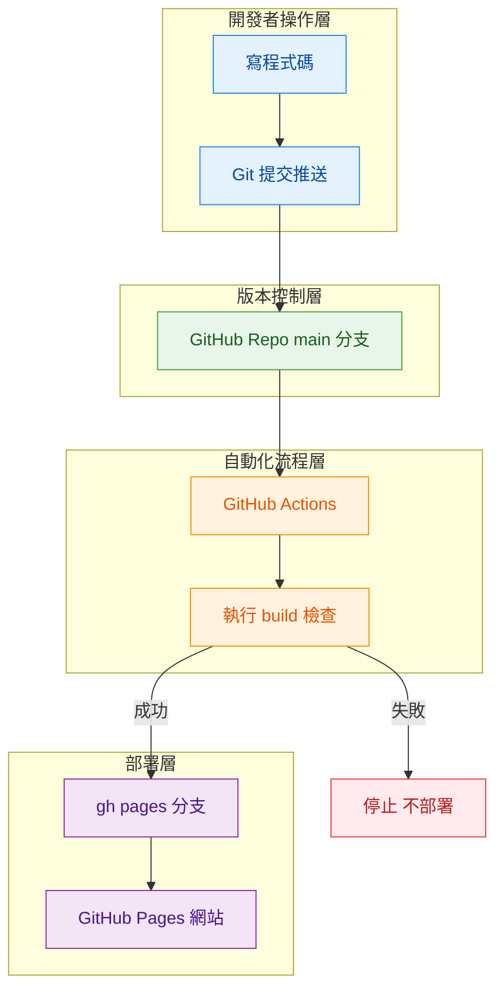
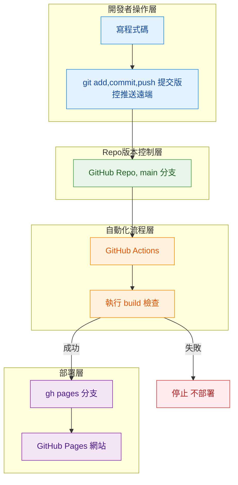

## 先懂角色分責

## 一、這裡有 **三件不同的事情**，只是它們常常被混在一起講：
- 1️⃣ GitHub Repo 版控在做什麼
- 2️⃣ GitHub Pages 在做什麼
- 3️⃣ GitHub Actions 在做什麼

### 1️⃣ GitHub Repo 版控在做什麼

👉 **只管程式碼歷史**

* git add | git commit | git push
* 管的是「誰在什麼時候改了什麼」
* ❌ 不負責檢查程式能不能跑
* ❌ 不負責 build
* ❌ 不負責 deploy

> **GitHub Repo 是檔案倉庫，不是驗證機器**

---

### 2️⃣ GitHub Pages 在做什麼

👉 **只負責「把靜態檔案丟到網路上」**

* 它只看某個 branch（通常是 gh-pages）
* 裡面有沒有 html css js
* 有就上線，沒有就沒東西

它**完全不知道**：

* 這些檔案怎麼來的
* build 有沒有錯
* 是不是最新

所以：

> **GitHub Pages 只做呈現成品，不會管內容**

---

### 3️⃣ GitHub Actions 在做什麼

👉 **自動幫你跑流程的機器人**

* 偵測事件（例如 push）
* 幫你跑 npm install
* 幫你跑 npm run build
* 成功才 deploy 部署

總結：

> **GitHub Actions 是自動化的工程師**

---

## 二、Mermaid 流程圖

> 🔧 再看一次！！！

---

## 三、用這張圖用以下解釋：

### 🔵 藍色：我本人開發者

* 寫程式
* git push
* 到這裡為止，**完全沒有 build**

---

### 🟢 綠色：GitHub Repo

* 只是存檔
* main 可能是好的，也可能是壞的
* Repo 本身不負責品質(只是儲存版本控制歷史)

---

### 🟠 橘色：GitHub Actions（關鍵）

* 它才是第一次「跑 build」
* 在我今天在終端機執行`npm run build`這份筆記的情境中：
  * 我是手動跑這一層(因為我手動執行 `npm run build`)
  * 有錯被擋下來，我一一debug
  * 除錯成功，才能手動執行 `npm run deploy`部署

* 這一條手動流程，之後我要變成自動跑：
  * Actions 自動跑

👉 **build 是在這一層才發生的**

---

### 🟣 紫色：GitHub Pages

* 只接收 gh-pages
* 不會問你：

  * build 有沒有成功
  * 專案健不健康

👉 所以 **deploy 前一定要有人或機器把關(GitHub Actions)**

---

### 🔴 紅色：停止點

* build 失敗
* deploy 不會發生
* 網站維持舊版

👉 這就是 CI 的價值(自動化測試，擋掉了錯誤的版本，能讓網站持續運行)

---

## 四、對照表

| 名稱                | 它負責什麼            | 不負責什麼      |
| ----------------- | ---------------- | ---------- |
| GitHub Repo       | 程式碼版本            | build 是否成功 |
| GitHub Pages      | 靜態網站上線           | build 過程   |
| npm run build     | 檢查專案是否健康         | 自動化        |
| GitHub Actions    | 自動跑 build deploy | 寫程式        |
| Branch Protection | 不讓壞碼進 main       | 幫你修 bug    |

---

## 五、結論

> **我今天是先把程式碼存起來，
> 再確認它能不能被做成網站，
> 確定沒壞，才讓它上線。**

GitHub Actions 只是把這句話
**變成每天都不會忘記做的機器流程**。

