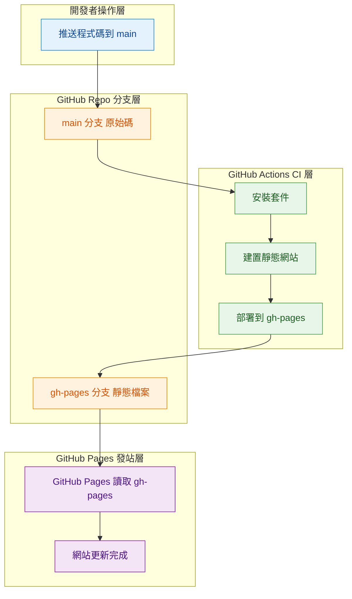

## GitHub Actions

```yaml
name: Deploy to GitHub Pages

on:
  push:
    branches:
      - main

permissions:
  contents: write

jobs:
  deploy:
    runs-on: ubuntu-latest

    steps:
      - uses: actions/checkout@v4

      - uses: actions/setup-node@v4
        with:
          node-version: 20
          cache: npm

      - name: Install dependencies
        run: npm ci

      - name: Build website
        run: npm run build

      - name: Deploy to gh-pages
        uses: peaceiris/actions-gh-pages@v4
        with:
          github_token: ${{ secrets.GITHUB_TOKEN }}
          publish_dir: ./build
```

### GitHub Pages 設定（一定要對齊）

* **Source**：Deploy from a branch
* **Branch**：`gh-pages`
* **Folder**：`/ (root)`

👉 `main`：負責原始碼
👉 `gh-pages`：只放 build 後的靜態檔
👉 GitHub Pages：只吃 `gh-pages`

---

## ⚠️ 今天的雷點整理

### ❌ 雷 1：嘗試用 `docusaurus deploy` 在 GitHub Actions

表面看起來很合理，但實際問題很多：

* `docusaurus deploy`

  * 會自己 clone repo
  * 自己跑 git
  * **常常抓不到 token**
* 導致反覆出現：

  ```
  could not read Password for 'https://github-actions[bot]@github.com'
  ```

👉 **工具不適合 CI**

---

### ❌ 雷 2：混用多種 Pages 部署模式

同時存在：

* `docusaurus deploy`（自己推 gh-pages）
* GitHub Pages 自動 workflow
* 想切 GitHub Actions Pages

👉 結果是：

* 誰在 deploy 不清楚
* branch 對不起來
* 看起來「沒反應」

**學到的教訓**：

> 一個 repo 只能有一個「負責部署的人」

---

### ❌ 雷 3：誤以為 build 成功 = 網站會更新

實際上：

* `npm run build`
  👉 只是在 **main branch** 產生 `build/`
* GitHub Pages
  👉 **完全不看 main**
  👉 只看 `gh-pages`

所以如果沒有把 `build/` 推到 `gh-pages`：

> 網站一定不會變（而且是正常的）

---

## 🧠 今天學到的關鍵總結

### 1️⃣ GitHub Pages 的本質

> GitHub Pages = **讀某個 branch 的靜態檔，直接發站**

它：

* 不幫你 build
* 不管你用什麼框架
* 只管「檔案在哪」

---

### 2️⃣ CI/CD 的正確分工

| 角色              | 負責什麼           |
| --------------- | -------------- |
| GitHub Actions  | build / deploy |
| main branch     | 原始碼            |
| gh-pages branch | 靜態檔            |
| GitHub Pages    | 發站             |

---

### 3️⃣ 為什麼最後這版會成功

因為這一行：

```yaml
uses: peaceiris/actions-gh-pages@v4
```

它幫你處理了：

* token 注入
* git push
* gh-pages 更新
* 各種認證細節

👉 **你只要告訴它：build 在哪個資料夾**

---

## 🧩 結論

> **Docusaurus 專案在 GitHub Pages 上，
> 最穩定的做法是：
> GitHub Actions build → actions-gh-pages 推 gh-pages**

> **不要硬修 `docusaurus deploy`，
> 那是給本機用的，不是給 CI 用的。**


## 流程圖



---

