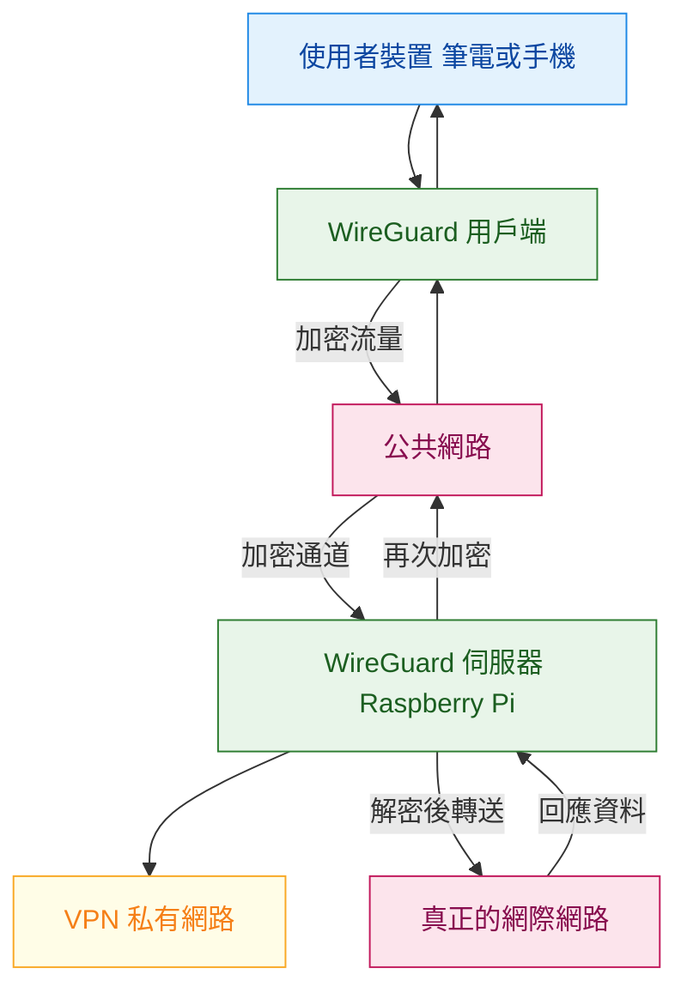
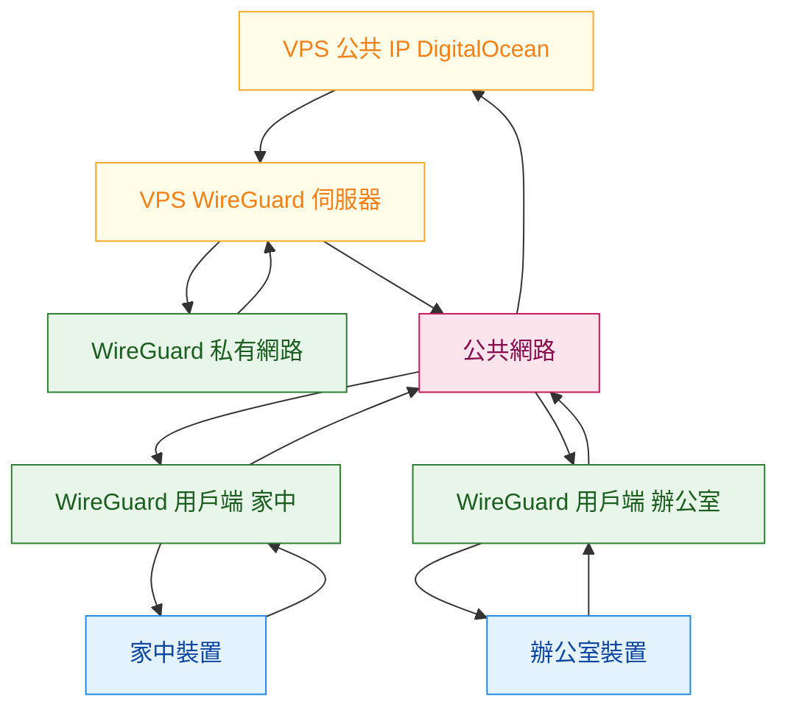

## 🟧 認識VPS,VPN

<Highlight>1️⃣ VPS 是什麼</Highlight>

:::tip Do what

VPS 是一台在網路上的 Linux 電腦
:::


:::tip How
- 跑在資料中心
- 有固定公開 IP
- 你可以用 SSH 完全控制
- 可裝任何服務
:::


:::tip Why
- 它「永遠在線」
- 是你對外的穩定入口
- 很適合當 VPN Server
- 👉 VPS = 網路上的一台遠端主機
:::

<Highlight color="#1877F2">我知道</Highlight> !

<Highlight color="#EF6C00">我知道</Highlight> !

<Highlight color="#C62828">我知道</Highlight> !

<Highlight color="#6A1B9A">我知道</Highlight> !


| 顏色 | Hex       | 用途語意      |
| -- | --------- | --------- |
| 藍 🟦  | `#1877F2` | 核心能力 / 主軸 |
| 綠 🟩 | 預設 | 實作經驗      |
| 橘 🟧 | `#EF6C00` | 設計取捨      |
| 紅 🟥 | `#C62828` | 風險警示      |
| 紫 🟪 | `#6A1B9A` | 進階 / 待補   |

代碼快
```jsx title="/src/components/HelloCodeTitle.js"
function HelloCodeTitle(props) {
  return <h1>Hello, {props.name}</h1>;
}
```

🟡🟢🔵✅❌⭕️📛💯🔴🟠🟡🟣⚫️🟤🔸🔹🔶🔷🟨 🟩 🟦 🟪 ⬛️⬜️🟫🟧🆘🟥♦️♦️🛑❌ 打勾
✳️0️⃣1️⃣2️⃣3️⃣4️⃣5️⃣6️⃣7️⃣8️⃣9️⃣🔟▶️🌐

## 🟦 VPN
<Highlight>2️⃣ VPN 是什麼</Highlight>

- > 

:::tip Virtual Private Network

VPN 是一條加密的私人通道：

- 什麼時候使用？
  - 公共Wifi 安全
    - 是指在使用公共wifi時保護自己的資料
  - 遠端存取
    - 安全的連結您家中或辦公室網路 
  - 繞過地理限制
:::

- 想像自己是一名系統管理員，管理一隻遠端工作團隊，透過設置VPN，
可以確保團隊成員，無論如何都能安全地存取公司的內部資源，不論他們的所在位置


:::tip How
- 在不安全的網路上

把流量包起來

送到你信任的地方

再由那裡出去上網
:::


:::tip Why
- 防偷聽

防竄改

把「公共網路」變成「像在內網」

👉 VPN 解決的是「網路不可信」的問題
:::

- VPN會創建安全的連線，在你的裝置和網路之間，這透過什麼機制實現的？
-  <Highlight color="#EF6C00">Tunneling 隧道</Highlight>
-  <Highlight color="#EF6C00">Encapsulation 封裝</Highlight>

VPN利用tunnel來建立私人連線通道(透過公共的網路)，這條隧道會加密你的資料，
確保它在你的裝置與VPN伺服器之間傳輸時保持安全
- 封裝涉及將資料封包包裹在額外的安全層中，這個過程會隱藏原始資料及其目的地，使得讓任何人很難去攔截該封包
- VPN也會隱藏你的來源IP位置
- 當我連接到VPN，我的網路流量會經過我的VPN 伺服器，這表示網站和線上服務會看到
VPN伺服器取代我的實際IP地址，提升我的隱私和匿名性

### 0️⃣ VPNs有兩種類型：

- 址對址 VPNs(網站VPN)
- 遠端存取VPNs

### 1️⃣ 址對址 VPNs(網站VPN)
- 企業常用在分行與分行之間的通訊安全
- > 

### 2️⃣ 遠端存取VPNs
- 遠端存取VPN允許個別使用者從遠端連接私有網路時使用
  - 這需要安全存取公司內部資源的遠端工作者 
- > 
---

## 🟦 WireGuard

<Highlight>3️⃣ WireGuard 是什麼</Highlight>

:::tip Do what

WireGuard 是一種現代 VPN 技術
:::


:::tip How
- 金鑰配對（像 SSH）
- Kernel 等級
- 設定極簡
- 沒有帳號密碼系統
:::


:::tip Why
- 快
- 穩
- 好維護
- 非常適合 DevOps
- 👉 WireGuard = VPN 世界的 SSH
:::

### 0️⃣ WireGuard 全流程心智圖（Mermaid）



### 1️⃣ WireGuard VPN on Linux
- 安裝 WireGuard VPN 伺服器在 linux 機器上
- 安裝 WireGuard VPN 客戶端在 linux 機器上/windows

### 2️⃣ 需要一個公共網路IP
- 世界上其他裝置要能「找到你」（一個對全世界可達的節點）
- VPN Server 必須是所有 Client 都能連到的固定入口
- VPS / 雲端 VM / 有公共 IP 的主機

:::tip 
- VPN 連線是「主動找 Server」
- Client 需要一個可路由的目的地
- NAT 後面的機器沒有這個資格
- 👉 沒有 Public IP，就沒有入口
:::




### 3️⃣ 段落副標

### 4️⃣ 段落副標

### 5️⃣ 段落副標

---

<Highlight color="#1877F2">「我知道 Linux Server 的基本安全風險與防護方向。」</Highlight> !


## 🟥 結尾

:::note

Some **content** with _Markdown_ `syntax`. Check [this `api`](#).

:::

:::tip

Some **content** with _Markdown_ `syntax`. Check [this `api`](#).

:::

:::info

Some **content** with _Markdown_ `syntax`. Check [this `api`](#).

:::

:::warning

Some **content** with _Markdown_ `syntax`. Check [this `api`](#).

:::

:::danger ❌❌❌❌❌

Some **content** with _Markdown_ `syntax`. Check [this `api`](#).

:::
