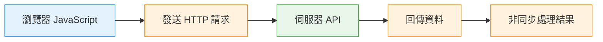
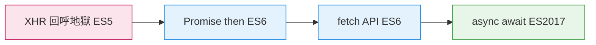

> 為什麼 JavaScript 需要非同步 ?

## 🟧 先認識同步程式碼 | 單執行緒

:::danger JavaScript 是「單執行緒」

-  JS 一次只能做一件事，如果：
  - 下載檔案
  - 等待 API 回傳
  - 等使用者點擊
都用「同步」方式執行：

👉 整個程式會卡住，畫面會凍結

:::

---

### 1️⃣ 同步程式碼（Synchronous）| 單執行緒
定義:
- 程式一行一行照順序執行
- 下一行一定要等前一行完成
```js
console.log('第一行')
console.log('第二行')
console.log('第三行')
```

📌 特性：
- 單執行緒
- 前一行沒跑完，後面全部卡住

另一個例子是：阻塞範例（alert）
```js
alert('請按 OK')
console.log('這行要等 前一行alert 結束')
```
📌 特性：
- alert 是同步、阻塞
- 使用者不按 OK，程式不繼續

---

### 2️⃣ 同步的問題在哪？

如果某行程式需要很久：

- 計時 5 秒
- 載入大型圖片
- 等 API 回應

👉 整個頁面會卡住

這在實務上是不能接受的，所有的使用者都是沒有耐心的。

--- 

## 🟦 計時器(Timers) ｜ setTimeout(註冊callbackFn,毫秒)


> 計時器(Timers) ，最簡單的一種非同步(asynchrony)，我想要在指定的長度的一段時間過去之後，執行某些程式碼，計時器只是「通知機制」

:::tip setTimeout(註冊callbackFn,毫秒)

計時器不會幫我「做事情」，它只負責：

時間到了 → 通知我 → 你自己定義要做什麼

而「我定義的事情」就是 callback。

:::

```js
//const id = setTimeout(callMe, 5000);
//clearTimeout(id);

setTimeout(callMe, 5000);
function callMe() {
  console.log("3觸發回乎");
}

console.log("1");
console.log("2");

//輸出會是這樣
"1"
"2"
"3觸發回乎"
```

:::tip

JS中的非同步程式設計是透過callbacks(回呼/回調)來完成，

一個callback是我所撰寫並傳入給其他函式的一種函式，

然後該函式會在某個條件達成或是某個(非同步)事件發生時，調用(回頭呼叫/calls back)我的函式

:::
---

## 🟦 認識：AJAX 與 XHR

<Highlight>AJAX一種 在不重新整理整個頁面的情況下</Highlight>
<br/>
<Highlight>由 JavaScript 在背景(非同步)向伺服器發 HTTP 請求資料，拿資料回來後再處理，不重新整理畫面</Highlight> 

:::note AJAX 是什麼（Asynchronous JavaScript And XML）

👉 AJAX一種 在不重新整理整個頁面的情況下，
由 JavaScript 在背景(非同步)向伺服器發 HTTP 請求資料，拿資料回來後再處理，不重新整理畫面 

📌 關鍵字：
JavaScript & HTTP & 非同步

📌 特性：
  - 不重新整理頁面
  - 使用 HTTP Request
  - 背景取得資料
:::

:::note XHR 是什麼（XMLHttpRequest）

👉 瀏覽器提供的一個 原生 API

👉 是「早期實作 AJAX 的工具之一」

📌 特性：
  - AJAX 是概念，XHR 是實作方式
  -（後來有 fetch、axios，但底層都還是 AJAX）
:::


AJAX 的基本流程


### 0️⃣ 為什麼 AJAX 一開始會用 XHR

<Highlight color="#1877F2">XHR 是「瀏覽器給的東西」(瀏覽器 API)</Highlight> !
:::tip

因為 XHR 是「瀏覽器給的東西」(瀏覽器 API)

👉 瀏覽器為了讓網頁「不要整頁重載」，就提供了 XHR(XMLHttpRequest)物件

它依賴：
- window
- 瀏覽器事件機制
- 瀏覽器網路層

在瀏覽器裡：
- 有 window
- 有 DOM
- 有畫面
- 有使用者操作
:::

- 所以 XHR 的本質是：瀏覽器內建的 HTTP 請求工具

:::danger ❌❌❌❌❌

早期 AJAX 透過 XMLHttpRequest 搭配事件處理非同步，但程式可讀性差，維護成本高。

:::

---

## 🟦 AJAX 非同步寫法的演進
> 從 XHR → Promise → fetch → async await 

AJAX 是一種非同步請求資料的概念，
- 早期使用 XMLHttpRequest 搭配 callback， 
- ES6 引入 Promise 改善流程控制，
- fetch 則是基於 Promise 的現代 AJAX API，
- async await 是 Promise 的語法糖，
讓非同步程式能以同步方式撰寫，是目前主流做法。

### 0️⃣ 先給一張「全景時間軸圖」


--- 

### 1️⃣ 第一代：XMLHttpRequest（ES5）

#### 🔹 出現背景（Why）
* JavaScript 最早**沒有非同步流程控制工具**
* 瀏覽器只提供「事件」來處理網路回應 <br/>
👉 所以只能用 **事件監聽** 來等資料回來

#### 🔹 寫法特色（How）
* 使用 `XMLHttpRequest`
* 用事件 `load` 處理結果
* 非同步靠 callback

📌 結論：
> 「我先送請求，
> 等瀏覽器跟我說資料回來，我再處理」

#### 🔹 問題點（Why 被淘汰）

* 巢狀 callback 很難讀
* 錯誤處理麻煩
* this 與狀態混亂
* 程式流程不直覺

:::danger XMLHttpRequest 問題

📌 常被稱為：
**callback hell（回呼地獄）**
> 早期 AJAX 透過 XMLHttpRequest 搭配事件處理非同步，但程式可讀性差，維護成本高。
:::

---


### 2️⃣ 第二代：Promise（ES6）

#### 🔹 出現背景（Why）

ES6 正式引入 **Promise**

👉 解決「非同步流程無法線性閱讀」的問題

#### 🔹 Promise 在做什麼（Do what）

:::tip
Promise 把非同步結果變成一個「未來會完成的值」

- 狀態只有三種：
* pending
* fulfilled
* rejected

:::


#### 🔹 寫法特色（How）

* 使用 `.then()` 接資料
* 使用 `.catch()` 接錯誤
* 流程可以串接

📌 結論：

> 「這件事完成後，再做下一件事」

#### 🔹 改善了什麼（Why）

:::info Promise

* 消除 callback 地獄
* 流程比較線性
* 錯誤可以集中處理

📌 但仍然是：

* 多層 then
* 程式仍偏「橫向閱讀」

> Promise 讓非同步結果可以被串接處理，大幅改善 callback 地獄問題。

:::


---

### 3️⃣ 第三代：fetch API（ES6）

#### 🔹 出現背景（Why）

XMLHttpRequest API 設計過時：

* 太多狀態
* 太多細節
* 不符合 Promise 思維

👉 瀏覽器推出 **fetch**

#### 🔹 fetch 是什麼（Do what）

* 一個「以 Promise 為核心」的 HTTP API
* 專門用來取代 XHR

📌 關係一句話：

> fetch = 用 Promise 包裝好的 AJAX

#### 🔹 寫法特色（How）

* `fetch` 回傳 Promise
* 回應資料再轉成 **JSON**
* 語意清楚

📌 結論：

> 「我 fetch 一個資源，
> 然後處理回來的結果」

#### 🔹 fetch 的限制（Why 還不夠）

* 仍然需要 then
* try catch 不直覺
* 多請求時可讀性下降

> fetch 是瀏覽器提供的現代化 AJAX API，以 Promise 為基礎，取代舊的 XMLHttpRequest。

---


### 4️⃣ 第四代：async await（ES2017）

#### 🔹 出現背景（Why）

即使有 Promise：

* 程式還是像「接水管」
* 不像同步邏輯

👉 async await 讓非同步**看起來像同步**

#### 🔹 async await 在做什麼（Do what）

* async 宣告一個非同步函式
* await 暫停在該行等待 Promise 完成
* 實際上仍是非同步

📌 關鍵觀念：

> await 只暫停「函式內部」，
> 不會卡住整個程式或畫面

#### 🔹 寫法特色（How）

* 像同步程式一樣由上往下
* 可以用 try catch
* 非同步流程超清楚

📌 結論：

> 「等這個結果回來，再往下做」

#### 🔹 為什麼是目前主流（Why）

* 可讀性最好
* 錯誤處理最直覺
* 最接近人類思考方式

> async await 是基於 Promise 的語法糖，讓非同步程式能以同步風格撰寫，但本質仍是非同步。

---

### 5️⃣ 一張「演進總整理表」

| 時代  | 技術          | 來源類型           | 標準     | 核心重點        |
| --- | ----------- | -------------- | ------ | ----------- |
| 第一代 | XHR         | 瀏覽器 window API | ES5 時代 | callback 地獄 |
| 第二代 | Promise     | JavaScript 語言  | ES6    | then 鏈可讀性   |
| 第三代 | fetch       | 瀏覽器 window API | ES6    | 仍基於 Promise |
| 第四代 | async await | JavaScript 語言  | ES2017 | 主流解法        |


---

### 6️⃣ 小結

> AJAX 是一種非同步請求資料的概念，
> 早期使用 XMLHttpRequest 搭配 callback，
> ES6 引入 Promise 改善流程控制，
> fetch 則是基於 Promise 的現代 AJAX API，
> 而 async await 是 Promise 的語法糖，
> 讓非同步程式能以同步方式撰寫，是目前主流做法。


---