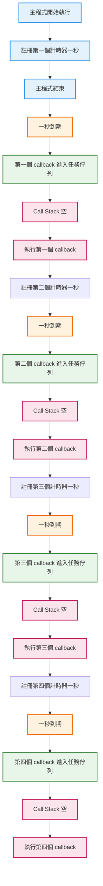

## 🟧 發送ajax call: XHR請求

> 先測試第一代的 AJAX call 發送 XHR(XMLHttpRequest)請求

:::note

- url 我想玩兩種：
  - [六角提供](https://raw.githubusercontent.com/hexschool/2021-ui-frontend-job/master/frontend_data.json)

- [REST Countries API](https://restcountries.com/)
  - 我想要從API裡拿到某國家的相關資料
:::

---

### 1️⃣ 定義流程

```
1. 建立一個 XMLHttpRequest 物件
2. 設定發送網路請求的方法 與 設定網址 .open()
3. 只是「開始請求」 .send() ==> request.send() 並不會等資料回來
4. 瀏覽器在背景發送 HTTP request(網路請求是非同步)
5. 伺服器回應資料
6. 註冊一個 callback（load 事件）
7. 瀏覽器接收完整 response
8. 👉 觸發 load 事件 => 註冊 load 事件 callback（透過 addEventListener）
```

:::danger
✔ send() 不會等待資料 => 非同步

✔ 一切都要靠 設計load callback 來接結果

- load 事件觸發的條件是：
  - ✔ 請求成功送出
  - ✔ 伺服器已回應
  - ✔ 回應內容 完整接收完成
  - ✔ responseText 已可安全讀取
   - 👉 這時才能 JSON.parse()
:::

| 事件                 | 什麼時候觸發 | 說人話    |
| ------------------ | ------ | ------ |
| `load`             | 回應完整收到 | 資料可以用了 |
| `error`            | 網路錯誤   | 請求失敗   |
| `timeout`          | 超過時間   | 等太久    |
| `abort`            | 被取消    | 被中斷    |
| `readystatechange` | 狀態改變   | 低階流程   |


### 2️⃣ 對應程式碼：


```js
"use strict";

// ES5方式：使用 XMLHttpRequest 發送 GET 請求
const request = new XMLHttpRequest();

// 設定請求（方法 + URL）
request.open("GET", "https://restcountries.com/v3.1/name/portugal");

// ⚠️ 非同步|發送請求（非同步，不會等待回傳）
request.send();

// 註冊 callback，等待資料回來
request.addEventListener("load", function () {
  console.log(this); // XMLHttpRequest instance
  // const data = JSON.parse(this.responseText);
});
```

<iframe
  height="300"
  style={{ width: "100%" }}
  scrolling="no"
  title="XHR AJAX Demo"
  src="https://codepen.io/sui-hsialn/embed/ZYOeBbP?default-tab=js"
  frameBorder="0"
  loading="lazy"
  allowFullScreen
/>


🔹 補充 1：為什麼 send 不等資料？
> 因為 Ajax 是非同步請求， .send() 的職責只是「送出請求」，資料會在背景傳輸，JavaScript 主執行緒不會被阻塞。


🔹 補充 2：為什麼一定要 callback？
> 因為資料「什麼時候回來」是無法預期的，JavaScript 只能先註冊一個 callback，等伺服器回應完成時，再由瀏覽器呼叫這個函式來處理結果。

- 也就是說，在 Ajax 中：
  - 我先定義「資料回來後要做什麼」
  - 但不是我決定「什麼時候做」

🔹 補充 3：為什麼現在不常用 XHR？
> 因為資料回來的時間不確定，只能在事件發生時處理結果。

| 問題          | 說明     |
| ----------- | ------ |
| 可讀性差        | 流程被拆散  |
| 巢狀 callback | 難維護    |
| 錯誤處理麻煩      | 必須手動判斷 |

:::tip

XMLHttpRequest 完全基於事件與 callback 設計，

當非同步流程變多時，程式碼容易被拆散、巢狀化，

可讀性與維護性都會快速下降。

👉 ES6 Promise / async await 就是為了解決這些問題
:::

### 3️⃣ 先把請求包成函式

```js 
"use strict";

const getCountryAndNeighbour = function (country) {
  //es5的方式 發送GET請求
  //AJAX CALL 1
  const request = new XMLHttpRequest();
  request.open("GET", `https://restcountries.com/v3.1/name/${country}`);
  request.send(); //非同步傳送請求到後端

  //事件驅動(load事件發生時，調用callback)
  request.addEventListener("load", function () {
    //console.log("this", this); //xhr物件
    const [data] = JSON.parse(this.responseText); //responseText物件包在[] 需要的資料格式是陣列
    console.log("data", data);
    console.log("data", data.name.common);
  });
};

getCountryAndNeighbour("portugal");

```

### 4️⃣ 回呼地獄（「單一請求 → 相依請求」的真實痛點）
我拿到了portugal該國的資料，我想要依據該國家去抓它鄰國的資料呢？
- 我第二次的請求依賴前一次請求的回傳結果
  - 一樣先使用XHR來做：

```js
"use strict";

const getCountryAndNeighbour = function (country) {
  //es5的方式 發送GET請求
  //AJAX CALL 1
  const request = new XMLHttpRequest();
  request.open("GET", `https://restcountries.com/v3.1/name/${country}`);
  request.send(); //非同步傳送請求到後端

  //事件驅動(load事件發生時，調用callback)
  request.addEventListener("load", function () {
    //console.log("this", this); //xhr物件
    const [data] = JSON.parse(this.responseText); //responseText物件包在[] 需要的資料格式是陣列
    console.log("data", data);
    console.log("data", data.name.common);

    //這裡我已經得到前一次的請求回傳（西班牙的資料）
    //[取的鄰國的資料] 要在發出第二次請求，依賴前一次請求的回傳
    //console.log(data.borders?.[0]);
    const [neighbour] = data.borders;
    console.log(neighbour);

    if (!neighbour) return;

    //AJAX CALL 2
    const request2 = new XMLHttpRequest();
    request2.open("GET", `https://restcountries.com/v3.1/name/${neighbour}`);
    request2.send(); //非同步傳送請求到後端

    //事件驅動(load事件發生時，調用callback)
    request2.addEventListener("load", function () {
      //console.log("this", this); //xhr物件
      const [data2] = JSON.parse(this.responseText); //responseText物件包在[] 需要的資料格式是陣列
      console.log("data2", data2);
      console.log("data2", data2.name.common);
    });
  });
};

getCountryAndNeighbour("portugal");

```

> 這裡可以測試結果
<iframe height="300" style={{ width: "100%" }} scrolling="no" title="callback hell xhr" src="https://codepen.io/sui-hsialn/embed/XJKMMBy?default-tab=js" frameborder="no" loading="lazy" allowtransparency="true">
      See the Pen <a href="https://codepen.io/sui-hsialn/pen/XJKMMBy">
  callback hell xhr</a> by Sui Hsilan (<a href="https://codepen.io/sui-hsialn">@sui-hsialn</a>)
  on <a href="https://codepen.io">CodePen</a>.
</iframe>

👉 為什麼 load 會導致 callback hell？
- 因為：
  - load 是「事件」
  - 事件只能「發生時被動通知」
  - 如果下一個請求 依賴上一個結果
  - 就只能「事件裡再註冊事件」
`load → load → load → ...`
  - 👉 是 事件模型本身的限制

:::tip
XMLHttpRequest 是第一代 AJAX 解法，完全基於事件與 callback。

.send() 只負責送出請求，實際網路傳輸由瀏覽器處理，

JavaScript 只能透過註冊 load 事件來接收結果。

當請求之間產生依賴關係時，callback 會快速巢狀化，

這就是後來 Promise 與 async/await 出現的原因。
:::

:::tip
在 XHR 中，非同步流程是「事件驅動」的，

XHR：事件發生 → callback

Promise：狀態改變 → resolve value

async/await：看起來像同步，其實還是 Promis
:::


> load 是瀏覽器在非同步請求完成後發出的通知事件，

> JavaScript 只能被動接收，無法主動等待，

> 這也是為什麼後來需要 Promise 與 async/await 來改寫非同步流程。

## 🟦 用setTimeOut()再解釋一次

```js
setTimeout(() => {
  console.log('過了 1 秒');

  setTimeout(() => {
    console.log('過了 2 秒');

    setTimeout(() => {
      console.log('過了 3 秒');

      setTimeout(() => {
        console.log('過了 4 秒');
      }, 1000);

    }, 1000);

  }, 1000);

}, 1000);

// "過了 1 秒"
// "過了 2 秒"
// "過了 3 秒"
// "過了 4 秒"
```
- 發生了什麼（Do What）
  - 👉 每一個 setTimeout 都在等上一個完成後才執行
  - setTimeout 是 非同步
  - JavaScript 不會等
  - 如果你想要「順序執行」，只能：
  - 👉 把下一步寫在 callback 裡

- 結構就會變：(呼應前面的XHR回呼地獄)
```
setTimeout
  └─ setTimeout
       └─ setTimeout
            └─ setTimeout
```

```
主程式跑完
↓
1 秒到 → 執行第一個 callback
↓
再註冊一個 setTimeout
↓
1 秒到 → 執行第二個 callback
↓
再註冊一個 setTimeout
↓
...

```
> setTimeout 並不會阻塞主程式，而是把 callback 註冊到事件佇列，等時間到才執行。

> 所以 ES6 才引入 Promise，ES2017 才有 async / await

### 0️⃣ 改寫成 ES6 Promise

```js
const wait = seconds =>
  new Promise(resolve => setTimeout(resolve, seconds * 1000));

wait(1)
  .then(() => {
    console.log('1 second passed');
    return wait(1);
  })
  .then(() => {
    console.log('2 seconds passed');
    return wait(1);
  })
  .then(() => {
    console.log('3 seconds passed');
    return wait(1);
  })
  .then(() => {
    console.log('4 seconds passed');
  });

```

<iframe height="300" style={{ width: "100%" }} scrolling="no" title="Untitled" src="https://codepen.io/sui-hsialn/embed/MYemWyY?default-tab=js" frameborder="no" loading="lazy" allowtransparency="true">
      See the Pen <a href="https://codepen.io/sui-hsialn/pen/MYemWyY">
  Untitled</a> by Sui Hsilan (<a href="https://codepen.io/sui-hsialn">@sui-hsialn</a>)
  on <a href="https://codepen.io">CodePen</a>.
      </iframe>


### 1️⃣ 改寫 async / await 


### 時序圖

