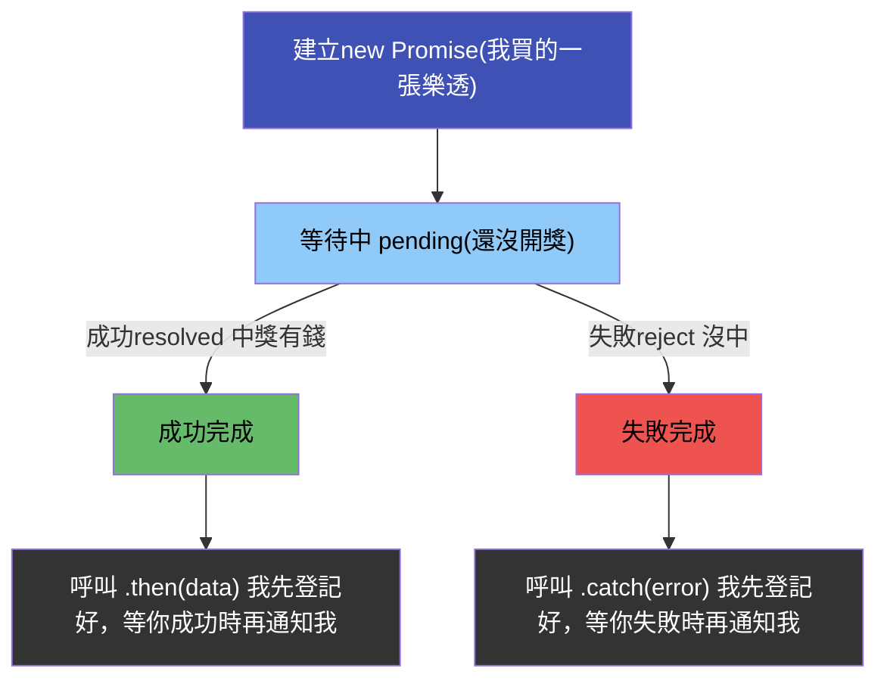
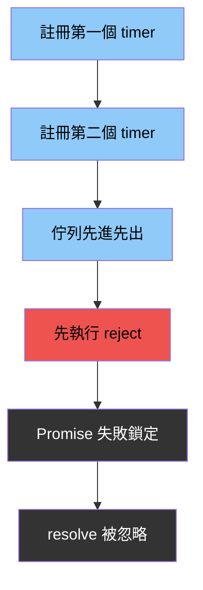

> 而為了解決「callback 地獄」(callback hell)問題，ES6就出現了 promise 方法

## 🟧 什麼是 Promise？

- <Highlight color="#1877F2">Promise 是一個物件(只是一個狀態容器)，用來「代表一個未來才會知道結果的值」。</Highlight>

- > Promise 只負責「記錄狀態」

| 狀態        | 中文  | 意思      |
| --------- | --- | ------- |
| pending   | 等待中 | 還不知道結果  |
| fulfilled | 成功  | 知道結果是成功 |
| rejected  | 失敗  | 知道結果是失敗 |

- ⚠️ 一旦進入成功或失敗
- ⚠️ 永遠不會再變

:::tip
一個 Promise 一開始一定是等待中

等事情結束後

只會走向成功或失敗其中一條路
:::

- Do（實際在做什麼）
  - 拿到一個 Promise
  - 幫它登記成功與失敗時的反應

- What（實際發生什麼）
  - 任務在背景跑
  - Promise 狀態改變
  - 對應的 handler 被觸發

- How（怎麼觸發）
  - 成功 → 進 fulfilled → then
  - 失敗 → 進 rejected → catch

- Why（為什麼要這樣）
  - 把「未來的值」當成現在可以操作的東西
  -   可以串接、傳遞、統一錯誤處理
  - 解決 callback 地獄

## 🟦 建構第一個 promise

- Promise架構圖



--- 

new Promise 是在「宣告一個規則」：
未來什麼時候成功、什麼時候失敗。

```js
const checkScore = new Promise((resolve, reject) => {//pending
   // 在這裡是 Promise 的「裁判室」＝>決定：什麼條件下 成功 or 什麼條件下 失敗
   resolve("成功了");
})
```
:::danger
- JavaScript 立刻做了 3 件事（同步）
  - 建立一個 Promise 物件
  - 狀態一開始就是「等待中」
  - 立刻執行傳進去的那個 function

- ⚠️ 注意：
  - 👉 這個 function 是「同步執行」的
:::

### 0️⃣ 「登記誰要接結果」

```js
const checkScore = new Promise((resolve, reject) => {//pending
   // 在這裡是 Promise 的「裁判室」＝>決定：什麼條件下 成功 or 什麼條件下 失敗
   resolve("成功了");
})
```

:::tip
這段程式碼做了什麼？

1. Promise 被建立

2. executor 立刻執行

3. resolve() 被呼叫

4. Promise 狀態變成「成功完成」

5. Promise 裡面記住了「成功了」

- 👉 但沒有任何東西被印出來
- 為什麼？
  - 因為我還沒「登記誰要接結果」。
:::

### 1️⃣ 「登記誰要接結果」=> 加上 .then()，看清楚「分工」
```js
const p = new Promise((resolve, reject) => {
  resolve("成功了");
});

p.then(data => {
  console.log(data);
});

```

- new Promise：決定結果是什麼

- .then()：決定結果要怎麼用

### 2️⃣ 常見錯誤
- 👉 這個 Promise 是成功還是等待中？
  - 永遠是等待中
```js
new Promise((resolve, reject) => {
  return "成功";
});

```

- Promise 完全不在乎 executor 的 return 值。

:::danger
- 逐行發生了什麼
  - 1. 建立一個 Promise
  - 2. Promise 狀態一開始是「等待中」
  - 3. executor function 立刻同步執行
  - 4. return "成功" 被執行
  - 5. 沒有人呼叫 resolve 或 reject

- 👉 Promise 永遠停在等待中
:::

| 寫法              | Promise 狀態 |
| --------------- | ---------- |
| `return "成功"`   | 等待中        |
| `resolve("成功")` | 成功完成       |
| `reject("錯誤")`  | 失敗完成       |
| 什麼都不做           | 永遠等待       |

---

```js
new Promise((resolve, reject) => {
  resolve("成功");
  return "失敗";
});

```

:::tip
- Promise 只聽第一次被呼叫的 resolve / reject。

- 精準執行流程（照時間順序）
- 1. 建立 Promise（狀態：等待中）

- 2. executor 同步執行

- 3. resolve("成功") 被呼叫

- 4. Promise 狀態 → 成功完成

- 5. Promise 記住值：「成功」

- 6. return "失敗" 被執行

⚠️ Promise 完全忽略
- executor 結束

- 👉 Promise 早就定型了

- 🔒 Promise 狀態鎖定規則
  - 第一次 resolve 或 reject 就鎖死
  - 後面的 resolve / reject / return
  - 全部無效
:::

### 3️⃣ 測驗3

```js
new Promise((resolve, reject) => {
  setTimeout(() => {
    resolve("成功");
  }, 0);
  reject("失敗");
});

```

- 是失敗狀態

> Promise 只看「誰先呼叫 resolve / reject」，不看誰寫在前面。


| 寫法                            | 結果   |
| ----------------------------- | ---- |
| `resolve("A"); resolve("B");` | 成功 A |
| `reject("錯"); resolve("好");`  | 失敗   |
| `resolve("好"); reject("錯");`  | 成功   |
| `return "值"`                  | 沒影響  |

### 4️⃣ 測驗題

```js
new Promise((resolve, reject) => {
  setTimeout(() => reject("錯誤"), 0);
  setTimeout(() => resolve("成功"), 0);
});

```

:::tip
- 兩個都是 0，不是同時跑；

- 誰「先被排進佇列、先執行」，誰就先改狀態。

- 在這段程式碼裡：
  - 第一個 setTimeout 先註冊
  - 第二個 setTimeout 後註冊
  - 佇列是 先進先出

- 👉 第一個 callback 先跑 → reject("錯誤") 先發生 → Promise 立刻鎖死
:::


---

## 🟦 檢查成績分數

```js
const checkScore = new Promise((resolve, reject) => {
  console.log(`====正在批改中====`)
  setTimeout(() =>{
    const score = Math.round(Math.random() * 100);
    if(score >= 60) {
      resolve(score)
    } else {
      reject("不及格")
    }
  }, 2000)
})

checkScore
  .then(data => console.log(data))
  .catch(error => console.log(error))
```

### 0️⃣ promise帶參數

```js
const checkScore = (score) => {
  return new Promise((resolve, reject) => {
    console.log(`====正在觀察是否及格====`)
    setTimeout(() =>{
        // const score = Math.round(Math.random() * 100);
        if(score >= 60) {
          resolve(score);
        } else {
          reject("不及格");
        }
      }, 2000)
  })
}

checkScore(80)
  .then(data => console.log(data))
  .catch(error => console.log(error))
```


### 1️⃣ 撰寫catch流程 
```js
const correctTest = (name) => {
  console.log("批改成績中");
  return new Promise((reslove, reject) => {
    setTimeout(() => {
      const score = Math.round(Math.random() * 100);
      if (score >= 60) {
        resolve({
          name,
          score
        });
      } else {
        reject("你已達到退學門檻");
      }
    }, 2000);
  });
};

correctTest("小明")
  .then((data) => console.log(data))
  .catch((error) => console.log(error));
```

### 2️⃣ promise chain 寫法 
<Highlight color="#EF6C00">一個 then，只會接收到「上一個 Promise resolve 的值」</Highlight> 

```js
const correctTest = (name) => {
  console.log("批改成績中");

  return new Promise((resolve, reject) => {
    setTimeout(() => {
      const score = Math.round(Math.random() * 100);

      if (score >= 60) {
        resolve({ name, score });
      } else {
        reject("你已達到退學門檻");
      }
    }, 1000);
  });
};

const checkReward = (data) => {
  console.log("正在檢查誰抽中獎中");

  return new Promise((resolve) => {
    setTimeout(() => {
      if(data.score >= 90) {
        resolve(`${data.name}獲得電影票`);
      } else if(data.score >= 60 && data.score <90) {
        resolve(`${data.name}獲得嘉獎`);
      }
    }, 1000);
  });
};

correctTest("小明")
  .then((data) => {
    return checkReward(data);
  }) //只要你在 then 裡 return Promise
  .then((reward) => {
    //外層 then 就會「等這個 Promise 結束」
    console.log(reward);
  })
  .catch((error) => {
    console.log(error);
  });
```

- then 會回傳一個新的 Promise。
- 如果在 then 裡 return 一個 Promise
- 外層 then 就會等待它完成，並把 resolve 的值傳給下一個 then

### 3️⃣ promise catch 多條件設計

```js
const correctTest = (name) => {
  console.log("批改成績中");

  return new Promise((resolve, reject) => {
    setTimeout(() => {
      const score = Math.round(Math.random() * 100);

      if (score >= 20) {
        resolve({ name, score });
      } else {
        reject("你已達到退學門檻");
      }
    }, 1000);
  });
};

const checkReward = (data) => {
  console.log("正在檢查誰抽中獎中");

  return new Promise((resolve) => {
    setTimeout(() => {
      if(data.score >= 90) {
        resolve(`${data.name}獲得電影票`);
      } else if(data.score >= 20 && data.score <90) {
        resolve(`${data.name}獲得嘉獎`);
      } else {
        reject("你沒有獎品")
      }
    }, 1000);
  });
};

correctTest("小明")
  .then((data) => {
    return checkReward(data);
  }) //只要你在 then 裡 return Promise
  .then((reward) => {
    //外層 then 就會「等這個 Promise 結束」
    console.log(reward);
  })
  .catch((error) => {
    console.log(error);
  });
```

### 4️⃣ async. await

```js
const correctTest = (name) => {
  console.log("批改成績中");

  return new Promise((resolve, reject) => {
    setTimeout(() => {
      const score = Math.round(Math.random() * 100);

      if (score >= 20) {
        resolve({ name, score });
      } else {
        reject("你已達到退學門檻");
      }
    }, 1000);
  });
};

const checkReward = (data) => {
  console.log("正在檢查誰抽中獎中");

  return new Promise((resolve) => {
    setTimeout(() => {
      if (data.score >= 90) {
        resolve(`${data.name}獲得電影票`);
      } else if (data.score >= 60 && data.score < 90) {
        resolve(`${data.name}獲得嘉獎`);
      } else {
        reject("你沒有獎品，打手10下");
      }
    }, 1000);
  });
};

// correctTest("小明")
//   .then((data) => {
//     return checkReward(data);
//   }) //只要你在 then 裡 return Promise
//   .then((reward) => {
//     //外層 then 就會「等這個 Promise 結束」
//     console.log(reward);
//   })
//   .catch((error) => {
//     console.log(error);
//   });

const init = async function () {
  try {
    const studentA = await correctTest("小明");
    const rewardA = await checkReward(studentA);
    console.log(rewardA);
  } catch (error) {
    console.log(error);
  }
};

init();

```


---

## 🟦 promise.all

```js
const correctTest = (name) => {
  console.log("批改成績中");

  return new Promise((resolve, reject) => {
    setTimeout(() => {
      const score = Math.round(Math.random() * 100);
      resolve({ name, score });

    }, Math.random() * 10000);
  });
};

Promise.all([correctTest('sui'),correctTest('ii'),correctTest('xx')])
  .then(data => console.log(data))
```


---

## 🟦 fetch 與 promise的關係

```js
const url = `https://raw.githubusercontent.com/hexschool/2021-ui-frontend-job/master/frontend_data.json`

fetch(url)
  .then(response => response.json())
  .then(data => console.log(data))
  .catch(error => console.log(error))
```
<iframe height="300" style={{ width: "100%" }} scrolling="no" title="Untitled" src="https://codepen.io/sui-hsialn/embed/ByzRzgB?default-tab=js" frameborder="no" loading="lazy" allowtransparency="true">
      See the Pen <a href="https://codepen.io/sui-hsialn/pen/ByzRzgB">
  Untitled</a> by Sui Hsilan (<a href="https://codepen.io/sui-hsialn">@sui-hsialn</a>)
  on <a href="https://codepen.io">CodePen</a>.
      </iframe>

---

## 🟦 嘗試寫 axios.get 套件功能