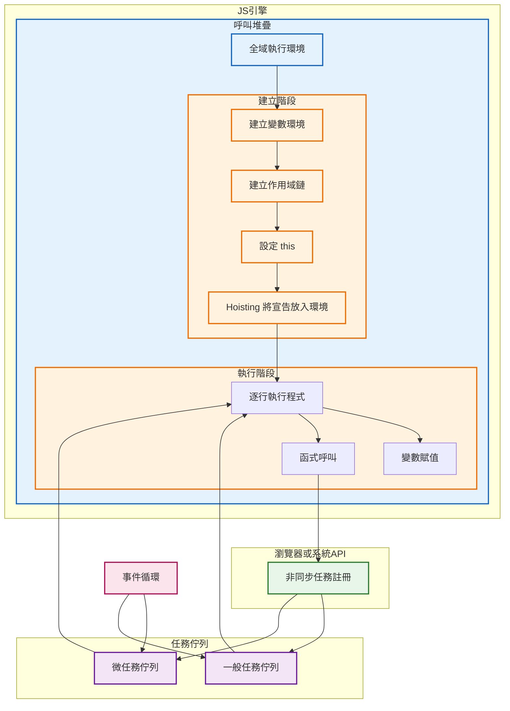
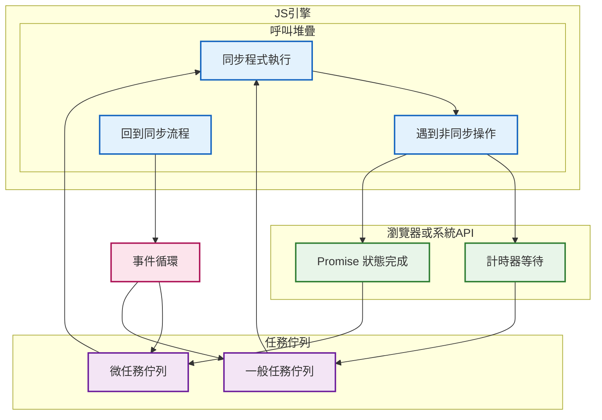

### 對照表

| 宣告方式         | 創建階段是否登記 | 初始狀態      | 是否存在 TDZ | 執行前可否使用 | Hoisting 行為說明               |
| ------------ | -------- | --------- | -------- | ------- | --------------------------- |
| var          | 有        | undefined | ❌ 無      | ✅ 可以    | 宣告被 hoisting，初始化為 undefined |
| function 陳述式 | 有        | 整個函式      | ❌ 無      | ✅ 可以    | 函式本體被完整 hoisting            |
| let          | 有        | 未初始化      | ✅ 有      | ❌ 不行    | 宣告被 hoisting，但受 TDZ 限制      |
| const        | 有        | 未初始化      | ✅ 有      | ❌ 不行    | 宣告被 hoisting，但受 TDZ 限制      |
| function 表達式 | 只有變數     | undefined | ❌ 無      | ❌ 不行    | 只有變數被 hoisting，函式不是         |

## 總整理：

1. **Creation 跟 Execution 差在哪**
2. **Hoisting 是在哪個階段發生**
3. **非同步怎麼透過 Event Loop 接進來**

---

## 1️⃣ Creation Phase 在做什麼

**Do**

* 建立變數環境
* 放入函式宣告
* 初始化變數為 undefined
* 決定 this

**How**

* 掃描整份程式
* 不執行任何一行
* 只做「宣告層級」的準備

**Why**

* 讓程式在執行前就知道「有哪些名字可以用」
* 這就是 hoisting 能發生的原因

---

## 2️⃣ Execution Phase 在做什麼

**Do**

* 逐行執行程式
* 指派變數實際值
* 呼叫函式

**How**

* 引擎一行一行跑
* 遇到非同步就丟給外部 API

**Why**

* 真正產生行為與結果
* console.log 會在這裡才印

---

## 3️⃣ Hoisting 放在哪裡（關鍵）

👉 **Hoisting 是 Creation Phase 的一部分**

不是：

* Event Loop
* Execution Phase
* 非同步

而是：

> 建立執行環境時，先把宣告放進變數環境

---

## 4️⃣ 非同步怎麼接進來

**Do**

* setTimeout 或 Promise 被註冊
* 回呼被排進佇列

**How**

* 瀏覽器或系統 API 處理等待
* 完成後放進任務佇列
* Event Loop 決定什麼時候丟回 Call Stack

**Why**

* 避免阻塞主執行緒
* 讓 JS 可以單執行緒卻能處理多工

---

> JavaScript 在執行前會先進入建立階段，建立執行環境、變數環境與作用域鏈，並在此階段完成 hoisting

> 接著進入執行階段逐行執行程式，若遇到非同步操作則交由瀏覽器或系統 API 處理，完成後透過事件循環將任務放回呼叫堆疊執行。

---

