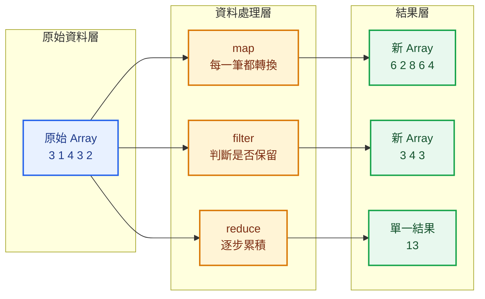
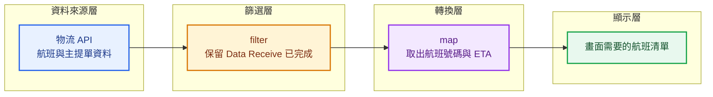

## 本篇觀念要點

<Highlight>

`map` 與 `filter` 都會回傳新的 Array。

最大的差別不是語法，而是：

- **map：轉換資料（Transformation）**
- **filter：篩選資料（Selection）**

</Highlight>

1. [為什麼需要 map 與 filter](#why-map-filter)
2. [map：轉換每一筆資料](#map)
3. [filter：篩選符合條件的資料](#filter)
4. [物流實務案例](#logistics-example)
5. [map 與 filter 的差異](#difference)
6. [串接 map 與 filter](#chaining)
7. [常見錯誤](#common-mistakes)
8. [如何選擇](#when-to-use)

---

## 為什麼需要 map 與 filter {#why-map-filter}

當後端 API 回傳資料後，通常有兩種需求：

```text
改變資料內容
↓

map

------------------

挑出符合條件的資料
↓

filter
```

例如：

```js
const employees = [
  {
    id: 1,
    name: 'John',
    department: 'IT',
    salary: 60000,
  },
  {
    id: 2,
    name: 'Mary',
    department: 'HR',
    salary: 52000,
  },
  {
    id: 3,
    name: 'Kevin',
    department: 'IT',
    salary: 70000,
  },
];
```

| 方法 | 思維 |
|------|------|
| `map` | Transformation（轉換） |
| `filter` | Selection（篩選） |

---

## map、filter、reduce 的資料處理概念 {#data-transformation-flow}

這三個方法都會走訪 Array，但它們想得到的結果不同：



### 這張圖在做什麼

它把資料處理拆成三層：

```text
原始資料
→ 使用 Array Method
→ 得到結果
```

### 三個方法的核心問題

| 方法 | Callback 要做什麼 | 最後得到什麼 |
|---|---|---|
| `map` | 回傳轉換後的新值 | 新 Array |
| `filter` | 回傳是否符合條件 | 新 Array |
| `reduce` | 回傳下一輪累積結果 | 單一結果 |

:::tip 不要只背語法

看到需求時，先問：

- 每一筆都要轉換嗎 → `map`
- 只留下符合條件的資料嗎 → `filter`
- 多筆資料要合成一個結果嗎 → `reduce`

:::

## map：轉換每一筆資料 {#map}

`map()` 會走訪 Array 中的每一個元素，並將 Callback Function 回傳的新值放進新的 Array。

```js
const names = employees.map((employee) => employee.name);

console.log(names);
```

結果：

```js
['John', 'Mary', 'Kevin']
```

資料流程：

```text
員工物件

↓

取出 name

↓

新的姓名 Array
```

再例如：

薪資加薪 10%

```js
const newSalaries = employees.map((employee) => {
  return employee.salary * 1.1;
});
```

結果：

```js
[66000, 57200, 77000]
```

:::tip map 記憶法

看到下面這些需求，就先想到 `map`：

- 取出姓名
- 修改資料格式
- 將資料轉成畫面需要的格式
- 新增欄位

:::

---

## filter：篩選符合條件的資料 {#filter}

`filter()` 一樣會走訪每個元素。

不同的是：

Callback 必須回傳：

- `true` → 保留
- `false` → 移除

```js
const itEmployees = employees.filter(
  (employee) => employee.department === 'IT'
);
```

結果：

```js
[
  {
    id: 1,
    name: 'John',
    department: 'IT',
    salary: 60000,
  },
  {
    id: 3,
    name: 'Kevin',
    department: 'IT',
    salary: 70000,
  },
];
```

資料流程：

```text
全部員工

↓

department === 'IT'

↓

只留下 IT 部門
```

:::tip filter 記憶法

看到下面需求，就想到 `filter`：

- IT 部門
- 今天 ETA
- 已完成資料
- 價格大於 1000
- 啟用中的會員

:::

---

## 💼 物流實務案例 {#logistics-example}

假設物流系統回傳一批航班資料：

```js
const shipments = [
  {
    masterNo: '172-85261573',
    flightNo: 'CV9364',
    eta: '2026-07-28 08:30',
    warehouse: '遠雄',
    dataReceived: true,
  },
  {
    masterNo: '160-12345678',
    flightNo: 'CX160',
    eta: '2026-07-28 10:20',
    warehouse: '榮儲',
    dataReceived: true,
  },
  {
    masterNo: '020-87654321',
    flightNo: 'JL809',
    eta: '2026-07-28 13:40',
    warehouse: '華儲',
    dataReceived: false,
  },
];
```

### 物流資料處理流程

假設物流 API 回傳多筆航班與主提單資料，畫面只需要：

1. 留下已完成 Data Receive 的資料
2. 顯示航班號碼與 ETA



對應程式碼：

```js
const flightList = shipments
  .filter((shipment) => shipment.dataReceived)
  .map((shipment) => {
    return {
      flightNo: shipment.flightNo,
      eta: shipment.eta,
    };
  });
```

### 這段流程怎麼理解

```text
API 回傳全部資料
→ filter 移除不需要的資料
→ map 改成畫面需要的格式
→ 交給前端顯示
```

### 為什麼通常先 filter 再 map

因為先把不需要的資料排除，後面的 `map` 就只需要處理真正會顯示的資料。

```text
先縮小資料範圍
→ 再轉換資料格式
```

這種順序不只是比較好讀，也更符合實務上的資料處理流程。

### 使用 map

需求：

> 畫面只需要航班號碼與 ETA。

```js
const flightList = shipments.map((shipment) => {
  return {
    flightNo: shipment.flightNo,
    eta: shipment.eta,
  };
});
```

資料流程：

```text
物流資料

↓

map

↓

航班號碼 + ETA
```

---

### 使用 filter

需求：

> 只顯示今天已完成 Data Receive 的航班。

```js
const arrivedFlights = shipments.filter(
  (shipment) => shipment.dataReceived
);
```

資料流程：

```text
全部航班

↓

filter

↓

只留下已完成 Data Receive 的航班
```

---

### 真實工作流程

很多企業系統都是：

```text
API 回傳所有資料

↓

filter
先留下需要的資料

↓

map
整理成畫面需要的格式

↓

Render 到畫面
```

這也是 React、Vue、Node.js 非常常見的資料處理流程。

---

## map 與 filter 的差異 {#difference}

| 比較 | map | filter |
|------|------|---------|
| 功能 | 轉換資料 | 篩選資料 |
| 回傳 | 新 Array | 新 Array |
| 長度 | 通常相同 | 可能變少 |
| Callback 回傳 | 新的值 | true / false |

一句話：

```text
map

每一筆都保留
只是變成新的值

------------------

filter

每一筆都檢查
符合才留下
```

---

## 串接 map 與 filter {#chaining}

需求：

> 今天已完成 Data Receive 的航班，只顯示航班號碼。

```js
const flights = shipments
  .filter((shipment) => shipment.dataReceived)
  .map((shipment) => shipment.flightNo);

console.log(flights);
```

流程：

```text
全部航班

↓

filter

↓

已完成 Data Receive

↓

map

↓

航班號碼
```

---

## 常見錯誤 {#common-mistakes}

### map 忘記 return

```js
const names = employees.map((employee) => {
  employee.name;
});
```

結果：

```js
[undefined, undefined, undefined]
```

---

### 用 map 做篩選

```js
employees.map((employee) => employee.department === 'IT');
```

得到的是：

```js
[true, false, true]
```

真正要篩選資料，應該使用：

```js
filter()
```

---

### 認為 filter 會修改原 Array

```js
const itEmployees = employees.filter(
  (employee) => employee.department === 'IT'
);
```

原本的 `employees` 不會改變。

---

## 如何選擇 {#when-to-use}

看到需求中的動詞：

| 動詞 | 方法 |
|------|------|
| 轉換 | `map` |
| 修改格式 | `map` |
| 取出欄位 | `map` |
| 篩選 | `filter` |
| 保留 | `filter` |
| 排除 | `filter` |

---

## 本篇重點整理

| 方法 | 核心問題 |
|------|-----------|
| `map` | 每一筆資料要變成什麼？ |
| `filter` | 每一筆資料要不要留下？ |

:::tip 一句話總結

**map 是「每一筆都轉換」，filter 是「符合條件才保留」。兩者都會建立新的 Array，不會修改原本的 Array。**

:::