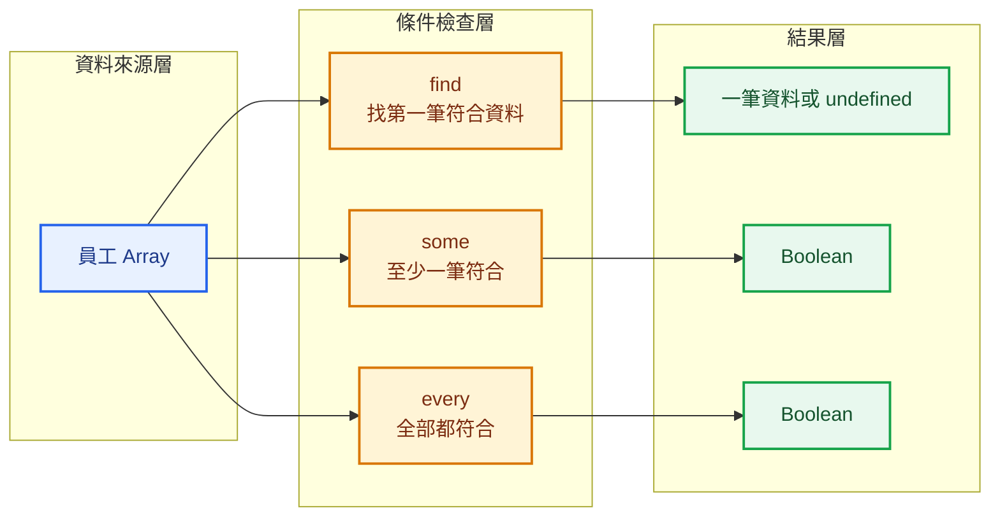
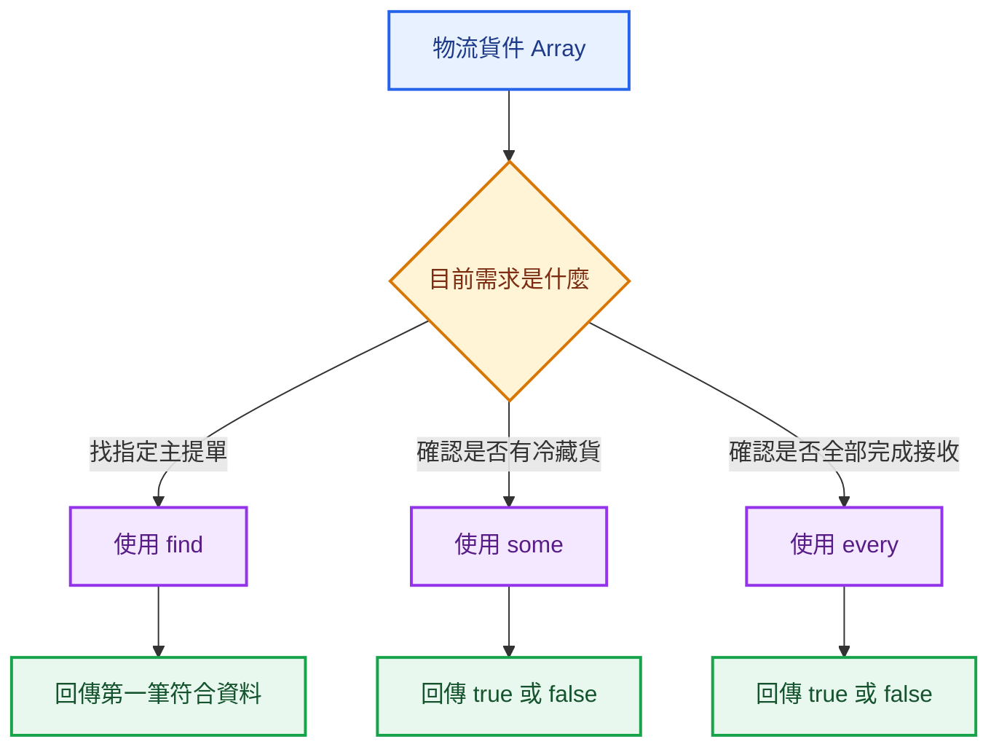

## 本篇觀念要點

<Highlight>

`find`、`some`、`every` 都會依序檢查 Array 裡的元素。

差別在於它們最後想得到的結果不同：

- `find`：找出第一筆符合條件的資料
- `some`：確認是否至少有一筆符合條件
- `every`：確認是否全部都符合條件

</Highlight>

1. [三個方法在解決什麼問題](#overview)
2. [find：找出第一筆符合資料](#find)
3. [some：至少有一筆符合](#some)
4. [every：是否全部符合](#every)
5. [物流實務案例](#logistics-example)
6. [三個方法的差異](#difference)
7. [如何選擇](#when-to-use)
8. [常見錯誤](#common-mistakes)

---

## 三個方法在解決什麼問題 {#overview}

假設系統有一組員工資料：

```js
const employees = [
  {
    id: 101,
    name: 'John',
    department: 'IT',
    active: true,
  },
  {
    id: 102,
    name: 'Mary',
    department: 'HR',
    active: false,
  },
  {
    id: 103,
    name: 'Kevin',
    department: 'IT',
    active: true,
  },
];
```

面對這組資料，可能會出現三種不同需求：

```text
我要找到 id 是 102 的員工
→ find

我想知道是否有停用中的員工
→ some

我想知道是否所有員工都已啟用
→ every
```



---

## find：找出第一筆符合資料 {#find}

`find()` 會依序檢查 Array 中的元素。

當 Callback Function 第一次回傳 `true`，`find()` 就會：

1. 回傳目前這筆資料
2. 停止繼續搜尋

```js
const employee = employees.find((employee) => {
  return employee.id === 102;
});

console.log(employee);
```

結果：

```js
{
  id: 102,
  name: 'Mary',
  department: 'HR',
  active: false,
}
```

### 使用 Arrow Function 簡寫

```js
const employee = employees.find(
  (employee) => employee.id === 102,
);
```

### 找不到資料時

```js
const employee = employees.find(
  (employee) => employee.id === 999,
);

console.log(employee);
```

結果：

```js
undefined
```

:::tip find 的核心問題

> 哪一筆資料是我要找的？

`find()` 回傳的是符合條件的**第一個元素本身**，不是新的 Array。

:::

---

## some：至少有一筆符合 {#some}

`some()` 用來判斷：

> Array 裡是否至少有一筆資料符合條件？

只要有一筆符合，結果就是 `true`。

```js
const hasInactiveEmployee = employees.some((employee) => {
  return employee.active === false;
});

console.log(hasInactiveEmployee);
```

結果：

```js
true
```

因為 Mary 的 `active` 是 `false`。

### some 的執行概念

```text
第一筆不符合
→ 繼續檢查

第二筆符合
→ 回傳 true
→ 停止檢查
```

:::tip some 的核心問題

> 有沒有至少一筆符合條件？

它只回答 `true` 或 `false`，不會回傳那筆資料。

:::

---

## every：是否全部符合 {#every}

`every()` 用來判斷：

> Array 裡的每一筆資料是否都符合條件？

只有全部符合，結果才會是 `true`。

```js
const allEmployeesActive = employees.every((employee) => {
  return employee.active === true;
});

console.log(allEmployeesActive);
```

結果：

```js
false
```

因為不是每位員工都已啟用。

### every 的執行概念

```text
第一筆符合
→ 繼續檢查

第二筆不符合
→ 回傳 false
→ 停止檢查
```

:::tip every 的核心問題

> 是否全部都符合條件？

只要有一筆不符合，結果就會是 `false`。

:::

---

## 💼 物流實務案例 {#logistics-example}

假設物流系統回傳一批貨件資料：

```js
const shipments = [
  {
    masterNo: '172-85261573',
    flightNo: 'CV9364',
    eta: '2026-07-28 08:30',
    warehouse: '遠雄',
    dataReceived: true,
    temperatureType: '常溫',
  },
  {
    masterNo: '160-12345678',
    flightNo: 'CX160',
    eta: '2026-07-28 10:20',
    warehouse: '榮儲',
    dataReceived: true,
    temperatureType: '冷藏',
  },
  {
    masterNo: '020-87654321',
    flightNo: 'JL809',
    eta: '2026-07-28 13:40',
    warehouse: '華儲',
    dataReceived: false,
    temperatureType: '常溫',
  },
];
```

### 使用 find 找指定主提單

需求：

> 找出主提單號碼為 `160-12345678` 的貨件資料。

```js
const shipment = shipments.find((shipment) => {
  return shipment.masterNo === '160-12345678';
});

console.log(shipment);
```

`find()` 適合用在：

- 根據主提單號找貨件
- 根據訂單編號找訂單
- 根據會員 ID 找會員
- 根據設備 ID 找設備

---

### 使用 some 檢查是否有冷藏貨

需求：

> 這批資料中是否有任何冷藏貨？

```js
const hasColdShipment = shipments.some((shipment) => {
  return shipment.temperatureType === '冷藏';
});

console.log(hasColdShipment);
```

結果：

```js
true
```

這種需求通常只需要知道：

```text
有
或
沒有
```

不一定需要取得完整貨件資料。

---

### 使用 every 檢查是否全部完成 Data Receive

需求：

> 所有貨件是否都已完成 Data Receive？

```js
const allReceived = shipments.every((shipment) => {
  return shipment.dataReceived;
});

console.log(allReceived);
```

結果：

```js
false
```

因為第三筆資料尚未完成。

---

### 物流資料判斷流程



---

## find、some、every 的差異 {#difference}

| 方法 | 想回答的問題 | 回傳值 |
|---|---|---|
| `find` | 哪一筆符合？ | 第一筆符合的元素或 `undefined` |
| `some` | 是否至少一筆符合？ | Boolean |
| `every` | 是否全部符合？ | Boolean |

### find

```js
const result = shipments.find(
  (shipment) => shipment.masterNo === '160-12345678',
);
```

回傳：

```text
貨件物件
```

---

### some

```js
const result = shipments.some(
  (shipment) => shipment.temperatureType === '冷藏',
);
```

回傳：

```js
true
```

---

### every

```js
const result = shipments.every(
  (shipment) => shipment.dataReceived,
);
```

回傳：

```js
false
```

---

## 如何選擇 {#when-to-use}

先看需求想得到什麼：

| 需求 | 方法 |
|---|---|
| 找出某一筆資料 | `find` |
| 判斷是否存在符合資料 | `some` |
| 判斷是否全部符合 | `every` |

```text
找出指定 ID 的員工
→ find

是否有任何停用帳號
→ some

是否所有表單都填寫完成
→ every
```

:::info find 與 filter 不一樣

`find()` 只回傳第一筆符合資料。

`filter()` 會回傳所有符合資料，結果是新的 Array。

```js
employees.find((employee) => employee.department === 'IT');
```

得到一位 IT 員工。

```js
employees.filter((employee) => employee.department === 'IT');
```

得到所有 IT 員工。

:::

---

## 常見錯誤 {#common-mistakes}

### 錯誤一：想找一筆資料卻使用 filter

```js
const employee = employees.filter(
  (employee) => employee.id === 102,
);
```

結果是：

```js
[
  {
    id: 102,
    name: 'Mary',
    department: 'HR',
    active: false,
  },
]
```

這仍然是一個 Array。

如果需求只需要一筆資料，應使用：

```js
const employee = employees.find(
  (employee) => employee.id === 102,
);
```

---

### 錯誤二：認為 some 會回傳符合的資料

```js
const result = employees.some(
  (employee) => employee.active === false,
);
```

`result` 只會是：

```js
true
```

如果需要取得那筆員工資料，應改用：

```js
const employee = employees.find(
  (employee) => employee.active === false,
);
```

---

### 錯誤三：混淆 some 與 every

```text
some
→ 至少一筆符合就 true

every
→ 全部符合才 true
```

例如：

```js
const numbers = [2, 4, 5];
```

```js
numbers.some((number) => number % 2 === 0);
```

結果：

```js
true
```

因為至少有一個偶數。

```js
numbers.every((number) => number % 2 === 0);
```

結果：

```js
false
```

因為不是全部都是偶數。

---

## 本篇重點整理

| 方法 | 核心問題 |
|---|---|
| `find` | 我要找的是哪一筆？ |
| `some` | 有沒有至少一筆？ |
| `every` | 是不是全部都符合？ |

:::tip 一句話總結

`find` 負責找出第一筆符合條件的資料；`some` 判斷至少有一筆符合；`every` 判斷是否全部符合。

:::