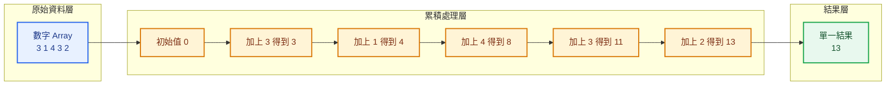
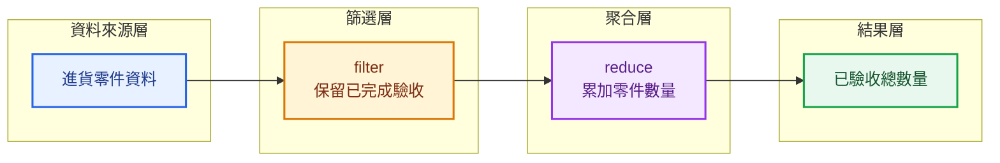
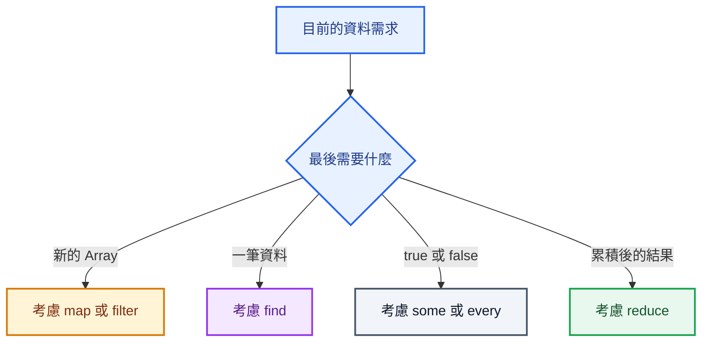

## 本篇觀念要點

<Highlight>

`reduce()` 會依序走訪 Array，並把多筆資料逐步累積成一個結果。

這種處理方式稱為：

**Aggregation，資料聚合。**

</Highlight>

1. [reduce 在解決什麼問題](#what-is-reduce)
2. [reduce 的基本結構](#reduce-structure)
3. [Accumulator 與 Current Value](#accumulator-current)
4. [reduce 的執行流程](#reduce-flow)
5. [製造業進貨零件案例](#manufacturing-example)
6. [reduce 與其他 Array 方法的差異](#difference)
7. [常見錯誤](#common-mistakes)
8. [如何判斷是否使用 reduce](#when-to-use)

---

## reduce 在解決什麼問題 {#what-is-reduce}

假設有一組數字：

```js
const numbers = [3, 1, 4, 3, 2];
```

現在的需求是：

> 計算所有數字的總和。

最後需要的不是另一個 Array，而是一個數字：

```js
13
```

這就是 `reduce()` 最典型的用途。

```text
多筆資料
→ 逐步累積
→ 一個結果
```

### Aggregation 是什麼

Aggregation 可以翻成：

> 聚合、彙總、整合。

常見需求包括：

- 計算訂單總金額
- 計算進貨零件總數
- 計算貨件總重量
- 統計每個部門的人數
- 將多筆資料整理成一個物件

:::tip 一句話記住

`reduce` 不是單純把 Array 變少。

它真正的概念是：

**把前一輪的結果帶到下一輪，持續累積。**

:::

---

## reduce 的基本結構 {#reduce-structure}

```js
const result = numbers.reduce(function (accumulator, currentValue) {
  return accumulator + currentValue;
}, 0);
```

也可以使用 Arrow Function：

```js
const result = numbers.reduce((accumulator, currentValue) => {
  return accumulator + currentValue;
}, 0);
```

簡寫：

```js
const result = numbers.reduce(
  (accumulator, currentValue) => accumulator + currentValue,
  0,
);
```

`reduce()` 主要接收兩個參數：

```js
numbers.reduce(callbackFunction, initialValue);
```

| 參數 | 說明 |
|---|---|
| Callback Function | 定義每一輪如何累積 |
| Initial Value | 累積器一開始的值 |

---

## Accumulator 與 Current Value {#accumulator-current}

Callback Function 最重要的兩個參數是：

```js
function (accumulator, currentValue) {}
```

### accumulator

`accumulator` 可以理解成：

> 前面幾輪累積到目前為止的結果。

常見簡寫：

```js
acc
```

### currentValue

`currentValue` 可以理解成：

> 這一輪正在處理的元素。

常見簡寫：

```js
current
```

因此：

```js
accumulator + currentValue
```

代表：

```text
目前累積結果
加上
這一輪的資料
```

---

## reduce 的執行流程 {#reduce-flow}

```js
const numbers = [3, 1, 4, 3, 2];

const total = numbers.reduce((acc, current) => {
  return acc + current;
}, 0);
```

執行過程：

| 輪次 | accumulator | currentValue | 回傳結果 |
|---|---:|---:|---:|
| 初始 | 0 | 尚未開始 | 0 |
| 第 1 輪 | 0 | 3 | 3 |
| 第 2 輪 | 3 | 1 | 4 |
| 第 3 輪 | 4 | 4 | 8 |
| 第 4 輪 | 8 | 3 | 11 |
| 第 5 輪 | 11 | 2 | 13 |

最後結果：

```js
13
```

關鍵在於：

```text
每一輪 return 的結果
→ 成為下一輪的 accumulator
```



---

## 💼 製造業進貨零件案例 {#manufacturing-example}

假設製造系統收到一批進貨零件資料：

```js
const incomingParts = [
  {
    partNo: 'R-1001',
    partName: '電阻',
    quantity: 500,
    unitPrice: 2,
    warehouse: 'A01',
    inspected: true,
  },
  {
    partNo: 'C-2001',
    partName: '電容',
    quantity: 300,
    unitPrice: 5,
    warehouse: 'A01',
    inspected: true,
  },
  {
    partNo: 'IC-3001',
    partName: '控制晶片',
    quantity: 80,
    unitPrice: 120,
    warehouse: 'B02',
    inspected: false,
  },
];
```

---

### 案例一：計算進貨零件總數量

需求：

> 這批進貨總共有多少個零件？

```js
const totalQuantity = incomingParts.reduce((total, part) => {
  return total + part.quantity;
}, 0);

console.log(totalQuantity);
```

結果：

```js
880
```

資料流程：

```text
初始總數量 0
→ 加上 500
→ 加上 300
→ 加上 80
→ 總數量 880
```

---

### 案例二：計算進貨總金額

每一筆零件的金額是：

```text
數量 × 單價
```

```js
const totalAmount = incomingParts.reduce((total, part) => {
  return total + part.quantity * part.unitPrice;
}, 0);

console.log(totalAmount);
```

計算內容：

```text
電阻
500 × 2
→ 1000

電容
300 × 5
→ 1500

控制晶片
80 × 120
→ 9600
```

總金額：

```js
12100
```

這也是 `reduce()` 很常見的實務用途：

> 每一筆先計算，再累積到總額。

---

### 案例三：只計算已完成驗收的零件數量

可以先用 `filter()` 篩選，再使用 `reduce()` 聚合。

```js
const inspectedQuantity = incomingParts
  .filter((part) => part.inspected)
  .reduce((total, part) => {
    return total + part.quantity;
  }, 0);

console.log(inspectedQuantity);
```

結果：

```js
800
```

資料流程：

```text
全部進貨零件
→ filter
→ 只留下已驗收零件
→ reduce
→ 加總已驗收數量
```



---

## reduce 與其他 Array 方法的差異 {#difference}

| 方法 | 核心用途 | 常見回傳結果 |
|---|---|---|
| `forEach` | 對每一筆執行動作 | `undefined` |
| `map` | 轉換每一筆資料 | 新 Array |
| `filter` | 篩選符合條件的資料 | 新 Array |
| `find` | 找第一筆符合資料 | 一筆資料或 `undefined` |
| `some` | 是否至少一筆符合 | Boolean |
| `every` | 是否全部符合 | Boolean |
| `reduce` | 將多筆資料累積成結果 | 數字、物件或其他結果 |

### 核心問題比較

```text
forEach
→ 每一筆要做什麼？

map
→ 每一筆要變成什麼？

filter
→ 每一筆要不要保留？

find
→ 哪一筆符合？

some
→ 有沒有任何一筆符合？

every
→ 是不是全部符合？

reduce
→ 這些資料最後要累積成什麼？
```

---

## 常見錯誤 {#common-mistakes}

### 錯誤一：忘記 return

```js
const total = incomingParts.reduce((total, part) => {
  total + part.quantity;
}, 0);
```

結果會是：

```js
undefined
```

正確寫法：

```js
const total = incomingParts.reduce((total, part) => {
  return total + part.quantity;
}, 0);
```

或使用簡寫：

```js
const total = incomingParts.reduce(
  (total, part) => total + part.quantity,
  0,
);
```

---

### 錯誤二：忘記 Initial Value

```js
incomingParts.reduce((total, part) => {
  return total + part.quantity;
});
```

這時第一個 Array 元素可能會被當作初始 accumulator。

但第一個元素是物件，不是數字，容易造成錯誤結果。

建議計算總和時明確指定：

```js
0
```

完整寫法：

```js
const total = incomingParts.reduce(
  (total, part) => total + part.quantity,
  0,
);
```

---

### 錯誤三：混淆 map 與 reduce

需求：

> 取得每筆零件的進貨金額。

應該使用 `map()`：

```js
const amounts = incomingParts.map((part) => {
  return part.quantity * part.unitPrice;
});
```

結果：

```js
[1000, 1500, 9600]
```

需求：

> 計算全部零件的進貨總金額。

才使用 `reduce()`：

```js
const totalAmount = incomingParts.reduce((total, part) => {
  return total + part.quantity * part.unitPrice;
}, 0);
```

結果：

```js
12100
```

---

## 如何判斷是否使用 reduce {#when-to-use}

看到以下需求時，可以先想到 `reduce()`：

- 總數量
- 總金額
- 總重量
- 平均值
- 分組統計
- 將多筆資料整理成一個物件

判斷問題：

> 我最後需要的是一個累積結果，而不是逐筆資料嗎？

如果答案是「是」，通常就可以考慮 `reduce()`。



---

## 本篇重點整理

| 概念 | 說明 |
|---|---|
| `accumulator` | 前面累積到目前為止的結果 |
| `currentValue` | 這一輪正在處理的元素 |
| `initialValue` | 累積器一開始的值 |
| `return` | 傳給下一輪的 accumulator |

:::tip 一句話總結

`reduce()` 會把每一輪的結果交給下一輪繼續累積，最後把多筆資料聚合成一個結果。

:::