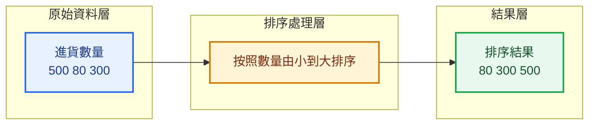
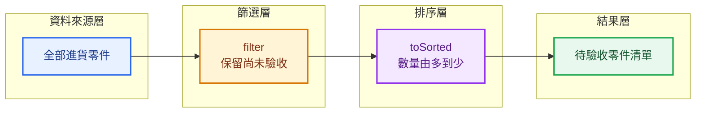

> 預估閱讀時間：約 4 分鐘

## 本篇觀念要點

<Highlight>
`sort()` 與 `toSorted()` 都可以排列 Array。

最大的差別是：

- `sort()`：會直接修改原本的 Array
- `toSorted()`：不修改原 Array，回傳排序後的新 Array
</Highlight>

1. [排序在解決什麼問題](#why-sorting)
2. [sort 的基本使用方式](#sort)
3. [為什麼數字排序需要 Compare Function](#compare-function)
4. [由小到大與由大到小](#ascending-descending)
5. [物件 Array 的排序](#object-sorting)
6. [sort 會修改原 Array](#sort-mutation)
7. [toSorted 不修改原 Array](#to-sorted)
8. [製造業資料案例](#manufacturing-example)
9. [常見錯誤](#common-mistakes)
10. [sort 與 toSorted 如何選擇](#when-to-use)

---

## 排序在解決什麼問題 {#why-sorting}

排序 Sorting，代表：

> 按照某個規則重新排列資料順序。

常見需求包括：

- 價格由低到高
- 日期由新到舊
- ETA 由早到晚
- 進貨數量由多到少
- 員工姓名按照字母排序
- 訂單按照建立時間排序

例如：

```js
const quantities = [500, 80, 300];
```

希望排列成：

```js
[80, 300, 500]
```

資料內容沒有消失，也沒有轉換成其他格式。

改變的是：

```text
資料排列順序
```



---

## sort 的基本使用方式 {#sort}

```js
const names = ['Kevin', 'Amy', 'John'];

names.sort();

console.log(names);
```

結果：

```js
['Amy', 'John', 'Kevin']
```

字串資料可以直接使用 `sort()`，預設會按照字串順序排列。

但是數字排序要特別注意。

---

## 為什麼數字排序需要 Compare Function {#compare-function}

假設有以下數字：

```js
const numbers = [10, 2, 100, 20];

numbers.sort();

console.log(numbers);
```

你可能以為結果是：

```js
[2, 10, 20, 100]
```

但實際上可能得到：

```js
[10, 100, 2, 20]
```

因為 `sort()` 預設會把元素轉成字串，再按照字串順序比較。

因此，數字排序應該提供 Compare Function：

```js
numbers.sort((a, b) => {
  return a - b;
});
```

結果：

```js
[2, 10, 20, 100]
```

:::danger 數字排序不要只寫 sort

```js
numbers.sort();
```

這不是可靠的數值排序。

應該寫成：

```js
numbers.sort((a, b) => a - b);
```

:::

---

## 由小到大與由大到小 {#ascending-descending}

### 由小到大

```js
const numbers = [500, 80, 300];

numbers.sort((a, b) => a - b);
```

結果：

```js
[80, 300, 500]
```

記憶方式：

```text
a 減 b
→ 小到大
```

---

### 由大到小

```js
const numbers = [500, 80, 300];

numbers.sort((a, b) => b - a);
```

結果：

```js
[500, 300, 80]
```

記憶方式：

```text
b 減 a
→ 大到小
```

---

### Compare Function 如何運作

```js
(a, b) => a - b
```

| 回傳結果 | 排序行為 |
|---|---|
| 小於 0 | `a` 排在 `b` 前面 |
| 大於 0 | `b` 排在 `a` 前面 |
| 等於 0 | 兩者順序維持相同 |

初學時不需要背完整演算法。

先記住：

```js
a - b;
```

代表由小到大。

```js
b - a;
```

代表由大到小。

---

## 物件 Array 的排序 {#object-sorting}

假設有一組進貨零件資料：

```js
const incomingParts = [
  {
    partNo: 'R-1001',
    partName: '電阻',
    quantity: 500,
    unitPrice: 2,
  },
  {
    partNo: 'C-2001',
    partName: '電容',
    quantity: 300,
    unitPrice: 5,
  },
  {
    partNo: 'IC-3001',
    partName: '控制晶片',
    quantity: 80,
    unitPrice: 120,
  },
];
```

### 按照進貨數量由小到大

```js
incomingParts.sort((partA, partB) => {
  return partA.quantity - partB.quantity;
});
```

排序結果：

```text
控制晶片 80
電容 300
電阻 500
```

---

### 按照進貨數量由大到小

```js
incomingParts.sort((partA, partB) => {
  return partB.quantity - partA.quantity;
});
```

排序結果：

```text
電阻 500
電容 300
控制晶片 80
```

---

### 按照單價由高到低

```js
incomingParts.sort((partA, partB) => {
  return partB.unitPrice - partA.unitPrice;
});
```

這時比較的不是整個物件，而是：

```js
partA.unitPrice;
partB.unitPrice;
```

:::tip 物件排序的思考方式

先問：

> 我要根據物件裡的哪一個欄位排序？

例如：

- `quantity`
- `unitPrice`
- `salary`
- `createdAt`
- `eta`

:::

---

## sort 會修改原 Array {#sort-mutation}

`sort()` 是一個會修改原始 Array 的方法。

```js
const quantities = [500, 80, 300];

const sortedQuantities = quantities.sort((a, b) => a - b);

console.log(sortedQuantities);
console.log(quantities);
```

結果：

```js
[80, 300, 500]
[80, 300, 500]
```

原本的 `quantities` 也被改變了。

資料流程：

```text
原始 Array
→ sort
→ 原始 Array 的順序被修改
```

這種行為稱為：

```text
Mutating
直接修改原資料
```

:::danger 在前端狀態管理中要特別注意

如果資料來自 React State、Vue Store 或其他共用狀態，直接使用 `sort()` 可能會意外修改原始資料。

:::

---

## toSorted 不修改原 Array {#to-sorted}

`toSorted()` 的排序規則和 `sort()` 類似。

最大的不同是：

> `toSorted()` 會建立排序後的新 Array，不會修改原本的 Array。

```js
const quantities = [500, 80, 300];

const sortedQuantities = quantities.toSorted((a, b) => {
  return a - b;
});

console.log(sortedQuantities);
console.log(quantities);
```

結果：

```js
sortedQuantities;
// [80, 300, 500]

quantities;
// [500, 80, 300]
```

資料流程：

```text
原始 Array
→ 保持不變

原始 Array
→ toSorted
→ 排序後的新 Array
```

### 使用物件欄位排序

```js
const sortedParts = incomingParts.toSorted((partA, partB) => {
  return partB.quantity - partA.quantity;
});
```

`incomingParts` 維持原本順序。

`sortedParts` 則是排序後的新 Array。

---

## sort 與 toSorted 的比較 {#sort-vs-to-sorted}

| 比較項目 | `sort()` | `toSorted()` |
|---|---|---|
| 是否排序資料 | 是 | 是 |
| 是否修改原 Array | 會 | 不會 |
| 是否回傳 Array | 會 | 會 |
| 適合直接修改資料 | 是 | 否 |
| 適合 React、Vue 狀態資料 | 較不建議 | 較適合 |

在舊環境中，也常看到先複製再排序：

```js
const sortedQuantities = [...quantities].sort((a, b) => {
  return a - b;
});
```

流程是：

```text
展開運算子建立新 Array
→ 對新 Array 使用 sort
→ 原始 Array 不受影響
```

---

## 💼 製造業進貨零件案例 {#manufacturing-example}

假設進貨系統取得以下資料：

```js
const incomingParts = [
  {
    partNo: 'R-1001',
    partName: '電阻',
    quantity: 500,
    expectedAt: '2026-07-28 10:30',
    inspected: true,
  },
  {
    partNo: 'IC-3001',
    partName: '控制晶片',
    quantity: 80,
    expectedAt: '2026-07-28 08:20',
    inspected: false,
  },
  {
    partNo: 'C-2001',
    partName: '電容',
    quantity: 300,
    expectedAt: '2026-07-28 09:10',
    inspected: true,
  },
];
```

### 需求一：按照進貨數量由多到少

```js
const sortedByQuantity = incomingParts.toSorted((partA, partB) => {
  return partB.quantity - partA.quantity;
});
```

結果順序：

```text
電阻 500
電容 300
控制晶片 80
```

---

### 需求二：只留下未驗收零件，再依數量排序

```js
const pendingParts = incomingParts
  .filter((part) => !part.inspected)
  .toSorted((partA, partB) => {
    return partB.quantity - partA.quantity;
  });
```

資料流程：



這種資料處理流程可以理解成：

```text
先決定哪些資料需要顯示
→ 再決定資料顯示順序
```

---

## 常見錯誤 {#common-mistakes}

### 錯誤一：數字直接使用 sort

```js
const quantities = [500, 80, 300];

quantities.sort();
```

這會按照字串規則排序，不是可靠的數值排序。

正確寫法：

```js
quantities.sort((a, b) => a - b);
```

---

### 錯誤二：不知道 sort 修改了原 Array

```js
const sortedParts = incomingParts.sort((a, b) => {
  return a.quantity - b.quantity;
});
```

此時：

```js
incomingParts;
```

也已經被重新排序。

不想修改原資料時，使用：

```js
const sortedParts = incomingParts.toSorted((a, b) => {
  return a.quantity - b.quantity;
});
```

---

### 錯誤三：物件排序時直接相減

```js
incomingParts.sort((a, b) => a - b);
```

`a` 和 `b` 是物件，不能直接進行有效的數值比較。

應指定欄位：

```js
incomingParts.sort((a, b) => {
  return a.quantity - b.quantity;
});
```

---

### 錯誤四：混淆 map 與 sort

`map()` 是改變每筆資料內容：

```js
incomingParts.map((part) => part.partName);
```

`sort()` 是改變資料排列順序：

```js
incomingParts.sort((a, b) => {
  return a.quantity - b.quantity;
});
```

---

## sort 與 toSorted 如何選擇 {#when-to-use}

| 情況 | 建議方法 |
|---|---|
| 明確要修改原 Array | `sort()` |
| 原始資料需要保留 | `toSorted()` |
| React 或 Vue 的狀態資料 | 優先考慮 `toSorted()` |
| 舊環境不支援 toSorted | 複製後再使用 `sort()` |

```js
const sortedData = [...originalData].sort(compareFunction);
```

:::tip 轉職者實務建議

除非你明確知道原始資料可以被修改，否則優先使用：

```js
toSorted()
```

或：

```js
[...array].sort()
```

這樣比較不容易因為修改共用資料而產生 Bug。

:::

---

## 本篇重點整理

| 方法 | 核心問題 |
|---|---|
| `sort()` | 我要重新排列資料，而且可以修改原 Array 嗎？ |
| `toSorted()` | 我要取得排序結果，但保留原 Array 嗎？ |

常用 Compare Function：

```js
// 數字由小到大
(a, b) => a - b;

// 數字由大到小
(a, b) => b - a;
```

:::tip 一句話總結

`sort()` 會直接修改原 Array；`toSorted()` 會回傳排序後的新 Array。處理 API、React 或 Vue 狀態資料時，要特別留意是否需要保留原始順序。

:::