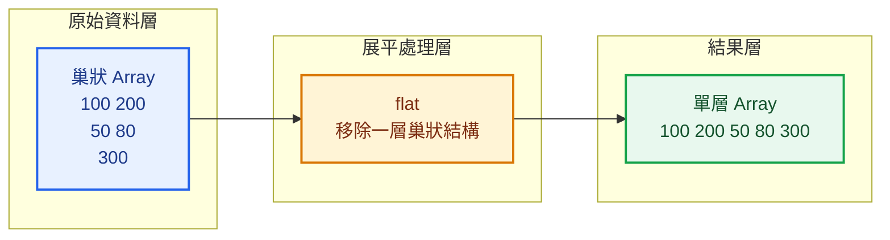
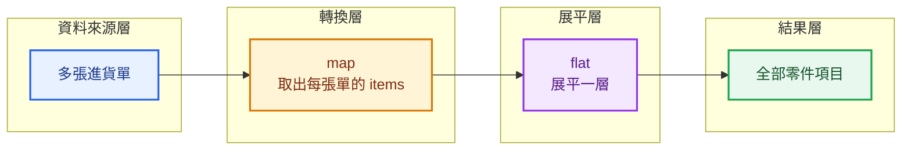
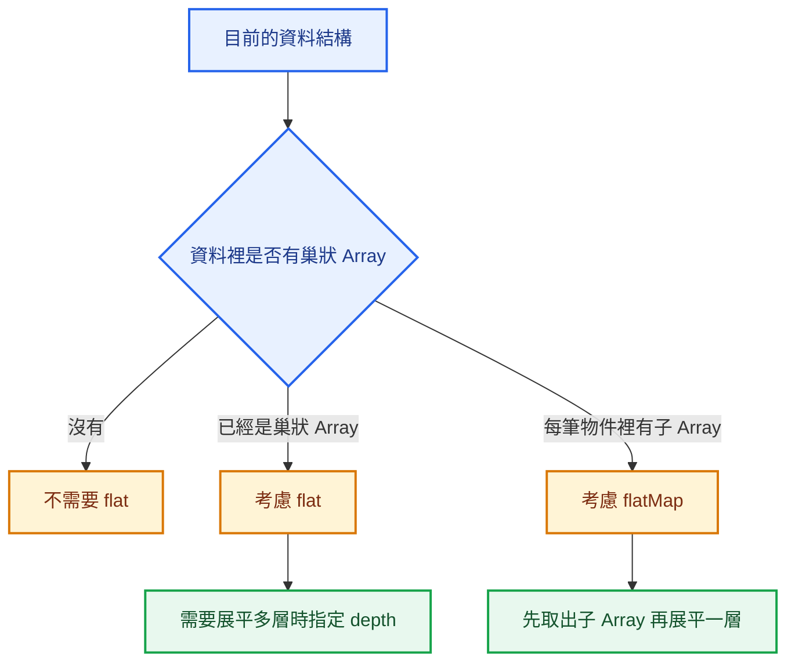

> 預估閱讀時間：約 3 分鐘

## 本篇觀念要點

<Highlight>
`flat()` 用來把巢狀 Array 展平。

`flatMap()` 則是先使用 `map()` 轉換每一筆資料，再把結果展平一層。
</Highlight>

1. [什麼是巢狀 Array](#nested-array)
2. [flat：展平巢狀 Array](#flat)
3. [flat 的 depth 參數](#flat-depth)
4. [flatMap：先轉換再展平](#flat-map)
5. [製造業進貨單案例](#manufacturing-example)
6. [flat 與 flatMap 的差異](#difference)
7. [常見錯誤](#common-mistakes)
8. [如何判斷要使用哪一個](#when-to-use)

---

## 什麼是巢狀 Array {#nested-array}

巢狀 Array 代表：

> Array 裡面還放著其他 Array。

例如：

```js
const quantities = [
  [100, 200],
  [50, 80],
  [300],
];
```

這不是一個單層 Array。

它的結構是：

```text
外層 Array
→ 第一個內層 Array
→ 第二個內層 Array
→ 第三個內層 Array
```

如果希望取得所有數量：

```js
[100, 200, 50, 80, 300]
```

就可以使用 `flat()`。

---

## flat：展平巢狀 Array {#flat}

`flat()` 會把巢狀 Array 展平成較平坦的 Array。

```js
const quantities = [
  [100, 200],
  [50, 80],
  [300],
];

const allQuantities = quantities.flat();

console.log(allQuantities);
```

結果：

```js
[100, 200, 50, 80, 300]
```

資料流程：

```text
巢狀 Array
→ flat
→ 單層 Array
```



:::tip flat 的核心問題

> 我的 Array 裡面是不是還包著其他 Array？

如果只是想把內層 Array 攤開，可以考慮 `flat()`。

:::

---

## flat 的 depth 參數 {#flat-depth}

`flat()` 預設只展平一層。

```js
const data = [1, [2, [3, 4]]];

console.log(data.flat());
```

結果：

```js
[1, 2, [3, 4]]
```

最內層的 `[3, 4]` 還沒有被展開。

### 展平兩層

```js
const result = data.flat(2);

console.log(result);
```

結果：

```js
[1, 2, 3, 4]
```

### 展平所有層級

```js
const result = data.flat(Infinity);
```

結果：

```js
[1, 2, 3, 4]
```

| 寫法 | 說明 |
|---|---|
| `flat()` | 展平一層 |
| `flat(2)` | 展平兩層 |
| `flat(Infinity)` | 展平所有層級 |

:::info 初學階段先掌握一層

大部分 API 或商業資料常見的結構是：

```text
多張單據
→ 每張單據裡有多個項目
```

這通常只需要展平一層。

:::

---

## flatMap：先轉換再展平 {#flat-map}

`flatMap()` 可以理解成：

```text
map
+
flat 一層
```

假設有以下資料：

```js
const groups = [
  [1, 2],
  [3, 4],
];
```

先使用 `map()`：

```js
const mapped = groups.map((group) => {
  return group;
});
```

結果仍然是巢狀 Array：

```js
[
  [1, 2],
  [3, 4],
]
```

接著使用 `flat()`：

```js
const result = groups
  .map((group) => group)
  .flat();
```

結果：

```js
[1, 2, 3, 4]
```

也可以直接寫成：

```js
const result = groups.flatMap((group) => group);
```

結果相同：

```js
[1, 2, 3, 4]
```

---

## flatMap 的重要限制

`flatMap()` 只會展平一層。

```js
const data = [
  [1, [2, 3]],
  [4, [5, 6]],
];

const result = data.flatMap((item) => item);
```

結果：

```js
[1, [2, 3], 4, [5, 6]]
```

它不等於：

```js
flat(Infinity)
```

---

## 💼 製造業進貨單案例 {#manufacturing-example}

假設進貨系統回傳多張進貨單。

每張進貨單裡都有自己的零件項目：

```js
const purchaseReceipts = [
  {
    receiptNo: 'IN-20260728-001',
    supplier: '供應商 A',
    items: [
      {
        partNo: 'R-1001',
        partName: '電阻',
        quantity: 500,
      },
      {
        partNo: 'C-2001',
        partName: '電容',
        quantity: 300,
      },
    ],
  },
  {
    receiptNo: 'IN-20260728-002',
    supplier: '供應商 B',
    items: [
      {
        partNo: 'IC-3001',
        partName: '控制晶片',
        quantity: 80,
      },
    ],
  },
];
```

目前的資料結構是：

```text
進貨單 Array
→ 每張進貨單
→ items Array
→ 零件資料
```

---

### 使用 map 取得每張單的 items

```js
const itemGroups = purchaseReceipts.map((receipt) => {
  return receipt.items;
});

console.log(itemGroups);
```

結果：

```js
[
  [
    {
      partNo: 'R-1001',
      partName: '電阻',
      quantity: 500,
    },
    {
      partNo: 'C-2001',
      partName: '電容',
      quantity: 300,
    },
  ],
  [
    {
      partNo: 'IC-3001',
      partName: '控制晶片',
      quantity: 80,
    },
  ],
]
```

結果仍然是：

```text
Array 裡面包著多個 items Array
```

---

### 使用 map 後接 flat

```js
const allItems = purchaseReceipts
  .map((receipt) => receipt.items)
  .flat();

console.log(allItems);
```

結果：

```js
[
  {
    partNo: 'R-1001',
    partName: '電阻',
    quantity: 500,
  },
  {
    partNo: 'C-2001',
    partName: '電容',
    quantity: 300,
  },
  {
    partNo: 'IC-3001',
    partName: '控制晶片',
    quantity: 80,
  },
]
```

---

### 使用 flatMap 簡化

```js
const allItems = purchaseReceipts.flatMap((receipt) => {
  return receipt.items;
});
```

簡寫：

```js
const allItems = purchaseReceipts.flatMap(
  (receipt) => receipt.items,
);
```

資料流程：



`flatMap()` 就是把中間兩步合在一起：

```text
多張進貨單
→ flatMap
→ 取出並展平所有 items
→ 全部零件項目
```

---

### 案例二：取得所有零件名稱

```js
const partNames = purchaseReceipts.flatMap((receipt) => {
  return receipt.items.map((item) => item.partName);
});

console.log(partNames);
```

結果：

```js
['電阻', '電容', '控制晶片']
```

這裡的處理順序是：

```text
每張進貨單
→ 進入 items
→ 將每個零件轉換成 partName
→ 展平所有名稱
```

---

### 案例三：計算全部進貨零件數量

可以先展平，再使用 `reduce()`：

```js
const totalQuantity = purchaseReceipts
  .flatMap((receipt) => receipt.items)
  .reduce((total, item) => {
    return total + item.quantity;
  }, 0);

console.log(totalQuantity);
```

結果：

```js
880
```

資料流程：

```text
多張進貨單
→ flatMap
→ 取得全部零件項目
→ reduce
→ 計算總數量
```

這就是實務中常見的 Array Method Chaining。

---

## flat 與 flatMap 的差異 {#difference}

| 比較項目 | `flat()` | `flatMap()` |
|---|---|---|
| 主要用途 | 展平巢狀 Array | 先轉換，再展平一層 |
| 是否執行 Callback | 否 | 是 |
| 是否可以指定深度 | 可以 | 不可以 |
| 預設展平層數 | 一層 | 一層 |
| 常見使用方式 | 已經是巢狀 Array | 物件裡有子 Array |

### flat

```js
const data = [
  [1, 2],
  [3, 4],
];

const result = data.flat();
```

核心問題：

> 我已經有一個巢狀 Array，要把它攤平。

### flatMap

```js
const result = purchaseReceipts.flatMap(
  (receipt) => receipt.items,
);
```

核心問題：

> 我要先從每筆資料取出一個 Array，再把這些 Array 合併起來。

---

## 常見錯誤 {#common-mistakes}

### 錯誤一：以為 map 會自動展平

```js
const allItems = purchaseReceipts.map(
  (receipt) => receipt.items,
);
```

這會得到：

```text
items Array 組成的巢狀 Array
```

不會自動變成所有零件項目的單層 Array。

應該使用：

```js
const allItems = purchaseReceipts
  .map((receipt) => receipt.items)
  .flat();
```

或：

```js
const allItems = purchaseReceipts.flatMap(
  (receipt) => receipt.items,
);
```

---

### 錯誤二：期待 flatMap 展平多層

```js
const data = [
  {
    values: [[1, 2]],
  },
];
```

```js
const result = data.flatMap((item) => item.values);
```

結果：

```js
[[1, 2]]
```

因為 `flatMap()` 只展平一層。

如果需要繼續展平，可以使用：

```js
const result = data
  .flatMap((item) => item.values)
  .flat();
```

---

### 錯誤三：資料不是 Array 卻使用 flat

```js
const receipt = {
  items: [
    {
      partNo: 'R-1001',
    },
  ],
};

receipt.flat();
```

這會發生錯誤，因為 `flat()` 是 Array Method。

應該對 Array 使用：

```js
receipt.items.flat();
```

不過這裡的 `items` 本身已經是單層 Array，因此通常不需要 `flat()`。

---

### 錯誤四：為了簡短而過度使用 flatMap

如果只是單純轉換每一筆資料：

```js
const receiptNumbers = purchaseReceipts.map(
  (receipt) => receipt.receiptNo,
);
```

這裡應該使用 `map()`。

因為 Callback 回傳的是字串，不是需要展平的 Array。

---

## 如何判斷要使用哪一個 {#when-to-use}



| 需求 | 方法 |
|---|---|
| 把巢狀 Array 攤平 | `flat()` |
| 指定要展平幾層 | `flat(depth)` |
| 從每筆物件取出子 Array 並合併 | `flatMap()` |
| 只轉換資料，不需要展平 | `map()` |

---

## 本篇重點整理

| 方法 | 核心問題 |
|---|---|
| `flat()` | 這個巢狀 Array 要展平幾層？ |
| `flatMap()` | 每筆資料要取出哪個子 Array，並合併成一層？ |

:::tip 一句話總結

`flat()` 負責展平已存在的巢狀 Array；`flatMap()` 負責先轉換每筆資料，再把 Callback 回傳的 Array 展平一層。

:::