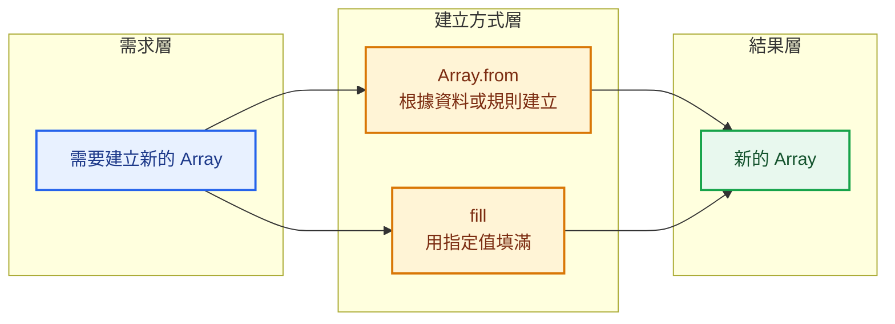
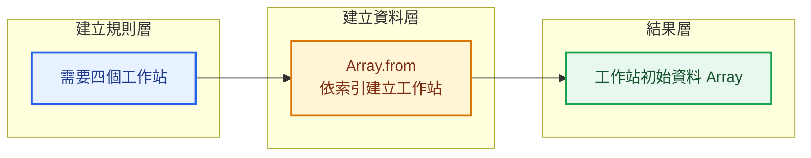
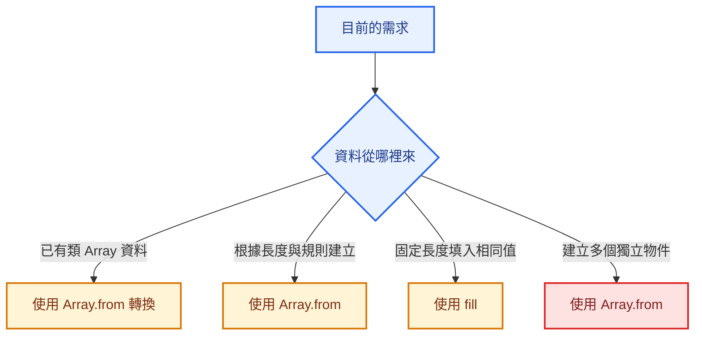

> 預估閱讀時間：約 4 分鐘

## 本篇觀念要點

<Highlight>
`Array.from()` 與 `fill()` 都可以幫助我們建立 Array。

差別在於：

- `Array.from()`：從既有資料或規則建立新的 Array
- `fill()`：用指定值填滿 Array 的全部或部分位置
</Highlight>

1. [這兩個方法在解決什麼問題](#overview)
2. [Array.from：從既有資料建立 Array](#array-from)
3. [使用 Array.from 產生連續資料](#array-from-generate)
4. [fill：填滿 Array](#fill)
5. [fill 的起點與終點](#fill-range)
6. [製造業初始化資料案例](#manufacturing-example)
7. [Array.from 與 fill 的差異](#difference)
8. [常見錯誤](#common-mistakes)
9. [如何選擇](#when-to-use)

---

## 這兩個方法在解決什麼問題 {#overview}

前面的 Array Methods 大多是在處理已經存在的資料。

例如：

```text
map
→ 轉換資料

filter
→ 篩選資料

reduce
→ 聚合資料
```

但有時候，我們需要的不是處理既有資料，而是：

> 建立一個新的 Array，作為初始資料結構。

常見需求包括：

- 建立固定長度的空位
- 建立連續編號
- 初始化每個工作站的狀態
- 建立頁碼
- 將類 Array 資料轉成真正的 Array
- 將所有欄位填入預設值



---

## Array.from：從既有資料建立 Array {#array-from}

`Array.from()` 會建立一個新的 Array。

基本結構：

```js
Array.from(source);
```

例如，字串是一種可以依序讀取的資料：

```js
const letters = Array.from('ABC');

console.log(letters);
```

結果：

```js
['A', 'B', 'C']
```

### 核心概念

```text
既有資料
→ Array.from
→ 新 Array
```

---

### 將類 Array 資料轉成真正的 Array

某些資料看起來像 Array，也有索引和 `length`，但不一定是真正的 Array。

例如瀏覽器取得多個 DOM 元素時，可能得到 `NodeList`。

```js
const elements = document.querySelectorAll('.item');

const elementArray = Array.from(elements);
```

轉換後，就可以比較安心地使用 Array Methods。

```js
elementArray.map(...);
elementArray.filter(...);
```

:::tip Array.from 的常見用途

- 字串轉 Array
- NodeList 轉 Array
- 其他類 Array 資料轉 Array
- 根據長度與規則產生新 Array

:::

---

## 使用 Array.from 產生連續資料 {#array-from-generate}

`Array.from()` 可以接收第二個參數：

```js
Array.from(source, mapFunction);
```

第二個參數會決定每一個位置要放什麼值。

### 建立 1 到 5

```js
const numbers = Array.from(
  { length: 5 },
  function (_, index) {
    return index + 1;
  },
);

console.log(numbers);
```

結果：

```js
[1, 2, 3, 4, 5]
```

使用 Arrow Function：

```js
const numbers = Array.from(
  { length: 5 },
  (_, index) => index + 1,
);
```

### 這段怎麼理解

```js
{ length: 5 }
```

代表：

> 我要建立一個長度為 5 的 Array。

Callback 的兩個參數：

```js
(value, index)
```

因為這裡不需要目前值，所以通常用 `_` 表示暫時不使用。

```js
(_, index) => index + 1
```

執行概念：

| index | 回傳值 |
|---:|---:|
| 0 | 1 |
| 1 | 2 |
| 2 | 3 |
| 3 | 4 |
| 4 | 5 |

:::info 底線不是特殊語法

`_` 只是一個一般參數名稱。

它代表：

> 這個參數存在，但目前不需要使用。

:::

---

### 建立工作站編號

```js
const stationNumbers = Array.from(
  { length: 4 },
  (_, index) => `ST-${index + 1}`,
);

console.log(stationNumbers);
```

結果：

```js
['ST-1', 'ST-2', 'ST-3', 'ST-4']
```

---

### 建立頁碼

```js
const totalPages = 5;

const pages = Array.from(
  { length: totalPages },
  (_, index) => index + 1,
);

console.log(pages);
```

結果：

```js
[1, 2, 3, 4, 5]
```

這在分頁元件中很常見。

---

## fill：填滿 Array {#fill}

`fill()` 會將 Array 中的元素替換成指定值。

```js
const statuses = new Array(4);

statuses.fill('待處理');

console.log(statuses);
```

結果：

```js
['待處理', '待處理', '待處理', '待處理']
```

資料流程：

```text
固定長度 Array
→ fill
→ 每個位置填入預設值
```

### 一步完成

```js
const statuses = new Array(4).fill('待處理');
```

結果相同：

```js
['待處理', '待處理', '待處理', '待處理']
```

:::tip fill 的核心問題

> 我要不要讓多個位置先具有相同的預設值？

如果答案是「要」，就可以考慮 `fill()`。

:::

---

## fill 的起點與終點 {#fill-range}

`fill()` 可以指定填入範圍：

```js
array.fill(value, start, end);
```

| 參數 | 說明 |
|---|---|
| `value` | 要填入的值 |
| `start` | 從哪個索引開始 |
| `end` | 到哪個索引之前停止 |

注意：

```text
包含 start
不包含 end
```

---

### 從索引 1 開始填滿

```js
const statuses = [
  '已完成',
  '待處理',
  '待處理',
  '待處理',
];

statuses.fill('處理中', 1);

console.log(statuses);
```

結果：

```js
['已完成', '處理中', '處理中', '處理中']
```

---

### 只填索引 1 到索引 2

```js
const statuses = [
  '已完成',
  '待處理',
  '待處理',
  '待處理',
];

statuses.fill('處理中', 1, 3);

console.log(statuses);
```

結果：

```js
['已完成', '處理中', '處理中', '待處理']
```

因為：

```text
索引 1 包含
索引 3 不包含
```

---

## fill 會修改原 Array

`fill()` 是會直接修改原始 Array 的方法。

```js
const statuses = [
  '待處理',
  '待處理',
  '待處理',
];

const result = statuses.fill('已完成');

console.log(result);
console.log(statuses);
```

兩者結果都是：

```js
['已完成', '已完成', '已完成']
```

這種行為稱為：

```text
Mutating
直接修改原資料
```

:::danger 注意原始資料是否需要保留

如果不希望修改原 Array，可以先複製：

```js
const updatedStatuses = [...statuses].fill('已完成');
```

:::

---

## 💼 製造業初始化資料案例 {#manufacturing-example}

假設工廠系統需要建立四個工作站的初始狀態。

### 使用 Array.from 建立工作站資料

```js
const stations = Array.from(
  { length: 4 },
  (_, index) => {
    return {
      stationId: `ST-${index + 1}`,
      status: '待啟動',
      completedQuantity: 0,
    };
  },
);

console.log(stations);
```

結果：

```js
[
  {
    stationId: 'ST-1',
    status: '待啟動',
    completedQuantity: 0,
  },
  {
    stationId: 'ST-2',
    status: '待啟動',
    completedQuantity: 0,
  },
  {
    stationId: 'ST-3',
    status: '待啟動',
    completedQuantity: 0,
  },
  {
    stationId: 'ST-4',
    status: '待啟動',
    completedQuantity: 0,
  },
]
```

資料流程：



---

### 使用 fill 建立每日驗收狀態

假設一張進貨單有五個驗收項目。

系統一開始將所有項目設為：

```text
尚未驗收
```

```js
const inspectionStatuses = new Array(5).fill('尚未驗收');

console.log(inspectionStatuses);
```

結果：

```js
[
  '尚未驗收',
  '尚未驗收',
  '尚未驗收',
  '尚未驗收',
  '尚未驗收',
]
```

當其中一段進入處理中：

```js
inspectionStatuses.fill('驗收中', 1, 3);
```

結果：

```js
[
  '尚未驗收',
  '驗收中',
  '驗收中',
  '尚未驗收',
  '尚未驗收',
]
```

---

## 物件與 fill 的重要陷阱

下面這段程式看起來像是建立三個獨立物件：

```js
const stations = new Array(3).fill({
  status: '待啟動',
});
```

但實際上，三個位置會指向同一個物件。

```js
stations[0].status = '運作中';

console.log(stations);
```

可能得到：

```js
[
  { status: '運作中' },
  { status: '運作中' },
  { status: '運作中' },
]
```

因為它們共用同一個物件參考。

:::danger 不要用 fill 建立多個獨立物件

錯誤方向：

```js
new Array(3).fill({});
```

需要獨立物件時，應使用：

```js
const stations = Array.from(
  { length: 3 },
  () => ({
    status: '待啟動',
  }),
);
```

每一次 Callback 都會建立一個新的物件。

:::

---

## Array.from 與 fill 的差異 {#difference}

| 比較項目 | `Array.from()` | `fill()` |
|---|---|---|
| 主要用途 | 根據資料或規則建立新 Array | 將 Array 填入指定值 |
| 是否建立新 Array | 是 | 不一定，通常操作既有 Array |
| 是否修改原 Array | 不會修改來源 | 會修改呼叫它的 Array |
| 可否根據 index 建立不同值 | 可以 | 不可以 |
| 適合建立獨立物件 | 適合 | 不適合直接填同一物件 |
| 常見用途 | 編號、頁碼、初始物件 | 預設狀態、固定值 |

### Array.from

```js
const numbers = Array.from(
  { length: 5 },
  (_, index) => index + 1,
);
```

結果：

```js
[1, 2, 3, 4, 5]
```

每個位置可以根據規則產生不同值。

### fill

```js
const statuses = new Array(5).fill('待處理');
```

結果：

```js
[
  '待處理',
  '待處理',
  '待處理',
  '待處理',
  '待處理',
]
```

每個位置填入相同值。

---

## 常見錯誤 {#common-mistakes}

### 錯誤一：以為 new Array 會產生正常元素

```js
const data = new Array(5);

console.log(data);
```

這會建立一個有五個空位的 Array：

```js
[empty × 5]
```

它不等於：

```js
[undefined, undefined, undefined, undefined, undefined]
```

某些 Array Methods 可能會跳過空位。

需要真正填入值時，可以使用：

```js
new Array(5).fill(undefined);
```

或：

```js
Array.from({ length: 5 });
```

---

### 錯誤二：fill 會修改原 Array

```js
const statuses = [
  'A',
  'B',
  'C',
];

statuses.fill('X');
```

原本的內容會直接被改成：

```js
['X', 'X', 'X']
```

---

### 錯誤三：使用 fill 建立物件

```js
const rows = new Array(3).fill({
  checked: false,
});
```

三筆資料會共用同一個物件。

應改成：

```js
const rows = Array.from(
  { length: 3 },
  () => ({
    checked: false,
  }),
);
```

---

### 錯誤四：混淆 Array.from 與 map

如果已經有一個真正的 Array：

```js
const quantities = [10, 20, 30];
```

只需要轉換內容時，直接使用：

```js
const doubled = quantities.map(
  (quantity) => quantity * 2,
);
```

不需要再使用 `Array.from()`。

---

## 如何選擇 {#when-to-use}



| 需求 | 建議方法 |
|---|---|
| NodeList 轉成 Array | `Array.from()` |
| 建立 1 到 10 | `Array.from()` |
| 建立工作站初始物件 | `Array.from()` |
| 建立五個相同狀態 | `fill()` |
| 替換 Array 某一段資料 | `fill()` |
| 建立多個獨立物件 | `Array.from()` |

---

## 本篇重點整理

| 方法 | 核心問題 |
|---|---|
| `Array.from()` | 我要根據哪個來源或規則建立新 Array？ |
| `fill()` | 我要用哪個相同值填入哪些位置？ |

:::tip 一句話總結

`Array.from()` 適合根據來源、長度或索引建立新的 Array；`fill()` 適合將既有 Array 的全部或部分位置填入相同值。建立物件資料時，要避免使用 `fill()` 造成多個位置共用同一個物件。

:::