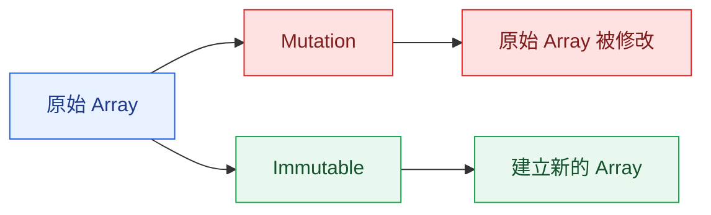
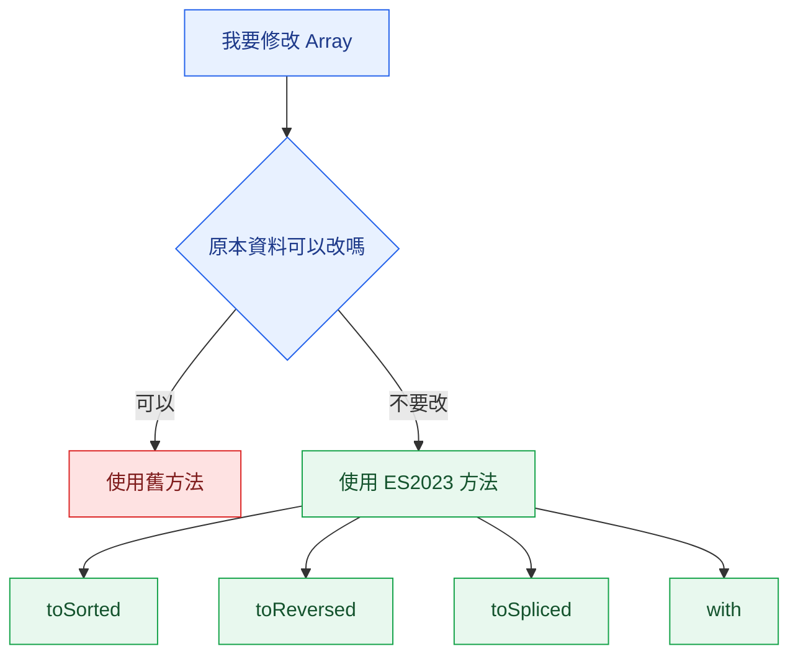

> 預估閱讀時間：約 2 分鐘

## 本篇觀念要點

<Highlight>

ES2023 新增了一組 Array Methods。

它們最大的特色不是功能，而是：

**不修改原本的 Array（Immutable）。**

</Highlight>

1. [為什麼 ES2023 新增這些方法](#why)
2. [Mutation 與 Immutable](#mutation)
3. [toReversed](#to-reversed)
4. [toSorted](#to-sorted)
5. [toSpliced](#to-spliced)
6. [with](#with)
7. [製造業資料案例](#manufacturing)
8. [四個方法比較](#compare)
9. [什麼時候使用](#when)

---

## 為什麼 ES2023 新增這些方法 {#why}

以前 JavaScript 很多 Array Method 都會：

```text
直接修改原本 Array
```

例如：

```js
sort()

reverse()

splice()
```

ES2023 新增：

```text
toSorted()

toReversed()

toSpliced()

with()
```

共同理念：

```text
建立新的 Array

↓

原本 Array 保持不變
```

---

## Mutation 與 Immutable {#mutation}

先理解兩個重要觀念。

### Mutation

直接修改原本資料。

例如：

```js
const numbers = [3, 1, 2];

numbers.sort();

console.log(numbers);
```

結果：

```js
[1,2,3]
```

原本的 `numbers` 已經改掉了。

---

### Immutable

不修改原本資料。

而是：

```text
原始資料

↓

建立新的資料

↓

回傳新的 Array
```

例如：

```js
const sortedNumbers = numbers.toSorted();
```

結果：

```js
numbers
// [3,1,2]

sortedNumbers
// [1,2,3]
```

---



---

## toReversed {#to-reversed}

以前：

```js
numbers.reverse();
```

會修改原本 Array。

現在：

```js
const reversed = numbers.toReversed();
```

結果：

```js
numbers

[1,2,3]

--------------

reversed

[3,2,1]
```

---

## toSorted {#to-sorted}

以前：

```js
numbers.sort();
```

現在：

```js
const sorted = numbers.toSorted(
  (a,b)=>a-b
);
```

原本資料完全不變。

---

## toSpliced {#to-spliced}

以前：

```js
numbers.splice(1,1);
```

會刪掉原本 Array。

現在：

```js
const newNumbers =
numbers.toSpliced(1,1);
```

原本資料保留。

新的 Array：

```js
[1,3]
```

---

## with {#with}

以前：

修改一個位置：

```js
numbers[2]=100;
```

直接修改。

現在：

```js
const updated =
numbers.with(2,100);
```

得到：

```js
原本

[1,2,3]

---------

新的

[1,2,100]
```

---

## 💼 製造業案例 {#manufacturing}

假設 MES 系統：

```js
const productionLines = [
  {
    line:'A',
    status:'Running'
  },
  {
    line:'B',
    status:'Idle'
  },
  {
    line:'C',
    status:'Running'
  }
];
```

主管希望：

畫面按照 Line 排序。

但是：

> 原本 API 回來的資料不能被改。

因此：

```js
const sortedLines =
productionLines.toSorted(
(a,b)=>a.line.localeCompare(b.line)
);
```

---

假設：

第二條產線狀態改成：

```text
Maintenance
```

可以：

```js
const updatedLines =
productionLines.with(
1,
{
    ...productionLines[1],
    status:'Maintenance'
}
);
```

原本資料：

保持不變。

新的 Array：

交給畫面 Render。

---

## 四個方法比較 {#compare}

| 舊方法 | 新方法 | 是否修改原 Array |
|------|---------|----------------|
| reverse | toReversed | ❌ |
| sort | toSorted | ❌ |
| splice | toSpliced | ❌ |
| arr[index]= | with | ❌ |

---

## 為什麼現在越來越重要？

React

Vue

Redux

Pinia

甚至很多 Backend Functional Programming。

都希望：

```text
不要改原資料

↓

建立新的資料

↓

狀態更容易追蹤
```

所以：

ES2023 才新增這組 API。

---

## 什麼時候使用 {#when}



---

## Array Data Processing 系列總整理

| 類別 | 方法 | 思維 |
|------|------|------|
| Iteration | `forEach` | 遍歷資料 |
| Transformation | `map` | 轉換資料 |
| Selection | `filter` | 篩選資料 |
| Searching | `find`、`findIndex` | 找資料 |
| Condition | `some`、`every` | 條件判斷 |
| Aggregation | `reduce` | 聚合資料 |
| Sorting | `sort`、`toSorted` | 排序 |
| Flattening | `flat`、`flatMap` | 展平資料 |
| Initialization | `Array.from`、`fill` | 建立資料 |
| Immutable Update | `toReversed`、`toSorted`、`toSpliced`、`with` | 建立修改後的新資料 |

---

## 本篇重點整理

| 方法 | 核心問題 |
|------|----------|
| `toReversed()` | 我要反轉資料，但不要修改原 Array。 |
| `toSorted()` | 我要排序資料，但不要修改原 Array。 |
| `toSpliced()` | 我要新增或刪除資料，但不要修改原 Array。 |
| `with()` | 我要更新某一個元素，但不要修改原 Array。 |

:::tip 一句話總結

ES2023 新增的 Array Methods 代表 JavaScript 越來越重視 **Immutable（不可變資料）**。與其直接修改原本的 Array，更推薦建立一份新的 Array，讓程式更容易維護，也更符合現代 React、Vue 與大型系統的開發方式。

:::