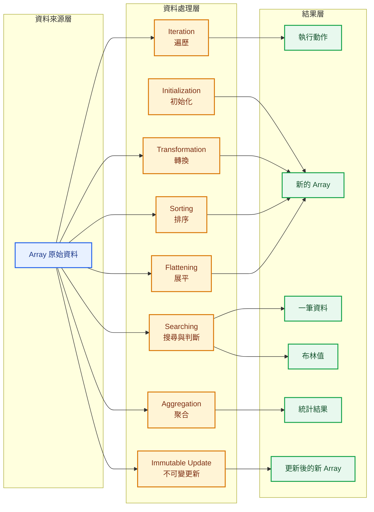
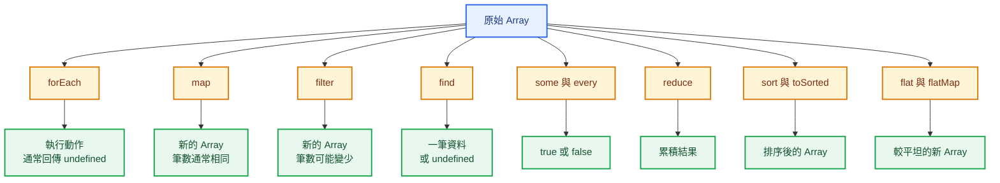
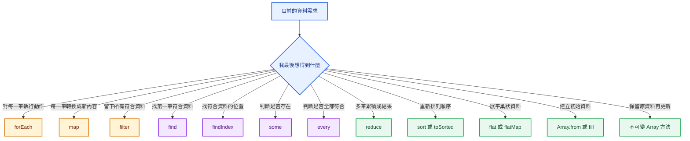
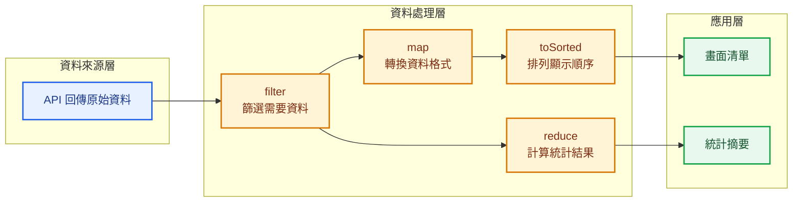
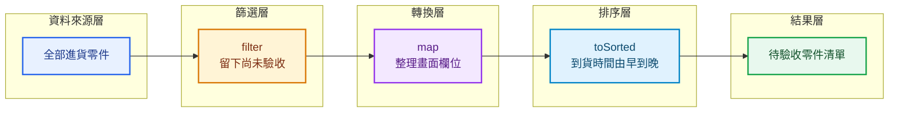
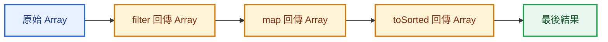
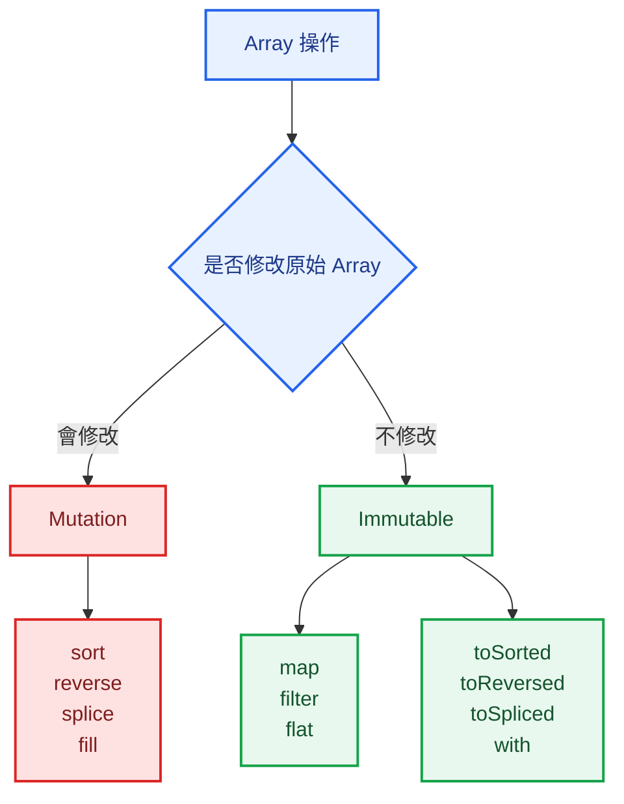

## 本篇觀念要點

<Highlight>
學習 Array Methods，不是背一長串方法名稱。

真正要建立的是：

**看到資料需求，就能判斷現在要遍歷、轉換、篩選、搜尋、聚合、排序、展平、初始化，還是更新資料。**
</Highlight>

1. [Array Data Processing 是什麼](#array-data-processing)
2. [Array 資料處理全貌](#overview)
3. [八種資料處理思維](#eight-concepts)
4. [各方法的輸入與輸出](#input-output)
5. [如何選擇 Array Method](#decision)
6. [企業系統中的完整資料流](#enterprise-flow)
7. [製造業進貨資料案例](#manufacturing-example)
8. [Method Chaining](#method-chaining)
9. [Mutation 與 Immutable](#mutation-immutable)
10. [常見錯誤](#common-mistakes)
11. [複習方式](#review)
12. [系列總結](#summary)

---

## Array Data Processing 是什麼 {#array-data-processing}

Array 通常用來保存多筆同類型資料，例如：

- 員工資料
- 商品資料
- 訂單資料
- 航班資料
- 進貨零件
- 設備狀態
- API 回傳結果

例如：

```js
const incomingParts = [
  {
    partNo: 'R-1001',
    partName: '電阻',
    quantity: 500,
    inspected: true,
  },
  {
    partNo: 'C-2001',
    partName: '電容',
    quantity: 300,
    inspected: true,
  },
  {
    partNo: 'IC-3001',
    partName: '控制晶片',
    quantity: 80,
    inspected: false,
  },
];
```

取得資料後，系統通常還需要：

```text
挑出需要的資料
→ 改成畫面需要的格式
→ 尋找指定資料
→ 計算統計結果
→ 按照規則排序
→ 更新其中一筆資料
```

這整個過程就是：

> **Array Data Processing，Array 資料處理。**

---

## Array 資料處理全貌 {#overview}



這張圖的核心是：

```text
同一組 Array
→ 根據不同需求選擇不同方法
→ 得到不同類型的結果
```

所以選擇 Array Method 前，要先問：

> **我最後想得到什麼？**

---

## 八種資料處理思維 {#eight-concepts}

### 一、Iteration 遍歷

方法：

```js
forEach()
```

核心問題：

> 每一筆資料都要做什麼？

例如：

- 印出每筆資料
- 發送通知
- 更新畫面
- 執行某個動作

```js
incomingParts.forEach((part) => {
  console.log(part.partName);
});
```

`forEach()` 通常是執行動作，不是建立新的 Array。

---

### 二、Transformation 轉換

方法：

```js
map()
```

核心問題：

> 每一筆資料要變成什麼？

```js
const partNames = incomingParts.map((part) => {
  return part.partName;
});
```

結果：

```js
['電阻', '電容', '控制晶片']
```

資料筆數通常不變，只是每一筆的內容或格式改變。

---

### 三、Selection 篩選

方法：

```js
filter()
```

核心問題：

> 哪些資料要留下？

```js
const inspectedParts = incomingParts.filter((part) => {
  return part.inspected;
});
```

`filter()` 會回傳所有符合條件的資料，因此結果仍然是 Array。

---

### 四、Searching 搜尋與條件判斷

方法：

```js
find()
findIndex()
some()
every()
```

它們都會檢查條件，但回傳結果不同。

```js
const part = incomingParts.find((part) => {
  return part.partNo === 'C-2001';
});
```

```js
const index = incomingParts.findIndex((part) => {
  return part.partNo === 'C-2001';
});
```

```js
const hasPendingPart = incomingParts.some((part) => {
  return !part.inspected;
});
```

```js
const allInspected = incomingParts.every((part) => {
  return part.inspected;
});
```

| 方法 | 核心問題 |
|---|---|
| `find` | 哪一筆符合？ |
| `findIndex` | 符合資料位於哪個索引？ |
| `some` | 是否至少有一筆符合？ |
| `every` | 是否全部符合？ |

---

### 五、Aggregation 聚合

方法：

```js
reduce()
```

核心問題：

> 多筆資料最後要累積成什麼？

```js
const totalQuantity = incomingParts.reduce((total, part) => {
  return total + part.quantity;
}, 0);
```

結果：

```js
880
```

`reduce()` 常見用途：

- 總數量
- 總金額
- 總重量
- 平均值
- 分組統計
- 建立統計物件

---

### 六、Sorting 排序

方法：

```js
sort()
toSorted()
```

核心問題：

> 資料要按照什麼順序排列？

```js
const sortedParts = incomingParts.toSorted((partA, partB) => {
  return partB.quantity - partA.quantity;
});
```

結果會按照進貨數量由多到少排列。

`sort()` 會修改原 Array。

`toSorted()` 會建立新的 Array。

---

### 七、Flattening 展平

方法：

```js
flat()
flatMap()
```

核心問題：

> Array 裡是不是還包著其他 Array？

例如多張進貨單，每張單裡有自己的零件項目：

```js
const receipts = [
  {
    receiptNo: 'IN-001',
    items: [
      { partNo: 'R-1001' },
      { partNo: 'C-2001' },
    ],
  },
  {
    receiptNo: 'IN-002',
    items: [
      { partNo: 'IC-3001' },
    ],
  },
];
```

取得全部零件：

```js
const allItems = receipts.flatMap((receipt) => {
  return receipt.items;
});
```

---

### 八、Initialization 與 Immutable Update

建立初始資料：

```js
Array.from()
fill()
```

不修改原 Array 的更新方式：

```js
toReversed()
toSorted()
toSpliced()
with()
```

例如建立四個工作站：

```js
const stations = Array.from(
  { length: 4 },
  (_, index) => {
    return {
      stationId: `ST-${index + 1}`,
      status: '待啟動',
    };
  },
);
```

更新第二筆資料，但保留原 Array：

```js
const updatedParts = incomingParts.with(1, {
  ...incomingParts[1],
  inspected: false,
});
```

---

## 各方法的輸入與輸出 {#input-output}



| 方法 | 主要用途 | 常見回傳值 |
|---|---|---|
| `forEach` | 遍歷並執行動作 | `undefined` |
| `map` | 轉換每筆資料 | 新 Array |
| `filter` | 篩選符合資料 | 新 Array |
| `find` | 找第一筆符合資料 | 元素或 `undefined` |
| `findIndex` | 找符合資料的索引 | 索引或 `-1` |
| `some` | 是否至少一筆符合 | Boolean |
| `every` | 是否全部符合 | Boolean |
| `reduce` | 將資料累積成結果 | 任意類型 |
| `sort` | 排序並修改原 Array | 排序後 Array |
| `toSorted` | 排序但保留原 Array | 新 Array |
| `flat` | 展平巢狀 Array | 新 Array |
| `flatMap` | 轉換後展平一層 | 新 Array |
| `Array.from` | 根據來源或規則建立 Array | 新 Array |
| `fill` | 將位置填入相同值 | 被修改的 Array |
| `toReversed` | 反轉但保留原 Array | 新 Array |
| `toSpliced` | 新增或刪除但保留原 Array | 新 Array |
| `with` | 更新指定索引但保留原 Array | 新 Array |

---

## 如何選擇 Array Method {#decision}

不要先背方法名稱。

先判斷需求中的動詞。



### 需求動詞對照表

| 需求中的動詞 | 優先想到 |
|---|---|
| 印出、通知、執行 | `forEach` |
| 轉換、整理、取出欄位 | `map` |
| 篩選、保留、排除 | `filter` |
| 找出一筆 | `find` |
| 找出位置 | `findIndex` |
| 是否存在 | `some` |
| 是否全部完成 | `every` |
| 加總、統計、聚合 | `reduce` |
| 排序、由高到低 | `sort`、`toSorted` |
| 攤平、合併子項目 | `flat`、`flatMap` |
| 初始化、產生編號 | `Array.from`、`fill` |
| 更新但保留原資料 | `with`、`toSpliced` |

---

## 企業系統中的完整資料流 {#enterprise-flow}

企業系統很少只使用一個 Array Method。

更常見的是多個方法依照資料流串接。



可以把這條流程理解成：

```text
取得原始資料
→ 留下真正需要的資料
→ 轉成使用者看得懂的格式
→ 按照規則排序
→ 顯示到畫面
```

另一條資料流則是：

```text
取得原始資料
→ 篩選指定範圍
→ 聚合成總數量或總金額
→ 顯示統計摘要
```

---

## 製造業進貨資料案例 {#manufacturing-example}

假設進貨系統取得以下資料：

```js
const incomingParts = [
  {
    partNo: 'R-1001',
    partName: '電阻',
    quantity: 500,
    unitPrice: 2,
    inspected: true,
    expectedAt: '2026-07-28 10:30',
  },
  {
    partNo: 'IC-3001',
    partName: '控制晶片',
    quantity: 80,
    unitPrice: 120,
    inspected: false,
    expectedAt: '2026-07-28 08:20',
  },
  {
    partNo: 'C-2001',
    partName: '電容',
    quantity: 300,
    unitPrice: 5,
    inspected: true,
    expectedAt: '2026-07-28 09:10',
  },
];
```

### 需求一：留下尚未驗收的零件

```js
const pendingParts = incomingParts.filter((part) => {
  return !part.inspected;
});
```

思維：

```text
Selection
→ 決定哪些資料要留下
```

---

### 需求二：整理畫面需要的欄位

```js
const partList = incomingParts.map((part) => {
  return {
    partNo: part.partNo,
    partName: part.partName,
    quantity: part.quantity,
  };
});
```

思維：

```text
Transformation
→ 每一筆資料要變成什麼格式
```

---

### 需求三：找出指定料號

```js
const targetPart = incomingParts.find((part) => {
  return part.partNo === 'IC-3001';
});
```

思維：

```text
Searching
→ 找第一筆符合資料
```

---

### 需求四：確認是否有尚未驗收的零件

```js
const hasPendingInspection = incomingParts.some((part) => {
  return !part.inspected;
});
```

思維：

```text
Condition Checking
→ 至少有一筆符合就回傳 true
```

---

### 需求五：計算進貨總數量

```js
const totalQuantity = incomingParts.reduce((total, part) => {
  return total + part.quantity;
}, 0);
```

結果：

```js
880
```

思維：

```text
Aggregation
→ 多筆資料累積成一個結果
```

---

### 需求六：依預計到貨時間排序

```js
const sortedParts = incomingParts.toSorted((partA, partB) => {
  return new Date(partA.expectedAt) - new Date(partB.expectedAt);
});
```

思維：

```text
Sorting
→ 決定資料顯示順序
```

---

### 完整資料流

需求：

> 顯示尚未驗收的零件，並按照預計到貨時間由早到晚排列。

```js
const pendingPartList = incomingParts
  .filter((part) => !part.inspected)
  .map((part) => {
    return {
      partNo: part.partNo,
      partName: part.partName,
      quantity: part.quantity,
      expectedAt: part.expectedAt,
    };
  })
  .toSorted((partA, partB) => {
    return new Date(partA.expectedAt) - new Date(partB.expectedAt);
  });
```



---

## Method Chaining {#method-chaining}

Method Chaining 代表：

> 將前一個方法的回傳結果，直接交給下一個方法繼續處理。

例如：

```js
const result = incomingParts
  .filter((part) => part.inspected)
  .map((part) => part.partName)
  .toSorted();
```

處理順序：

```text
第一步
filter
留下已驗收資料

第二步
map
取出零件名稱

第三步
toSorted
按照文字順序排列
```

### 為什麼可以串接

因為：

```js
filter()
map()
toSorted()
```

都會回傳 Array。

所以前一個方法的結果，可以繼續呼叫下一個 Array Method。



:::tip 閱讀 Method Chaining

從上到下閱讀，每一行回答一個資料需求：

```js
const result = data
  .filter(...)
  .map(...)
  .toSorted(...);
```

不要一次把整段當成一個巨大語法。

:::

---

## Mutation 與 Immutable {#mutation-immutable}

Array Methods 可以分成：

```text
會修改原始資料
與
不修改原始資料
```

### 常見會修改原 Array 的方法

```js
sort()
reverse()
splice()
fill()
push()
pop()
shift()
unshift()
```

### 常見不修改原 Array 的方法

```js
map()
filter()
find()
some()
every()
reduce()
flat()
flatMap()
toSorted()
toReversed()
toSpliced()
with()
```



:::danger 為什麼要注意 Mutation

當資料來自：

- React State
- Vue Store
- Pinia
- 共用變數
- API 快取

直接修改原始 Array，可能讓其他地方的資料也一起改變。

:::

---

## 常見錯誤 {#common-mistakes}

### 錯誤一：只背語法，不理解輸出

看到 Array 就直接使用 `map()`，但沒有先想需要的結果。

應先問：

```text
我要新的 Array？
一筆資料？
true 或 false？
還是一個總數？
```

---

### 錯誤二：用 map 做篩選

```js
incomingParts.map((part) => part.inspected);
```

結果是：

```js
[true, true, false]
```

這是在轉換資料，不是在篩選。

真正篩選：

```js
incomingParts.filter((part) => part.inspected);
```

---

### 錯誤三：用 filter 找單一資料

```js
const part = incomingParts.filter((part) => {
  return part.partNo === 'IC-3001';
});
```

結果仍然是 Array。

如果只需要一筆：

```js
const part = incomingParts.find((part) => {
  return part.partNo === 'IC-3001';
});
```

---

### 錯誤四：reduce 忘記初始值

```js
incomingParts.reduce((total, part) => {
  return total + part.quantity;
});
```

第一筆是物件，不適合當數字累積器。

應明確提供初始值：

```js
incomingParts.reduce((total, part) => {
  return total + part.quantity;
}, 0);
```

---

### 錯誤五：數字直接使用 sort

```js
const quantities = [500, 80, 300];

quantities.sort();
```

數字排序應提供 Compare Function：

```js
quantities.sort((a, b) => a - b);
```

---

### 錯誤六：忽略原 Array 是否被修改

```js
incomingParts.sort(...);
```

`incomingParts` 本身會被排序。

不想修改原資料時：

```js
const sortedParts = incomingParts.toSorted(...);
```

---

### 錯誤七：過度串接

Method Chaining 太長時，閱讀成本會增加。

```js
const result = data
  .filter(...)
  .map(...)
  .flatMap(...)
  .filter(...)
  .toSorted(...)
  .map(...)
  .reduce(...);
```

可以適度拆成具名變數：

```js
const pendingParts = data.filter(...);

const normalizedParts = pendingParts.map(...);

const totalQuantity = normalizedParts.reduce(...);
```

:::tip 可讀性比少幾行更重要

Method Chaining 是工具，不是越長越專業。

:::

---

## 複習方式 {#review}

複習 Array Methods 時，不要按照方法名稱背誦。

可以使用「需求分類法」。

### 第一層：先判斷資料意圖

```text
我要逐筆做事
→ forEach

我要轉換資料
→ map

我要篩選資料
→ filter

我要找資料
→ find

我要判斷條件
→ some 或 every

我要統計
→ reduce
```

### 第二層：再判斷輸出類型

```text
新 Array
→ map filter flat toSorted

單一元素
→ find

索引
→ findIndex

Boolean
→ some every

統計結果
→ reduce
```

### 第三層：最後才寫語法

```mermaid
flowchart LR

    A["閱讀需求"] --> B["判斷資料意圖"]
    B --> C["確認需要的輸出"]
    C --> D["選擇 Array Method"]
    D --> E["撰寫 Callback"]
    E --> F["檢查結果與原資料"]

    classDef requirement fill:#E8F1FF,stroke:#2563EB,color:#1E3A8A,stroke-width:2px
    classDef thinking fill:#FFF4D6,stroke:#D97706,color:#7C2D12,stroke-width:2px
    classDef coding fill:#F3E8FF,stroke:#9333EA,color:#581C87,stroke-width:2px
    classDef validation fill:#E8F8EE,stroke:#16A34A,color:#14532D,stroke-width:2px

    class A requirement
    class B,C thinking
    class D,E coding
    class F validation
```



---

## 系列總結 {#summary}

Array Data Processing 可以整理成以下完整路徑：

| 資料處理類型 | 方法 | 核心問題 |
|---|---|---|
| Iteration | `forEach` | 每一筆要做什麼？ |
| Transformation | `map` | 每一筆要變成什麼？ |
| Selection | `filter` | 哪些資料要留下？ |
| Searching | `find`、`findIndex` | 哪一筆符合？位置在哪裡？ |
| Condition Checking | `some`、`every` | 是否存在？是否全部符合？ |
| Aggregation | `reduce` | 多筆資料最後要累積成什麼？ |
| Sorting | `sort`、`toSorted` | 資料要如何排列？ |
| Flattening | `flat`、`flatMap` | 如何展開子 Array？ |
| Initialization | `Array.from`、`fill` | 如何建立初始 Array？ |
| Immutable Update | `toReversed`、`toSpliced`、`with` | 如何更新但不修改原資料？ |

```mermaid
flowchart LR

    A["取得資料"] --> B["篩選"]
    B --> C["轉換"]
    C --> D["搜尋與判斷"]
    D --> E["聚合"]
    E --> F["排序"]
    F --> G["展平"]
    G --> H["更新狀態"]
    H --> I["畫面或 API 結果"]

    classDef source fill:#E8F1FF,stroke:#2563EB,color:#1E3A8A,stroke-width:2px
    classDef selection fill:#FFF4D6,stroke:#D97706,color:#7C2D12,stroke-width:2px
    classDef transformation fill:#F3E8FF,stroke:#9333EA,color:#581C87,stroke-width:2px
    classDef processing fill:#E0F2FE,stroke:#0284C7,color:#0C4A6E,stroke-width:2px
    classDef output fill:#E8F8EE,stroke:#16A34A,color:#14532D,stroke-width:2px

    class A source
    class B selection
    class C transformation
    class D,E,F,G,H processing
    class I output
```



:::tip 一句話總結

Array Methods 不是零散的 JavaScript API，而是一套完整的資料處理語言。

看到需求時，先判斷是在遍歷、轉換、篩選、搜尋、聚合、排序、展平、初始化還是更新資料，再選擇正確的方法。

:::

---

## 與其他技術的連結

這套資料處理思維不只屬於 JavaScript。

| 資料需求 | JavaScript | SQL 概念 |
|---|---|---|
| 篩選資料 | `filter` | `WHERE` |
| 選擇或轉換欄位 | `map` | `SELECT` |
| 找一筆資料 | `find` | `LIMIT 1` |
| 判斷是否存在 | `some` | `EXISTS` |
| 聚合資料 | `reduce` | `SUM`、`COUNT`、`AVG` |
| 排序資料 | `sort`、`toSorted` | `ORDER BY` |
| 分組統計 | `reduce` | `GROUP BY` |

之後進入 React、Vue、Node.js、API 或 SQL 時，底層仍然是在回答相同問題：

> 資料從哪裡來、要留下哪些、要轉換成什麼、最後要得到什麼結果？