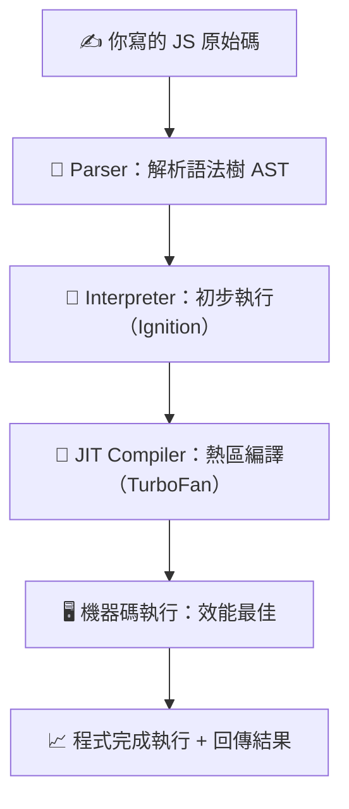
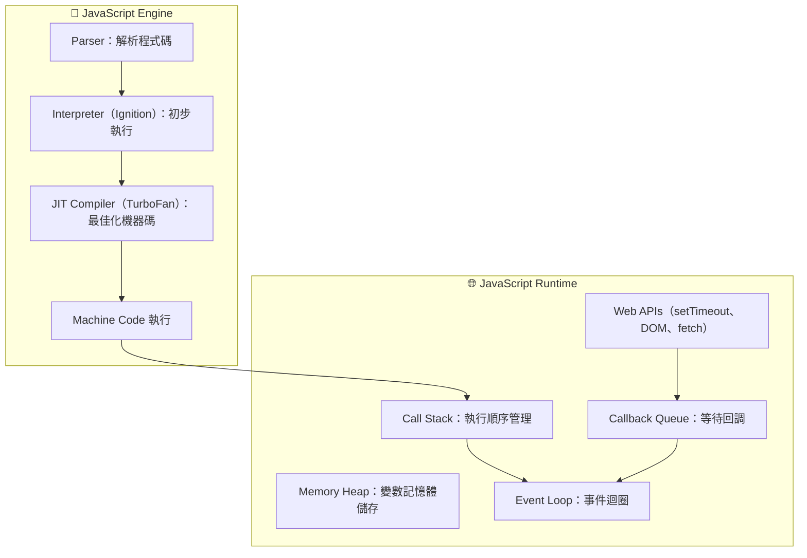

import Highlight from '@site/src/components/ui/Highlight.jsx';

<!-- export const Highlight = ({ children, color }) => (
<span
style={{
      backgroundColor: color,
      borderRadius: "20px",
      color: "#fff",
      padding: "10px",
      cursor: "pointer",
    }}
onClick={() => {
alert(`You clicked the color ${color} with label ${children}`);
}}

>

    {children}

  </span>
); -->

# JavaScript 基礎(上)

:::note
雖然有 GPT 這個好同事，但總是對自己學習觀念碎片化不太滿意，所以透過 zeromaster.io 平台課程學習好好的把 JS 觀念透過 output 筆記梳理起來！
:::

---

## 0️⃣ 開場

學習需要『儀式感』，這陣子了解自己的動能起伏，那個起伏是有一陣很熱血沸騰，有一陣很凍僵，但透過了解自己的特質是恆毅力滿強的，那就從儀式感(前置 5 分鐘)帶入：

> - <Highlight color="#f97316">泡好一杯咖啡 ☕</Highlight>

> - <Highlight color="#fda4af">打開 VS Code</Highlight>

> - <Highlight color="#60a5fa">新增一個 md 筆記</Highlight>

### 用一張圖片來概覽這篇章要複習的主題：

> 

這邊筆記主要以右側的基礎觀念為主，

這是 zerotomaster.io 提供的總覽心智圖

> [JS 高級觀念](https://coggle.it/diagram/XE3ZoVj-rtA5hcxj/t/advanced-javascript)

---

- 電腦只讀懂0和1，因此現在丟一隻JS程式碼給電腦，而沒有JS引擎的話，電腦是不能懂的。

## 1️⃣ JS Engin | JS 引擎(V8 or SpiderMonkey)

:::info JS 引擎
JS 引擎內部做了什麼？

> JavaScript 引擎負責<Highlight color="#25c2a0">讀取、解析、編譯、執行</Highlight> JS 原始碼，變成機器碼，使電腦設備能夠讀懂並且執行的語言

:::

> 

引擎內部運作如下：

> 

程式碼如何被 JS 引擎執行?



圖 2：JS 執行環境（Runtime）架構



:::success
<Highlight color="#25c2a0">ECMAScript</Highlight>

> 每個人都可以創建 JS 引擎，但必須遵照 ECMAScript 的標準（管理機構），一致化 JS 語言的標準以及定義如何運作，至於引擎要怎麼構建可以自己決定(只要符合 ECMAScript 下都可以)

:::

---

## 2️⃣ Interpreter / Compiler / JIT Compiler ｜解譯器 / 編譯器 / 即時編譯器

最初時，Brendan Eich 創建的 SpiderMonkey 引擎將 JS 程式碼解譯為 Bytecode(位元組碼)，SpiderMonkey 引擎可以在瀏覽器中運行，來告訴電腦這些程式碼是什麼

:::info

> 在程式設計中，通常有兩種方法可以將程式碼轉換成『機器碼 0 或 1』(CPU 可以懂的語言)

:::

<Highlight color="#25c2a0">解譯器 與 編譯器</Highlight>

> 

前面有提到 V8 引擎有使用了混合形編譯(JIT)使得兩個直譯與編譯的方式讓運行 JS 碼變得非常快

對比一下不同的程式語言


<Highlight color="#25c2a0">JIT Compiler 即時編譯</Highlight>


> 現在的 JS 是**混合型（Interpreter and Compiler）** 語言

---

## 3️⃣ Writing Optimized Code

IC

hidden classes

---

## 4️⃣ Call Stack and Memory Heap 呼叫堆疊 和 記憶堆疊

---

## 5️⃣ Stack Overflow 堆疊溢位

---

## 6️⃣ Garbage Collection ｜垃圾回收機制

- <Highlight>JS是一種垃圾回收的語言</Highlight>

:::info
- 在JS中的垃圾回收機制是使用一種叫『mark 和 sweep algotithm/標記掃瞄演算法』
- 在 JavaScript 中
  - Root Set 包含全域物件 window 或 global
  - 以及目前 Call Stack 中的變數
  - 還有被執行環境保留的 callback 與閉包參考
  - GC 會從這些 Root 開始判斷可達性
- > 先用圖解釋一下 JS 垃圾回收機制
:::

- > 

- <Highlight color="#1877F2">會標記出函式還有在使用的物件參考位置</Highlight>

> 


- <Highlight color="#C62828">會掃描沒有在使用的物件參考位置</Highlight> 
> 


- <Highlight color="#6A1B9A">執行垃圾回收機制</Highlight>
> 

---

圖中左邊 Root Set/根集合會是
- num1 → 610
- str1 → "一些文字"
- obj →（一個「記憶體位置」）

```jsx title="用程式碼來解釋：GC"

//分配記憶體位置給num1變數該區域儲存值610
const num1 = 610;

//分配記憶體位置給str1變數，變數該區域儲存值"一些文字"
const str1 = "一些文字";

//物件
let human = {
  first: "sui",
  last: "hsilan"
}


human = 5;
```

:::tip
重點一句話先記

- JS的primitive原始型別會直接存值，不是存參考
- 以下num1 與 str1 發生了什麼事（primitive）

- 實際記憶體狀態（概念）
- Call Stack 裡：
  - num1 → 610
  - str1 → "一些文字"

- 👉 值就直接跟著變數走
- 👉 不需要額外指到 Heap

- 因為：
  - number
  - string
  - boolean
  - null
  - undefined
  - symbol
- 都是 immutable（不可變）
- 引擎可以安全地直接放在 Stack
:::


- 細看物件：
- > 全域變數不是「永生」，只有「目前被參考」才活著

```js
//物件
let human = {
  first: "sui",
  last: "hsilan"
}


human = 5;
```

:::tip

🧠 執行前：記憶體狀態

- Root Set（左邊）參照剛剛的圖
  - 全域變數 human → 指向 Heap 的物件（右側記憶體參考位置）

- Memory Heap（右邊）
  - 某個物件：
    - `first → "sui"`
    - `last → "hsilan"`
- 👉 此時物件可達

:::

- 🔁 執行 human = 5 發生什麼？
  - 這一行做了關鍵的一件事：
    - human 不再指向物件
    - human 改成存 primitive 值 5
  - 現在 Root Set 長這樣：
    - human → 5（primitive）
  - Heap 呢？
    - `{ first, last }`
    - ❌ 沒有任何 Root 指向

:::tip
- 🧹 GC 怎麼看？
  - GC 規則還是一樣：
  - 從 Root Set 走不到 = 不可達
```js
  { first: "sui", last: "hsilan" }
```
- 👉 在下一輪 Garbage Collection 中會被回收
:::


### 多做GC練習：「不會被 GC」的反例

```js
let human = {
  first: "sui",
}

const backup = human
human = 5

```

- backup 還指著那個物件
- Root Set 仍走得到該物件的位置
- 👉 物件不會被 GC

### 函式裡的物件，只要函式執行完、沒有被外面留住參考，就會變成 GC 候選對象

- <Highlight>「函式結束後，Root 還走不走得到」</Highlight> 

- 情境一：最單純的情況（會被 GC）

```js
function test() {
  let human = {
    first: "sui",
  }
}

test()

```

- 執行時發生什麼？
  - 1️⃣ test 執行中
    - Call Stack：
      - test 的執行環境
      - human → 指向 Heap 的物件
    - Heap：
      - `{ first: "sui" }`
- 👉 此時物件是可達的

  - 2️⃣ test 執行結束
    - test 的執行環境從 Call Stack 移除
    - human 這個變數消失
    - Heap 裡的物件 再也沒有任何 Root 指向
- 👉 物件變成不可達

- ✅ 結論
  - ➡️ 該物件 會在之後某一輪 GC 被回收

### ❌ 為什麼有時候「不會被 GC」:閉包

```js
function outer() {
  let human = {
    first: "sui",
  }

  return function inner() {
    console.log(human.first)
  }
}

const fn = outer()

```

- Root Set 裡有什麼？
  - 全域變數 fn
  - fn 指向 inner 函式
  - inner 函式 關閉式地參考 human
- 👉 human 仍然走得到

- ✅ 結論
  - ➡️ 該物件 ❌ 不會被 GC
  - 即使：outer 已經執行完
  - outer 的 Stack frame 已經消失

### 承接閉包=> 把參考斷掉，就能 GC

```js
let fn = outer()
fn = null
```
- 發生什麼？
  - inner 函式不再被參考
  - human 也一起變成不可達
  - 👉 下一輪 GC 全部清掉

:::tip
- GC 只看「從 Root 走不走得到」
- 函式結束 ≠ 一定被回收
- 閉包是最常見的「記憶體留下來的原因」

- 函式內建立的物件
- 在函式執行期間會被 Call Stack 參考
- 函式結束後若沒有被外部變數或閉包保留
- 就會變成不可達
- 在之後的垃圾回收週期中被回收

- 判斷方式，從全域或正在執行的函式，還走得到它嗎？
:::
---

## 7️⃣ Memory Leaks 記憶體洩漏

- <Highlight>當Memory Heap中變得太大直到極限，就會發生Memory Leaks 記憶體洩漏</Highlight>
---

## 8️⃣ Single Threaded Model ｜單執行緒模型（事件迴圈）

---

## 9️⃣ JavaScript 執行時環境(JS Runtime)

---

## 🔟 Node.js 執行環境

- `src/pages/index.js` → `localhost:3000/`
- `src/pages/foo.md` → `localhost:3000/foo`
- `src/pages/foo/bar.js` → `localhost:3000/foo/bar`


