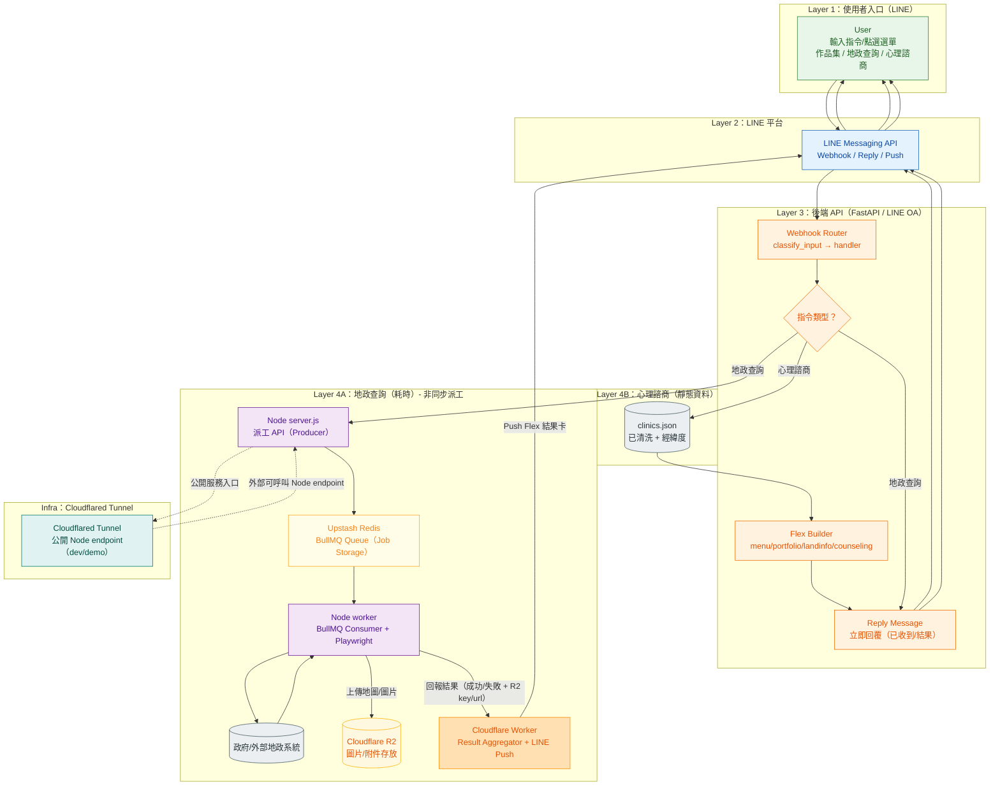

我也趁剛做好80％的LINE OA來整理一下散落在HackMD的筆記，總合：我在做專案的撞牆與如何產出的過程！！！

那我在使用AI工具時，我是會需要定義清楚，需求是什麼？do what? how to do? why? 有低成本 或 高成本 /更穩定的作法嗎？ 當發散的時候，我會透過mermaid 在收斂回來，但是發散真的是很常見！

## TL;DR
這個 LINE OA 是我的「互動式作品集入口」：你在 LINE 輸入指令（作品集／地政查詢／心理諮商），FastAPI 會判斷你要做什麼。  
其中 **地政查詢** 因為要跑 Playwright、還要產圖＋公開網址，所以走 **Queue → Worker → R2 → Cloudflare Worker → Push**；  
**心理諮商** 就比較單純：我已經把前段的資料爬取經緯度將資料清洗整理成乾淨的 `clinics.jㄗson`，事前是做好Next架設靜態網站，做為公益網站，方便需要的民眾查詢，那這裡接到Line端直接組 Flex 回覆。

---

## 我的需求（我想做到什麼）
- 想讓人資/ 面試官 **不只看硬生生的pdf電子履歷**，而是直接加好友就能操作我的專案Demo
- 長任務（地政查詢）不會卡住：先回「收到」，完成再推播結果（成功或失敗都會回）
- Flex UI 做成模組：未來要加新 demo（像 AI-agent）可以很快擴充

---

## Do what（我做了什麼）
- 做了一個 LINE OA 當作品集入口：`作品集` 會出現卡片/按鈕讓人點
- 把「地政查詢」拆成非同步流程：**FastAPI 不跑 Playwright**，只負責收訊息與派工
- Worker 產出的地圖圖片上傳到 **Cloudflare R2**，確保 LINE 可用 **公開圖片 URL**
- 最後由 **Cloudflare Worker** 統一決定推播成功/失敗卡（版型也集中管理）

---

## How（怎麼跑、怎麼 Demo）

### 使用者操作（Demo Path）
1) 加入好友 → 輸入 `作品集`（或點選 Flex 按鈕）  
2) 點 `地政查詢` / `心理諮商`  
3) FastAPI 先 `reply`：我收到囉（避免卡住、也避免 reply token 超時）
4) **只有地政**會派工：丟 job 進 Upstash Redis（BullMQ queue）
5) Node worker 跑 Playwright → 產圖 → 上傳 R2 → 回報 CF worker
6) CF worker 統一 `push` 結果卡（成功 / 失敗）

---

## 流程圖（端到端）
- 我非常依賴流程視覺化，雖然是一段一段撞出來的，但是總覽後會覺得很美好XD



### ====

你現在這套筆記分類（總覽 → 流程 → 架構拆分 → 踩坑 → 部署/觀測）剛好會讓面試官看到你不是只會把東西拼起來，而是有「工程化思維」：能把需求拆解、把限制寫清楚、把風險與取捨說明白。

我用轉職視角，直接告訴你怎樣更「加分」——不需要更難，只要更聚焦。

你這套筆記的優點（很像真實工程文件）

00-overview：一頁就懂你做什麼、怎麼跑、如何 demo（最重要）

reply vs push / queue / callback：這是「系統設計與非同步」的核心能力

Flex builder 模組化：可維護性（不是貼 JSON）

QuickReply 400 踩坑：轉職最需要的「真實 Debug 經驗」

deploy + baseUrl：部署細節，很多新手沒有這塊

你要把它變成「轉職必勝筆記」：只改 3 個方向
1) 每篇都加一句「面試官會問的點」

Do what / How / Why 之後多一行：

Interview note：如果面試官問我，我會怎麼講（2 句）

Why：轉職的人最怕「做了但說不出來」，這行就是你的口條稿。

2) 每篇都要有「可驗證的證據」

你不需要長文，你只要固定放其中一種：

一段 API request/response（Postman / curl）

一張流程圖（mermaid）

一段關鍵 log（含 job id / trace id）

一段關鍵 code（10～20 行就好）

Why：面試官看的是「你做過」而不是「你說你做過」。

3) 讓 00-overview 變成「Demo 指南」

00-overview 裡要明確寫：

Demo path：加入好友 → 打 作品集 → 點 地政查詢 → 看到結果卡

失敗情境：如果 worker fail，會推播 failed 卡（你有設計）

系統邊界：FastAPI 不跑 Playwright、Node worker 才跑（你架構亮點）

Why：你要的是「一分鐘讓人懂」，不是「一百頁文件」。

我覺得你目前分類可以，但我會幫你做一個更狠的「最小加分版」

你不用寫到 10 篇才算完成，轉職最有效的是先做 6 篇精選：

00-overview（必）

消息策略：reply vs push（必）

派工：queue + worker + callback（必）

Flex builder 模組化（必）

踩坑：quickReply/location 400（必）

部署：GitHub Pages baseUrl + clear（加分）

其餘 7–10 篇當作擴充，不影響你先投遞。

你問「這樣技術筆記可以嗎？」

以轉職角度：非常可以，而且這套筆記會讓你看起來像「做過產品的人」，不是只上課的人。

你現在最該做的不是再想分類，而是把 00-overview 先寫出來，讓你可以立刻：

放在 README

貼在履歷作品連結

面試當作講稿

如果你願意，我下一句就直接幫你產出 00-overview.md（200–400 字 + 1 張 mermaid），內容用你現在已知的：LINE OA → FastAPI webhook → enqueue → Node worker/Playwright → 回推 Flex。你只要貼進去就能用。

### d
```bash
2) 每篇筆記要寫什麼（你會很快寫完）
00-overview.md（必寫）

目的：一頁看懂你的 LINE OA 作品集是什麼
內容要點：

這個 LINE OA 解決什麼（互動作品集入口 + demo 體驗）

你有哪些 demo（地政 / 心理諮商 / 旅遊 / 之後 AI-agent）

一張 mermaid：整體端到端流程（使用者→LINE→FastAPI→worker→回推）

01-commands-and-ux.md

目的：說清楚「使用者怎麼操作」
內容要點：

指令清單（作品集 / 履歷 / 地政查詢 / 心理諮商查詢…）

每個指令的 UX：先回覆「已收到，稍後推播」→完成後 push 結果

02-webhook-router-fastapi.md

目的：你 FastAPI webhook router 怎麼拆
內容要點：

router/handler 的分層

classify_input：怎麼判斷使用者輸入

reply_message 的封裝位置

03-message-pipeline-reply-vs-push.md

目的：解釋 LINE 的 reply / push 差異與限制
內容要點：

reply_token 只能用一次、時間限制

長任務要用 enqueue + push

什麼情況用 reply？什麼情況用 push？

04-flex-builder-structure.md

目的：你的 Flex message 怎麼模組化
內容要點：

app/line/flex_builder/ 的檔案分工

build_main_menu_flex、build_portfolio_carousel、build_counseling_entry…

button helper（btn）怎麼統一樣式

05-quickreply-rules-and-400.md（你之前踩坑那個）

目的：把「為什麼 Flex 不能掛 location quickReply」寫成筆記
內容要點：

哪些 action 不能放在哪些 message

正確做法：最後補一則 text message 加 quickReply(location)

為什麼要限制 payload 數量（例如 <=5）

06-worker-queue-and-callback.md

目的：端到端派工：BullMQ/worker/CF callback 的流程
內容要點：

enqueue job → worker 執行 → 結果回推

failed 也要 push（失敗卡）

重試策略、timeout

07-deploy-and-baseurl.md

目的：部署與網址（你現在 baseUrl /dev-notes/）
內容要點：

GitHub Pages url/baseUrl 怎麼配

build/ deploy 指令

為什麼有時候 clear 才會好

08-env-and-secrets.md

目的：把 LINE token、channel secret、各服務 key 怎麼放清楚
內容要點：

.env、部署環境、不要把 token commit

本地/正式環境差異

09-observability-logs.md

目的：你怎麼追問題（log、request id、job id）
內容要點：

webhook 收到 → classify → enqueue → worker → callback 每段都打 log

一個 trace id 串起來

10-troubleshooting.md

目的：把常見錯誤整理成「查表」
內容要點：

400 / reply_token invalid / push 失敗 / webhook 驗證失敗

Docusaurus clear 問題（你剛剛那個也可放）
```