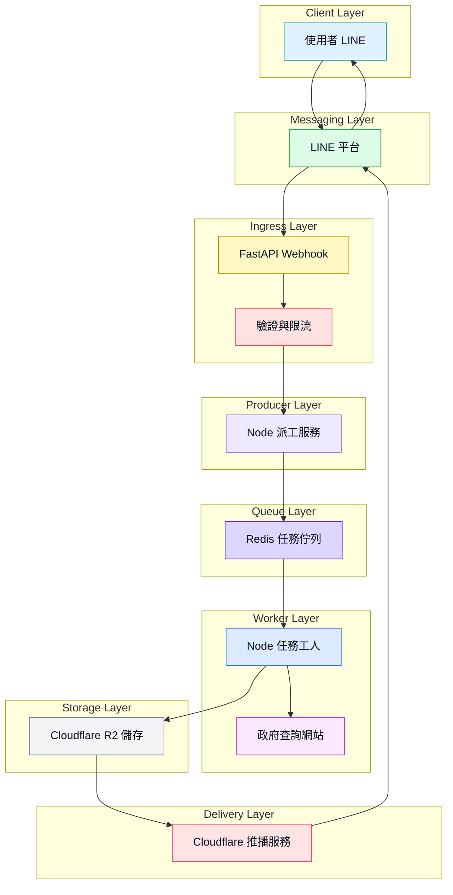

# LandInfo LINE OA Demo

把 **[地政便民圖資查詢](https://easymap.moi.gov.tw//Z10Web/Normal)** 接到 LINE OA(我的專案互動作品集 | 展示用途)，讓使用者體驗 在LINE 輸入段名地號後，
後端以非同步任務執行自動化查詢，並用 Push 回傳結果卡片到LINE

- FastAPI：LINE webhook 入口與流程編排
- Node server：Producer 派工，將查詢轉為 job 丟進 Queue
- Worker：Playwright 執行查詢與截圖，完成後 Push 回傳

## Demo(補line操作截圖)

- 使用者輸入：段名 地號
- 範例：XXX段 1306
- 系統先回覆已收到，完成後推播結果與圖片連結

## 流程圖


## 專案結構

```bash
.
├─ cloudflared/
│  └─ cloud_worker.js   ## Cloudflare Worker 端 點與推播(僅放程式碼)
├─ services/
│  ├─ helpers/          ## 段名段號解析與工具
│  ├─ src/              ## middleware 與共用模組
│  ├─ utils/            ## 小工具
│  └─ public/           ## 本機暫存或靜態輸出
├─ browser-singleton.js ## Playwright browser 共用與重啟策略
├─ index.js             ## Playwright 查詢與截圖主流程
├─ queue.js             ## BullMQ 與 Redis 連線
├─ server.js            ## 派工入口 enqueue only
├─ worker.js            ## 消費任務 跑爬蟲 上傳 R2 通知推播
├─ .env.example
└─ package.json

```


## 專案模組描述（依執行順序）

以「一次查詢從入口到推播」的順序排列:


> 1️⃣ <Highlight> server.js | 派工入口（Producer）</Highlight>

- Do what：
    - 提供派工 API：POST /jobs  
    - 接收查詢參數後 enqueue 到佇列並立即回 jobId 與 traceId
    

- How：
    - POST /jobs 經 requireJobToken 驗證與 rateLimitByUserId 限流
    - 呼叫 crawlQueue.add 建立 job，payload 內包含 userId 與 traceId

- Why：
    - Webhook 需要快回，避免入口卡住
    - FastAPI 不跑瀏覽器；派工集中在 Node 讓 job 規格一致、可擴充

---

>  2️⃣ <Highlight> queue.js | 佇列與連線（Queue） </Highlight>

- Do what：
    - 建立 BullMQ queue 與事件監聽，並處理 TLS 連線設定

- How：
    - 用 ioredis 依 rediss 自動開 TLS
    - QueueEvents 使用獨立連線，避免事件與 job 流互相影響

- Why：
    - BullMQ 對 Redis 連線選項有建議值
    - 事件監聽獨立連線通常更穩定，方便追 job 完成或失敗


---

> 3️⃣ <Highlight> worker.js | 任務執行（Consumer）</Highlight>

- Do what：
    - 消費 queue 任務，執行 Playwright 查詢
    - 將截圖上傳到 Cloudflare R2
    - 並通知 Cloudflare Worker 推播結果到 LINE

- How：
    - 取 job payload（含 city/district/section/landNo/userId/traceId）
    - 取得共用 browser（ensureBrowser）
    - 呼叫 scrapeLandInfo 產出本機 PNG 與文字資料
    - 呼叫 Cloudflare Worker /presign 拿 PUT URL，上傳 PNG 到 R2
    - 再呼叫 Cloudflare Worker /result回報結果，交由 CF Worker 推播

- Why：
    - LINE 需要可公開存取的圖片 URL(本機路徑不可用)
    - 推播集中在 Cloudflare Worker，讓交付層可重用也更安全
    - 爬蟲與推播解耦，任務失敗也能回報錯誤摘要

---


> 4️⃣ <Highlight> browser-singleton.js | 瀏覽器資源管理（Worker 內部）</Highlight>

- Do what：
    - 讓多個任務共用同一顆 browser，並以壽命與使用次數控制定期重啟

- How：
    - ensureBrowser 回傳可用 browser
    - 超過時間或次數就重啟並自動恢復
    - markBrowserUsed 記次
    - 瀏覽器異常中斷可自動恢復

- Why：每個 job 都 launch browser 會慢且耗資源
    - 長時間不重啟可能累積記憶體導致不穩
    - 定期重啟更可靠

---

> 5️⃣ <Highlight> index.js | 爬蟲主流程（Worker 內部）</Highlight>

- Do what
    - Playwright 自動操作新版地籍便民系統
    - 支援段號或段名，擷取文字表格成 JSON
    - 調整地圖縮放避免裁切，等待重繪後截圖輸出檔案

- How
    - 段號優先
    - 沒有段號就用 resolveSection 解析段名取得段號
    - 點擊走 safeClick 避免遮罩阻擋
    - 縮放後用 waitMapStable 等畫面穩定再截圖

- Why
    - 新版查詢需要段號；使用者輸入段名較自然
    - 地圖渲染未完成就截圖會截到舊畫面或裁切

---

> 6️⃣ <Highlight> cloudflared [cloud_worker.js] | 推播與 R2 上傳門面（Delivery）</Highlight>

- Do what
    - 提供 /presign 給 worker 上傳圖片到 R2
    - 提供 /result 統一處理推播到 LINE

- How
    - worker 呼叫 /presign 取得 PUT URL 後，上傳 PNG 到 R2
    - worker 呼叫 /result 帶 userId 與 imageUrl，由 CF Worker 推播回LINE端

- Why
    - 上傳與推播集中在同一層交付服務，爬蟲端不用直接握住推播邏輯與憑證
    - 便於統一重試、統一格式、未來可支援更多任務結果交付

---

## Local Run（可複製指令）

0) 安裝依賴
```bash
npm install
```

1) 建立環境變數
```bash
cp .env.example .env

## 依序要設定以下變數

### Redis
REDIS_URL=...

### Queue
WORKER_CONCURRENCY=1
HEADLESS=false（本機除錯）

### Cloudflare Worker
CF_WORKER_URL=...
WORKER_TOKEN=...

### Node 派工 API 門禁
NODE_JOB_TOKEN=...

#其他像 CITY/DISTRICT/SECTION/LANDNO 是本機跑 index.js 或 worker 的預設值用 ===> 如果 job payload 有帶，會覆蓋

```


2) 啟動 Redis（推薦：Docker）
- 原先我使用upstash託管的redis，但是額度滿了，我改用Docker
- 本專案使用 BullMQ（Redis-based queue）。為了確保 queue 穩定，建議使用可設定 noeviction 的 Redis。
- 本機開發 / Demo 最推薦 Docker 方式，避免 Upstash 免費方案額度與 eviction policy 造成不穩定。
- 記得Docker要開啟喔！

```bash
docker run --rm -d \
  --name redis-queue \
  -p 6379:6379 \
  redis:7-alpine \
  redis-server --maxmemory-policy noeviction

# 驗證 Redis 已啟動
docker exec -it redis-queue redis-cli ping
# 預期：PONG


# 查看 Redis 記憶體使用量（可選）
docker exec -it redis-queue redis-cli INFO memory | grep used_memory

# 我本機啟動後觀察到（示例）：
used_memory:1044416
used_memory_human:1019.94K

# 最後把 .env 指到本機 Redis：
REDIS_URL=redis://127.0.0.1:6379

# 停止 Redis（需要時）：
docker stop redis-queue


```

2-1) 其他選項：使用託管 Redis（不推薦 Upstash 當 BullMQ queue）

你仍然可以使用託管 Redis（只要 .env 的 REDIS_URL 正確），但建議選擇可設定 maxmemory-policy=noeviction 的方案，避免 queue 的 job/lock key 被驅逐導致不一致。

<Highlight> 我一度遇到Troubleshooting： Upstash 額度滿的狀況，才改用Docker </Highlight>


3) 啟動 Node 派工服務（Producer）& 啟動 Worker（Consumer）
只要一個指令：
```bash
npm run start:all
```

因為我已經寫腳本指令:
```json
"scripts": {
    "start:server": "node services/server.js",
    "start:worker": "node services/worker.js",
    "start:all": "concurrently -n server,worker -c auto \"node services/server.js\" \"node services/worker.js\"",
    "test": "echo \"Error: no test specified\" && exit 1"
  }
```


若 => 驗證健康檢查：
```bash
curl http://127.0.0.1:3001/health
```


5) 本機測派工 ｜ 或也可以使用 Postman測試
:::tip 本機測 / Postman測
注意： /jobs 有 token 門禁，測試時要帶 authorization。
:::

```bash
curl -X POST http://127.0.0.1:3001/jobs \
  -H "content-type: application/json" \
  -H "authorization: Bearer YOUR_NODE_JOB_TOKEN" \
  -d '{
    "userId": "Uxxxxxxxxxxxx",
    "city": "H",
    "district": "13",
    "section": "XXX段",
    "landNo": "1000"
  }'

```
- 會拿到 jobId 與 traceId
- 接著 worker 會開始跑：截圖 → 上傳 R2 → 呼叫 CF Worker 推播