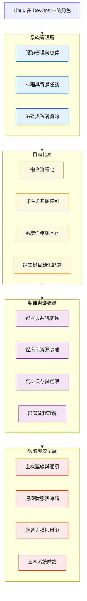

## 🟧 我的學習方式
我不想是完全依照章節線性進行死死的學一門課，因為我過往學習比較是從動手做，遇到坑，想方設法解決跟找答案或透過模仿相似的模式來協助理解，然後事後回過頭整理理解使用Mermaid來協助整理架構，雖然這樣速度慢，但我很享受這種學習方式，很紮實。

我上課前，會和GPT同事討論，這門課的定位與內容含金量以及課程整體的架構圖，並討論學習方式，那這次的定位是：

- 「如何用 DevOps 工程師視角，重新組織這堂 Linux Sysadmin 課程」(GPT同事幫我定位的，學習這門課的方法)

---

## 🟦 搭配Raspberry Pi 4 + Raspberry Pi OS Lite
這是我在學習這門課時，搭配操作Raspberry Pi 4作為Linux Server，Pi 4是去年我在健行科大職訓局受訓的AIOT工程師實戰班得到的戰利品，剛好又再一次用上了！

讓我複習了起來：
:::tip My tip

✅ 1. 樹莓派作業系統選擇: Raspberry Pi OS Lite(Headless Linux Server)

✅ 2. 開機後，設定username＝登入這台機器的使用者
    - username 和 password(建立第一個 Linux user)
        - **是我 SSH 登入用的**
        - **是我 sudo 的身份**
        ≈ 我在這台 server 的「主要操作者」

✅ 3. server name(hostname) | 這台 linux server 機器Pi的名字

✅ 4. 網路連線設定
```bash
sudo raspi-config
```
會進入到 Raspberry Pi 的系統設定工具（TUI）

✅ 5. 選擇網域國家
- 系統層在做的事是：
- 設定無線法規區域
- 決定允許的 Wi-Fi 頻道
- 沒設 → 無線可能直接不起來

✅ 6. Wireless 設定=> 設定：SSID和Password
- 實際上是在做：
    - 寫入 wpa_supplicant 設定
    - systemd 開機時會讀這份設定
    - 自動連線

✅ 7. 重開機讓設定生效(我只是想驗證這台 server 每次開機都能自動連網)
```bash
sudo reboot
```
:::

> 我在 Raspberry Pi 4 上安裝 Raspberry Pi OS Lite，
> 以 Headless Server 為前提建立 Linux 使用者與 hostname，
> 透過 raspi-config 設定 WLAN 國家碼與 Wi-Fi 連線，
> 驗證 systemd 與網路服務在重開機後能自動恢復連線，
> 作為後續系統服務與自動化實驗的基礎環境。

```
硬體
↓
作業系統
↓
使用者
↓
網路
↓
可重開機復原
```

### 0️⃣ 系統更新『流程』
其實我一直搞不懂以下兩個指令，順便好好趁機搞清楚：

<Highlight color="#1877F2">在 Linux 世界裡，系統更新不是一個動作，而是一個流程。先知道「現在最新是什麼」，再決定「要不要更新」</Highlight>

> 讓這台 Linux Server 的套件狀態，與「官方倉庫的已知狀態」同步。

為了：
- 安全性
- 可預期性
- 降低除錯成本

指令：
```bash
sudo apt update
```

:::tip My tip
系統層實際在做的事：
- 連線到套件倉庫（repository）
- 下載「套件清單（index）」
- 不會安裝任何東西

:::

<Highlight>apt update = 更新「目錄」，不是更新「軟體」</Highlight>

--- 

指令：
```bash
sudo apt upgrade
更常用加 -y 
sudo apt upgrade -y 
# -y = automatically answer yes
```

在 Server / CI / 自動化裡：
- 沒人可以在那邊按 y
- 所以要自動化(寫 script 一定會用的習慣)

:::tip My tip

系統層實際在做的事：
比對：
- 目前安裝的套件版本
- 倉庫裡最新的版本
    - 有新版 → 升級
    - 沒新版 → 不動

:::

<Highlight>apt upgrade = 根據剛剛的目錄，真的更新套件</Highlight>

> 統整一下 系統更新在「整個 Server 生命週期」的位置

```
開機
↓
網路起來
↓
SSH 登入
↓
系統更新   ← 你現在在這裡
↓
安裝服務
↓
跑應用程式

```

### 1️⃣ 繼續設定 SSH(安全的遠端登入協定) 
> SSH = DevOps 工程師跟 Server 對話的主要方式 
> 目的：我想要讓我的Linux server可以被遠端(筆電/AWS EC2)都可以連進來

步驟：
:::tip My tip

✅ 1.確認 SSH 有沒有啟用
```bash
sudo systemctl status ssh
```

✅ 2.啟用 SSH（如果沒開）
```bash
sudo systemctl enable ssh # enable：開機自動啟動
sudo systemctl start ssh # 現在立刻啟動

```

✅ 3.確認 Pi 的 IP(這台 Linux Server 在「網路世界」中的地址)
```bash
hostname -I
```
簡單來說，hostname是人看的懂的，ip是網路實際用來找機器的地址

✅ 4.從另一台裝置 SSH 進來
讓遠端client連進我的linux server
```bash
# 「用誰 @ 在哪一台機器」
ssh xx@linux server_ipaddr
```
:::

--- 

## 🟦 課程順序 × 提綱契領

```mermaid
flowchart TD
    A[Linux 系統核心能力] --> B[操作基礎層]
    A --> C[系統管理層]
    A --> D[自動化層]
    A --> E[容器與部署層]
    A --> F[網路與安全層]

    %% 基礎層
    B --> B1[終端操作與指令理解]
    B --> B2[檔案系統與結構]
    B --> B3[權限與使用者]
    B --> B4[程序與資源觀念]

    %% 系統管理層
    C --> C1[服務管理]
    C --> C2[排程與背景任務]
    C --> C3[磁碟與掛載]
    C --> C4[系統啟動與常駐服務]

    %% 自動化層
    D --> D1[指令流程化]
    D --> D2[條件與迴圈控制]
    D --> D3[系統任務腳本化]
    D --> D4[跨主機自動化觀念]

    %% 容器層
    E --> E1[容器與系統關係]
    E --> E2[程序隔離與資源限制]
    E --> E3[資料保存與權限]
    E --> E4[部署流程理解]

    %% 網路與安全層
    F --> F1[主機連線與通訊]
    F --> F2[連線監控與除錯]
    F --> F3[帳號與權限風險]
    F --> F4[基本系統防護]

    %% 樣式定義
    classDef base fill:#E8F5E9,stroke:#2E7D32,stroke-width:1px
    classDef admin fill:#E3F2FD,stroke:#1565C0,stroke-width:1px
    classDef auto fill:#FFF8E1,stroke:#F9A825,stroke-width:1px
    classDef container fill:#F3E5F5,stroke:#6A1B9A,stroke-width:1px
    classDef security fill:#FBE9E7,stroke:#D84315,stroke-width:1px

    class B,B1,B2,B3,B4 base
    class C,C1,C2,C3,C4 admin
    class D,D1,D2,D3,D4 auto
    class E,E1,E2,E3,E4 container
    class F,F1,F2,F3,F4 security

```


- 分段看：


其實生活中我在實務專案中已經頻繁使用 Linux 指令與環境，但欠缺的是——
如何用「系統管理與自動化」的角度，重新理解這些操作。

因此，我將課程內容重新整理為幾個能力層級，並調整學習順序：
- 先從「系統如何被管理」開始
- 再進入「如何把維運工作自動化」
- 接著理解容器與部署背後的 Linux 行為
- 最後補上網路與安全的整體視角

--- 
## 🟥 課程章節分配
### 0️⃣ Week 1｜Linux 系統管理的骨架（先建立視角）

> 主線章節: Section 17｜System Administration
- cron / anacron
- systemd / systemctl
- mount / df

- 這週要做到的事（很重要）
:::tip My tip

Linux 服務怎麼啟動、停止、重啟

任務怎麼排程

:::


- 實際做一件小事：
:::tip My tip
用 cron 跑一個你現有的專案任務

或用 systemctl 管一個服務
:::


📌 這週的定位
<Highlight color="#1877F2">「開始用 Linux 管系統，不只是下指令。」</Highlight> !

---

### 1️⃣ Week 2–3｜Bash 自動化（DevOps 核心能力）

> 主線章節: Section 20｜Bash Shell Scripting（選重點）
- variables
- if / elif / else
- for / while
- functions
- 這週要做到的事（很重要）
:::tip My tip

寫一支完整 script

一定要有的產出

:::


👉 至少一支「真的能用」的 Bash script

範例（選一個就好）：
- 檢查服務是否存活
- 跑資料更新流程
- 部署前檢查環境

📌 這兩週的定位
<Highlight color="#1877F2">「我能用 Bash 把重複的維運工作自動化。」</Highlight> !

---

### 2️⃣ Week 4｜Ansible（理解定位，不鑽太深）

> 主線章節: Section 30｜Automating with Ansible

重點不是寫 Playbook

而是回答這個問題：

:::tip My tip

「什麼情境下，我會選 Ansible，而不是 Bash？」

:::


📌 這週的定位
<Highlight color="#1877F2">「我知道自動化工具的分工，而不是只會硬寫 script。」</Highlight> !

---

### 3️⃣ Week 5｜Linux × Docker（把實作過的講完整）

> 主線章節: Section 23｜Podman（觀念）
> 主線章節: Section 24｜Docker Project

要整理的是
- Linux process / permission / volume
- 為什麼 container 會需要這些

📌 這週的定位
<Highlight color="#1877F2">「我理解 Docker 背後的 Linux 系統行為。」</Highlight> !

---

### 4️⃣ Week 6｜網路與連線（Server 必備）

> 主線章節: Section 13｜Networking（選重點）
- ip / ssh
- ports / ss / netstat
- scp / rsync


📌 這週的定位
<Highlight color="#1877F2">「我能在 Linux Server 上查連線、解問題。」</Highlight> !

---

### 5️⃣ Week 7｜安全觀念（拉高度，不鑽洞）

> 主線章節:Project #2｜Security Hardening
- sshd / sudo / permissions


📌 這週的定位
<Highlight color="#1877F2">「我知道 Linux Server 的基本安全風險與防護方向。」</Highlight> !

---

### 6️⃣ Week 8–10｜尾聲

📌 這兩週的定位實作：
<Highlight color="#1877F2">「在專案中使用 Linux 進行系統管理與自動化，包含 Bash 腳本、排程、Container 與基本網路設定。」</Highlight> !

