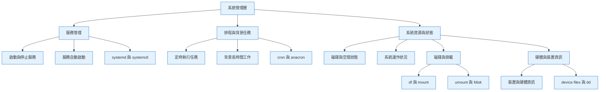

## Week1：Linux 系統管理的骨架



---

## 排程與背景任務

> CRON 排程工具（Linux）

### 一、CRON在做什麼（What）

 **CRON**，一個 Linux 系統中用來**定時執行指令或腳本**的核心工具。

理解：

* CRON 是什麼角色
* 什麼事情適合交給 CRON 做
* 使用者層級 vs 系統層級排程的差異

核心觀點是：

> 幾乎沒有一台正式的 Linux Server 是沒有 CRON 任務的。

:::tip My tip

CRON 主要用來**自動化重複性工作**，例如：
* 備份資料
* 監控磁碟空間
* 系統更新
* 寄送通知信
* log 輪替
:::


---

### 二、怎麼做（How）

#### 1️⃣ CRON 的基本概念

* CRON 以 **daemon（背景服務）** 方式運作
* 每一個排程任務叫做 **CRON job**
* CRON 會依照**設定的時間**去執行指令或腳本

---

#### 2️⃣ CRON tab 的三個意思

#### 1. **使用者的 crontab 檔案**

   * **每個使用者都有一份**
   * 裡面存**該使用者**所有排程任務
   * Ubuntu 路徑通常在
     `/var/spool/cron/crontabs`
   * 只有 root 可以直接存取

#### 2. **crontab 指令**

   * 用來管理 crontab 檔案（新增、編輯、刪除）

#### 3. **系統層級的 crontab 設定檔**

   * 位於 `/etc/crontab`

---

#### 3️⃣ 使用者層級 CRON（最常用）

##### 常用指令

* 查看目前使用者的排程
  `crontab -l`

* 編輯目前使用者的排程
  `crontab -e`

* 刪除目前使用者的所有排程
  `crontab -r`


⚠️ **不建議直接用編輯器打開檔案**

原因：
* crontab 指令會幫忙做格式驗證
* 避免語法錯誤導致整份排程失效

---

#### 4️⃣ CRON job 的格式（核心）

每一行代表一個任務，共 **六個欄位**：

```
分鐘 小時 幾號 月份 星期 指令
```

說明：

* 前五個欄位 → 什麼時候跑
* 最後一個欄位 → 要執行什麼

時間欄位意義：

* 分鐘（0–59）
* 小時（0–23，24 小時制）
* 每月第幾天
* 月份
* 星期（0 或 7 代表星期日）

---

#### 5️⃣ 常見符號用法

* `*`
  代表「每一個」
  例如每天、每小時、每分鐘

* `,`
  指定多個離散值
  例如：4,6,10 點

* `-`
  指定範圍
  例如：9 到 17 點

* `/`
  指定間隔
  例如：每 3 天一次

---

#### 6️⃣ 範例理解（用白話）

* **每天早上 6 點跑備份**

  * 分鐘 0
  * 小時 6
  * 其他欄位全部用 *
  * 指令寫備份腳本的完整路徑

* **只在星期日早上 6 點跑**

  * 星期欄位填 0 或 7

* **每分鐘監控磁碟空間**

  * 分鐘用 *
  * 其他時間欄位用 *

* **上班日 9 點到 17 點，每小時跑**

  * 小時用 9-17
  * 星期用 1-5

* **每 3 天在固定時間跑**

  * 使用 */3

---

#### 7️⃣ 特殊關鍵字（不用記數字）

* `@yearly` / `@annually`
  每年 1 月 1 日 00:00

* `@monthly`
  每月 1 號 00:00

* `@weekly`
  每週日 00:00

* `@daily`
  每天 00:00

* `@hourly`
  每小時整點

* `@reboot`
  系統開機時執行

---

#### 8️⃣ 實務驗證方式

* CRON 的執行紀錄會寫入系統 log

  * Ubuntu：`/var/log/syslog`
  * CentOS：`/var/log/cron`

* 可用即時追蹤方式確認是否有執行

---

#### 9️⃣ 管理其他使用者的 CRON（root）

* 編輯某使用者的排程
  `crontab -e -u 使用者`

* 刪除某使用者的排程
  `crontab -r -u 使用者`

---

#### 🔟 權限控制

:::danger Take care

* 透過兩個檔案控制誰能用 crontab

  * `cron.allow`
  * `cron.deny`

:::


---

#### 1️⃣1️⃣ 系統層級 CRON（system-wide）

除了使用者 crontab，系統還有這些目錄：

* `/etc/cron.hourly`
* `/etc/cron.daily`
* `/etc/cron.weekly`
* `/etc/cron.monthly`

做法很單純：

* 把腳本丟進對應目錄
* 系統會在固定時間以 root 身份執行

實際執行時間由 `/etc/crontab` 定義
例如：

* weekly 是星期日早上 6 點 47 分

---

### 三、為什麼這樣做（Why）

* CRON 是「最基本、最可靠」的 Linux 自動化工具
* 不需要額外套件
* 適合：

  * 例行任務
  * 不需要即時反應的工作
* 但 **不適合高頻（秒級）任務**

  * 最小單位是「分鐘」

另外一個重要限制：

:::danger Take care

* **系統關機時，CRON 不會補跑**
* 所以適合「一直開機的伺服器」

這也是為什麼下一個筆記會介紹 **anacron**。

:::


---

### 四、關鍵字

* daemon：背景服務
* CRON job：排程任務
* crontab：CRON table
* system-wide crontab：系統層級排程
* absolute path：絕對路徑
* environment variables：環境變數

⚠️ 最常踩雷：

> CRON 的 PATH 跟你登入 shell 的 PATH 不一樣
> 👉 指令一定要用「完整路徑」

---

### 五、我個人專案情境來說

對我的專案情境來說，CRON 可以用在：

* 求職資料爬蟲「每天定時更新」
* 自動同步 JSON → 前台網站
* 定期寄送職缺摘要到 Email / LINE
* 清理暫存資料、log

⚠️ 但記住：

> CRON 負責「穩定、可預期的排程」，
> 即時性與補跑交給其他工具處理。

---


## 一句話結論：

* **cron**：準時執行、不管你在不在
* **anacron**：錯過沒關係，之後一定補跑
* **worker queue**：事情很多、不急著幾點做，但一定要做完

---