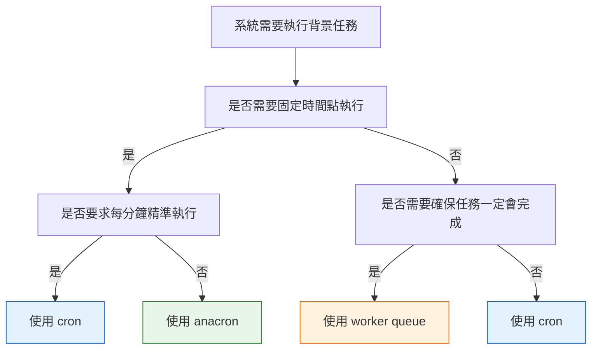
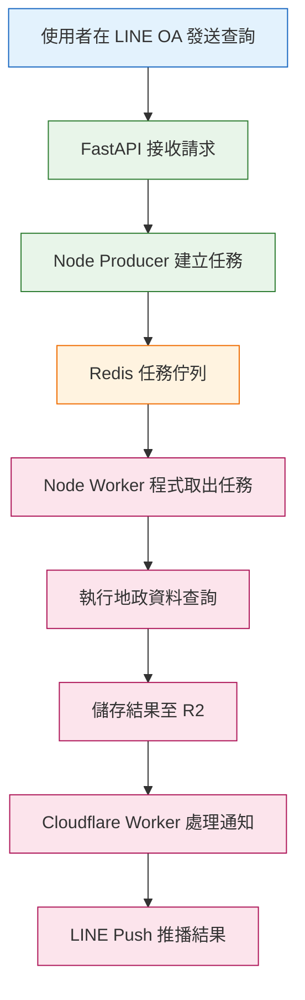

## 從排程到事件驅動背景任務的設計思維

在系統設計中，「背景任務」常常被混為一談，但實際上 **cron、anacron 與 worker queue 解決的是不同類型的問題**。

因為我目前專案很常使用到Worker Queue，所以先來做個對照：

這篇筆記整理三者的差異，並說明我在實務專案中，為什麼選擇 **Worker Queue 概念** 來處理事件驅動的長時間任務。

---

## 一、快速判斷流程（先選對工具）

:::tip My tip

這張圖的重點是：
**先判斷問題類型，而不是先選工具。**

:::

---

## 二、cron：處理「時間」的工具

### Do（做什麼）

* 在**固定時間點**執行指令或腳本

### What（解決什麼問題）

* 每天幾點跑
* 每 5 分鐘跑一次
* 準時、規律、可預期

### How（怎麼做）

* 由 cron daemon 常駐監聽時間
* 系統必須是開機狀態
* 時間到時執行對應任務
* 如果系統在該時間點關機，任務不會補跑
* cron 不會記得錯過的任務

### Why（為什麼用它）

* 系統穩定在線
* 任務本身很快
* 即使錯過一次也不影響整體流程

**典型場景**

* 每 5 分鐘清理暫存
* 每天凌晨產生報表
* 定期同步資料

---

## 三、anacron：處理「不要漏」的需求

### Do（做什麼）

* 補跑錯過的排程任務

### What（解決什麼問題）

* 電腦關機
* VM 或個人電腦不是 24 小時開著
* 仍然希望每天至少執行一次

### How（怎麼做）

* 系統開機後檢查：

  * 昨天是否執行
  * 如果沒有，就現在補跑

### Why（為什麼用它）

* 比準時更在意不要漏
* 適合非伺服器環境

**典型場景**

* 每日備份（不在乎幾點）
* 每日清理 log
* 個人電腦或間歇性開機系統

---

## 四、worker queue：處理「事件與可靠度」

### Do（做什麼）

* 把事情排隊，一件一件處理
* 將即時請求與長時間任務解耦
* 由事件觸發背景流程

### What（解決什麼問題）

* 任務執行時間不固定
* 外部系統回應慢或不穩定
* API 不適合同步等待
* 任務需要確保最終完成

### How（怎麼做）

* 使用者事件觸發任務
* Producer 負責建立任務
* 任務進入佇列集中管理
* Worker 程式負責消費任務
* Redis 儲存任務狀態與佇列

### Why（為什麼用它）

* 可靠性優先
* 不依賴固定時間點
* API 不會被長任務卡住
* 可逐步擴充任務處理能力

---

## 五、實際應用：事件驅動的 Worker Queue 概念實作

這不是一個通用 Queue 產品，而是**Worker Queue 概念的實際應用**，重點在流程設計與職責拆分。

### 情境說明

使用者在 LINE OA 發送地政查詢需求，此流程具備以下特性：

* 任務由使用者行為觸發
* 需查詢外部政府系統
* 執行時間不可預期
* 不適合同步回應

因此採用 **Worker Queue 概念** 來處理。

---

### 架構角色對應

* LINE OA：事件來源
* FastAPI：接收請求並立即回應
* Node producer：建立背景任務
* Redis（Docker 啟用）：任務佇列與狀態儲存
* BullMQ：任務管理與調度
* Node worker 程式：消費佇列中的任務
* Cloudflare Worker：處理後續通知流程
* Cloudflare R2：儲存任務產出結果
* LINE Push：推播結果給使用者

> Docker 僅用於啟動 Redis，
> **不是 Worker 執行環境的一部分**。

---

### 事件驅動 Worker Queue 流程

---

## 六、為什麼這是 Worker Queue，而不是 cron 或 anacron

* 任務不是固定時間發生
* 任務由使用者事件觸發
* 每次任務內容不同
* 無法事先排程

這是**事件驅動的背景任務處理問題**，而不是排程問題。

---

## 七、總結

> cron 管時間
> anacron 管遺漏
> **worker queue 管事件與可靠度**

> 本系統實作事件驅動的 Worker Queue 概念，
> 使用 Redis 與 BullMQ 管理背景任務，
> 並將即時 API 與長時間任務處理流程解耦。

| 問題      | 選誰           |
| ------- | ------------ |
| 要不要準時   | cron         |
| 錯過要不要補  | anacron      |
| 任務一定要成功 | worker queue |
| 系統不一定開著 | anacron      |
| 任務很多很重  | worker queue |
---
