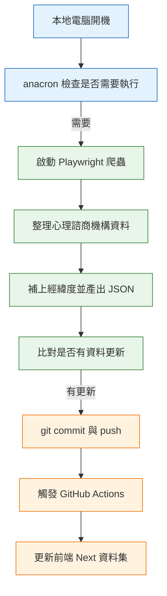

### 我目前可以動手做的 anacron 實作

在這堂課理解 cron 與 anacron 的差異後，我立刻聯想到自己之前做過的一個實際專案：
**衛福部心理健康支持方案的資料整理與公開查詢工具**。

這個專案的出發點很單純。

我身邊有朋友是心理諮商師，在聊天中提到一個實際問題：
雖然政府有提供心理健康支持方案，但相關資料散落在網站頁面中，
對一般民眾來說不容易查詢，也很難即時知道哪些機構「還有名額」。

如果資料沒有即時更新，
那即使做了前端查詢工具，實際上也會變成「看起來有用，但資訊不準確」。

---

#### 我的資料流設計

我實際採用的資料流程如下：

1. 在**本地環境**啟動 Playwright 爬蟲
2. 擷取網站上有合作方案的心理諮商機構資料
3. 將資料整理成結構乾淨的 JSON
4. 透過 API 補上各機構的經緯度
5. 組成完整、可用於地圖顯示的資料集
6. 若資料有更新，提交至 Git 儲存庫
7. 觸發 GitHub Actions
8. 自動更新前端 Next.js 專案中的靜態資料

這樣做的目的，是讓民眾可以用一個簡單的介面，快速查詢附近「目前仍有名額」的心理諮商資源。

---

#### 為什麼這份資料「一定要定期更新」

這個資料集有一個很重要的特性：

* 合作機構名單相對穩定
* **方案名額會隨著每週預約而變動**
* 有「名額用罄」與「釋出新名額」的狀況

因此這份資料有一個明確需求：

> **不是即時更新，但一定不能長時間不更新**

如果資料一週沒有更新，
前端顯示的資訊就可能是錯的，
那這個工具對民眾就失去了實際意義。

---

#### 工具選擇的關鍵判斷

在這個情境下，我重新對照了三種常見工具的定位：

* 這不是固定時間一定在線的伺服器
* 爬蟲執行環境在本地，電腦會關機或睡眠
* 不在乎幾點跑
* **但不能漏跑**

這正是 anacron 的設計初衷。

> 與其追求「準時」，
> 我更在意「每個週期內至少成功執行一次」。

因此在這個專案中，
我選擇用 **anacron（或 anacron 型思維）** 來觸發本地爬蟲流程，
確保在非長時間開機的環境下，
資料仍然可以穩定地被更新。

---

#### 為什麼不是 cron

cron 適合的前提是：

* 系統長時間在線
* 固定時間一定能執行

但在本地電腦環境中，只要關機或睡眠，
就有可能錯過排程，導致資料整週沒有更新。

在「資料正確性」比「執行時間點」更重要的情況下，
cron 反而不是最安全的選擇。

---

#### anacron 在這個專案中的角色

在這個資料流中，anacron 負責的事情很單純：

* 檢查這個週期是否已執行過更新任務
* 如果沒有，在開機後自動補跑
* 不關心實際是星期幾、幾點

這讓我可以專注在：

* 資料品質
* 比對邏輯
* 前端呈現是否正確

而不用擔心「今天電腦沒開，資料就漏了」。

---

#### 整體流程示意（Mermaid）

---

#### 小結：這是一個「貼近現實限制」的工具選擇

這個專案不是為了展示複雜架構(我也還沒那個能力XD)，雖然尚且不確定更好的方法，
但為了解決這真實存在的資訊落差問題。

在「爬蟲容易被雲端環境擋下」且「資料必須定期且可靠更新」的前提下，
我選擇 **anacron 型排程 + 本地資料生產 + CI/CD 發佈**方式！
