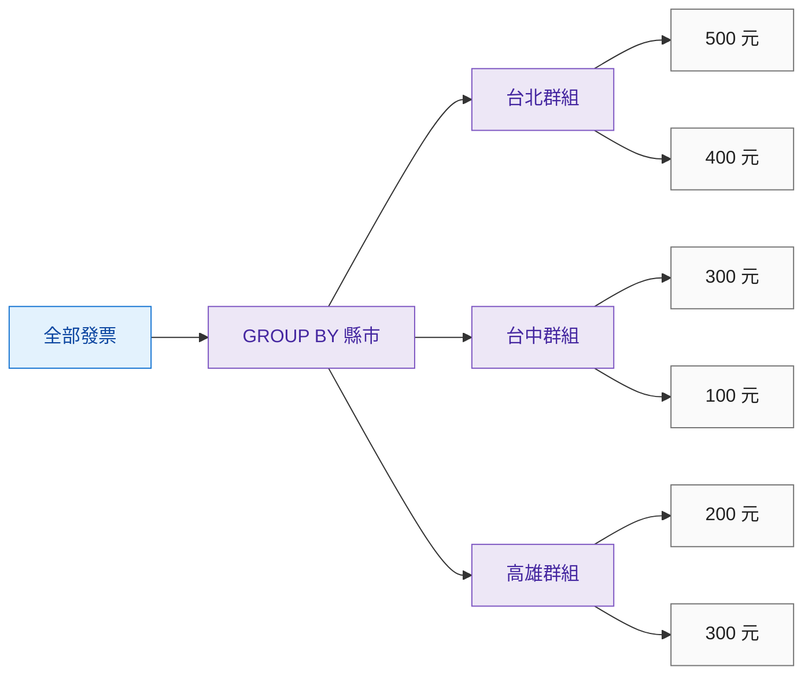
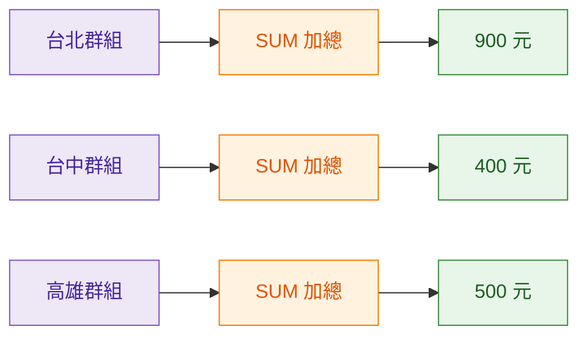
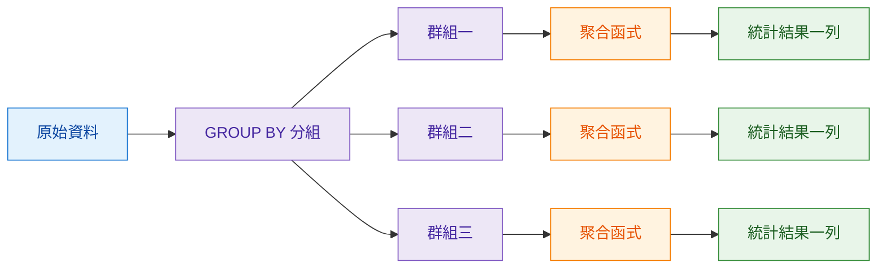
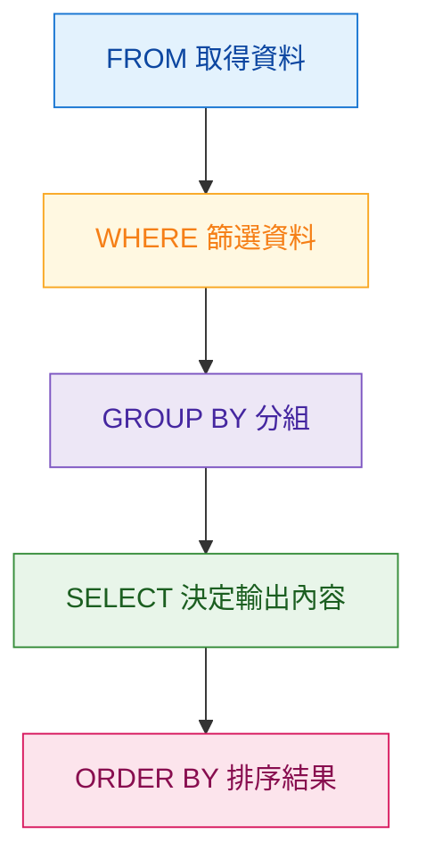
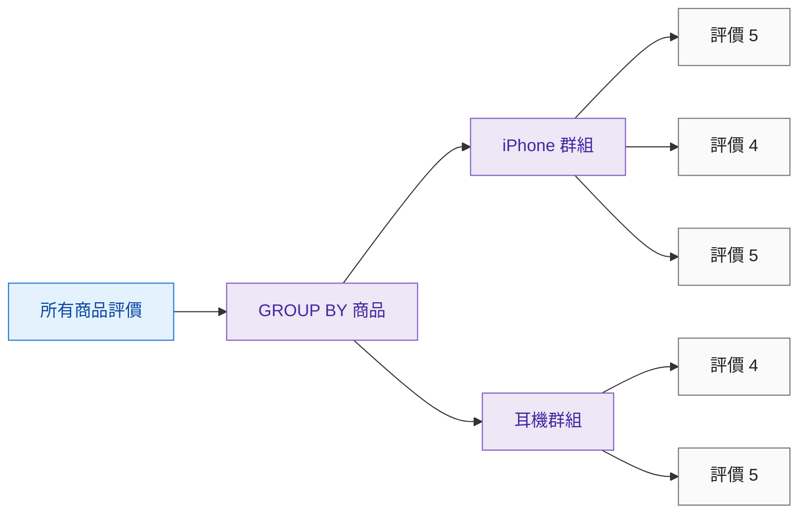
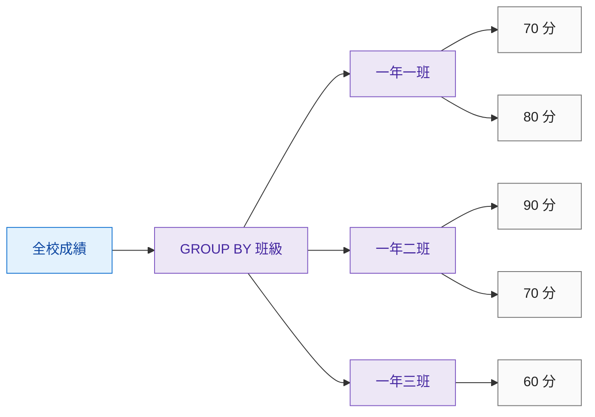
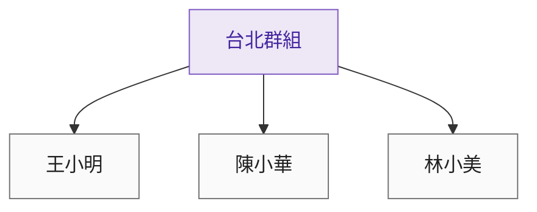
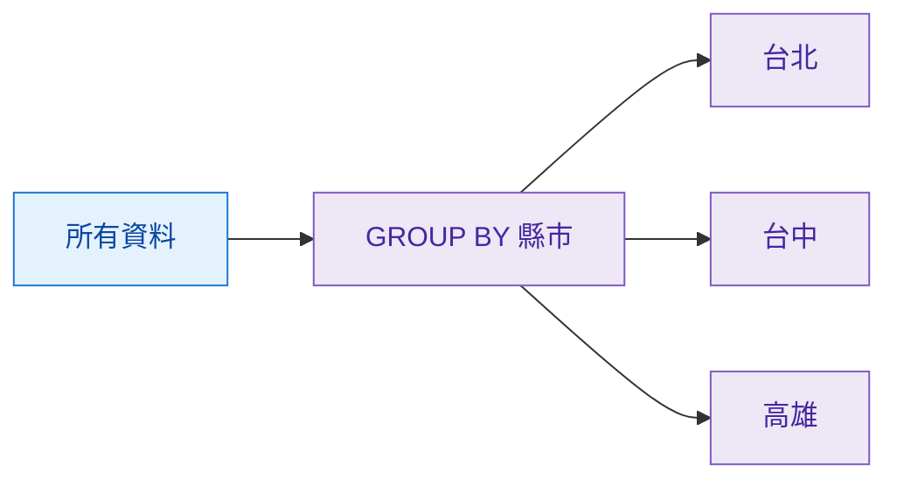
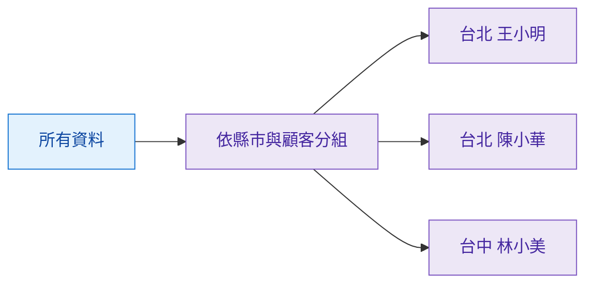
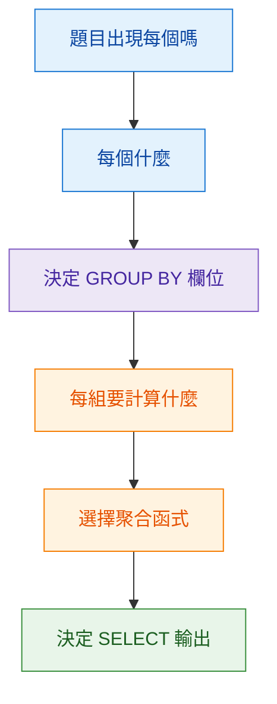

> 預估閱讀時間：約 5 分鐘

## 本篇觀念要點

聚合函式可以計算整份資料的 `SUM` 總和、`AVG` 平均與 `COUNT` 筆數。

但是遇到這類需求：

> 每個縣市、每項商品、每個班級各自是多少？

就不是計算「全部資料」，而是必須先把資料分類。

這時就會使用 `GROUP BY`。

<Highlight>GROUP BY：先依照指定欄位分組，再讓聚合函式對每一組分別計算。</Highlight>

1. [為什麼需要 GROUP BY](#why-group-by)
2. [生活例子：全台發票](#life-example)
3. [GROUP BY 基本結構](#group-by-structure)
4. [GROUP BY 執行流程](#group-by-flow)
5. [SQL 實際處理 GROUP BY 的順序](#sql-order)
6. [更多生活情境](#more-examples)
7. [SELECT 欄位規則](#select-rule)
8. [多欄位分組](#multiple-group)
9. [常見錯誤](#common-errors)
10. [我的解題判斷](#thinking)
11. [Cheat Sheet](#cheat-sheet)

:::info 這篇的學習主線

**原始資料 → GROUP BY 分類 → 聚合函式計算 → 每個群組輸出一列**

:::

---

## 為什麼需要 GROUP BY {#why-group-by}

假設有一張全台灣發票資料表：

| city | amount |
| --- | ---: |
| 台北 | 500 |
| 台中 | 300 |
| 高雄 | 200 |
| 台北 | 400 |

如果只有：

```sql
SELECT SUM(amount)
FROM invoices;
```

SQL 會把所有資料一起計算：


得到：

| total_amount |
| ---: |
| 1400 |

但是這只能回答：

> 全台灣總共消費多少？

---

如果問題變成：

> **每個縣市分別消費多少？**

就必須先：

```sql
GROUP BY city
```

---

## 生活例子：全台發票 {#life-example}

可以想像你手上有整箱全台灣顧客的發票。

### 第一步：原始資料混在一起

| city | amount |
| --- | ---: |
| 台北 | 500 |
| 台中 | 300 |
| 高雄 | 200 |
| 台北 | 400 |
| 台中 | 100 |
| 高雄 | 300 |

目前所有發票都混在一起。

---

### 第二步：GROUP BY 負責分類

執行：

```sql
GROUP BY city
```

概念就像拿三個箱子開始分類：



此時還沒有統計。

`GROUP BY` 只負責：

> **把相同縣市的資料放在一起。**

---

### 第三步：聚合函式對每組分別計算

接著：

```sql
SUM(amount)
```

不是對整張表只執行一次。

而是：



最後得到：

| city | total_amount |
| --- | ---: |
| 台北 | 900 |
| 台中 | 400 |
| 高雄 | 500 |

<Highlight>GROUP BY 負責拿箱子分類；聚合函式負責在每個箱子裡計算。</Highlight>

---

## GROUP BY 基本結構 {#group-by-structure}

```sql
SELECT
    city,
    SUM(amount) AS total_amount
FROM invoices
GROUP BY city;
```

可以拆成：

| SQL | 功能 |
| --- | --- |
| `FROM invoices` | 從哪裡取得資料 |
| `GROUP BY city` | 依照縣市分組 |
| `SUM(amount)` | 計算每組的總金額 |
| `SELECT city` | 顯示目前是哪一組 |

題目：

> 每個縣市的總消費額

可以直接拆成：

```text
每個縣市
→ GROUP BY city

總消費額
→ SUM amount
```

---

## GROUP BY 執行流程 {#group-by-flow}

完整 Mental Model：



所以：

<Highlight>每一個 Group 最後通常會輸出一列統計結果。</Highlight>

---

## SQL 實際處理 GROUP BY 的順序 {#sql-order}

這裡有一個很容易混淆的地方。

我們寫 SQL 時：

```sql
SELECT
    city,
    SUM(amount)
FROM invoices
WHERE amount > 100
GROUP BY city
ORDER BY city;
```

語法看起來是：

```text
SELECT
FROM
WHERE
GROUP BY
ORDER BY
```

但是 SQL **邏輯處理資料的順序不是照我們寫的順序**。

可以先建立這個簡化版 Mental Model：



### 1. FROM

先決定：

> 我要從哪張資料表取得資料？

```sql
FROM invoices
```

---

### 2. WHERE

再把不需要的資料先排除。

```sql
WHERE amount > 100
```

所以 `GROUP BY` 處理的是：

> **WHERE 篩選之後剩下的資料。**

---

### 3. GROUP BY

再依指定欄位分組：

```sql
GROUP BY city
```

---

### 4. SELECT

分組完成後，才決定最後要顯示什麼：

```sql
SELECT
    city,
    SUM(amount)
```

這也可以幫助理解：

> 為什麼使用 `GROUP BY` 之後，`SELECT` 的普通欄位會受到限制？

因為資料此時已經被整理成「群組」。

---

### 5. ORDER BY

最後再排列輸出的結果：

```sql
ORDER BY city;
```

:::info 先記簡化版就好

```text
FROM
  ↓
WHERE
  ↓
GROUP BY
  ↓
SELECT
  ↓
ORDER BY
```

之後學到 `HAVING` 時，再把它加到 `GROUP BY` 後面。

:::

---

## 更多生活情境 {#more-examples}

### 情境一：網購平台

假設訂單原始資料：

| product | rating |
| --- | ---: |
| iPhone | 5 |
| 耳機 | 4 |
| iPhone | 4 |
| 耳機 | 5 |
| iPhone | 5 |

需求：

> 每項商品的平均評價是多少？

先分組：



再使用：

```sql
AVG(rating)
```

得到：

| product | avg_rating |
| --- | ---: |
| iPhone | 4.67 |
| 耳機 | 4.50 |

Mental Model：

```text
GROUP BY 商品
→ 商品分類

AVG 評價
→ 每個商品箱子各算一次平均
```

---

### 情境二：學校成績

原始資料：

| class_name | score |
| --- | ---: |
| 一年一班 | 70 |
| 一年二班 | 90 |
| 一年一班 | 80 |
| 一年二班 | 70 |
| 一年三班 | 60 |

需求：

> 每個班級的平均成績是多少？



再執行：

```sql
AVG(score)
```

最後：

| class_name | avg_score |
| --- | ---: |
| 一年一班 | 75 |
| 一年二班 | 80 |
| 一年三班 | 60 |

所以：

```text
每個班級
→ GROUP BY class_name

平均成績
→ AVG score
```

---

## SELECT 欄位規則 {#select-rule}

使用 `GROUP BY` 後，`SELECT` 裡通常只能放兩類內容。

### 第一類：GROUP BY 欄位

```sql
city
```

代表：

> 現在是哪一個群組。

### 第二類：聚合函式

```sql
COUNT(*)
SUM(amount)
AVG(score)
MAX(salary)
MIN(salary)
```

代表：

> 這個群組最後要算出什麼。

正確：

```sql
SELECT
    city,
    SUM(amount)
FROM invoices
GROUP BY city;
```

---

錯誤：

```sql
SELECT
    city,
    customer_name,
    SUM(amount)
FROM invoices
GROUP BY city;
```

因為分組後可能變成：



但最後「台北群組」只能輸出一列。

SQL 就會遇到問題：

> 到底要顯示王小明、陳小華，還是林小美？

所以 `customer_name` 沒有唯一答案。

:::warning 核心規則

`SELECT` 中沒有被聚合的普通欄位，通常必須出現在 `GROUP BY` 裡。

:::

---

## 多欄位分組 {#multiple-group}

如果寫：

```sql
GROUP BY city, customer_name
```

意思不是：

> 多顯示一個欄位。

而是：

> **改變分組方式。**

原本：



代表：

```text
一個縣市 → 一組
```

加入顧客後：



現在變成：

```text
一個縣市中的一位顧客 → 一組
```

所以：

```text
GROUP BY city
→ 每個縣市一列

GROUP BY city, customer_name
→ 每個縣市中的每位顧客一列
```

<Highlight>GROUP BY 欄位越多，群組通常會切得越細，結果的粒度也會改變。</Highlight>

---

## 常見錯誤 {#common-errors}

### 1. 忘記 GROUP BY

```sql
SELECT
    city,
    SUM(amount)
FROM invoices;
```

`SUM` 想產生一個統計結果，但 `city` 有很多不同值。

SQL 不知道該搭配哪個城市。

---

### 2. SELECT 未分組的普通欄位

```sql
SELECT
    city,
    customer_name,
    SUM(amount)
FROM invoices
GROUP BY city;
```

一個城市裡可能有很多顧客，`customer_name` 沒有唯一答案。

---

### 3. GROUP BY 欄位放太多

```sql
GROUP BY city, invoice_id
```

如果每張發票都有不同的 `invoice_id`：

```text
發票一 → 一組
發票二 → 一組
發票三 → 一組
```

原本想看：

> 每個縣市總消費額

結果卻把幾乎每張發票拆成獨立群組。

---

### 4. 把 GROUP BY 當成排序

`GROUP BY`：

> 負責分類。

`ORDER BY`：

> 負責排序。

```sql
ORDER BY total_amount DESC;
```

---

## 我的解題判斷 {#thinking}

看到統計題，可以先不要急著寫 SQL。

先拆需求：



例如：

> 每項商品的平均評價

拆解：

```text
每項商品
→ GROUP BY product_name

平均評價
→ AVG rating
```

再組成：

```sql
SELECT
    product_name,
    AVG(rating) AS average_rating
FROM reviews
GROUP BY product_name;
```

---

## Cheat Sheet {#cheat-sheet}

### 每組筆數

```sql
SELECT
    group_column,
    COUNT(*) AS total
FROM table_name
GROUP BY group_column;
```

### 每組總和

```sql
SELECT
    group_column,
    SUM(value_column) AS total
FROM table_name
GROUP BY group_column;
```

### 每組平均

```sql
SELECT
    group_column,
    AVG(value_column) AS average_value
FROM table_name
GROUP BY group_column;
```

### 分組後排序

```sql
SELECT
    group_column,
    SUM(value_column) AS total
FROM table_name
GROUP BY group_column
ORDER BY total DESC;
```

---

## 結尾：核心觀念整理

- 聚合函式可以統計整份資料
- `GROUP BY` 負責把資料分類成不同群組
- 聚合函式會對每個群組分別計算
- 每個群組最後通常輸出一列
- `GROUP BY` 決定「一列資料代表什麼」
- 分組欄位越多，群組通常切得越細
- `WHERE` 會在分組之前先篩選資料
- `GROUP BY` 負責分組
- `ORDER BY` 負責最後的結果排序

<Highlight>GROUP BY 決定「要分成哪些箱子」，聚合函式決定「每個箱子裡要算什麼」。</Highlight>

```text
原始資料
   ↓
WHERE 篩選
   ↓
GROUP BY 分桶
   ↓
聚合函式計算
   ↓
SELECT 輸出結果
   ↓
ORDER BY 排序
```

**原始大雜燴資料 → 分組 → 每組計算 → 每組輸出一列乾淨的統計結果**