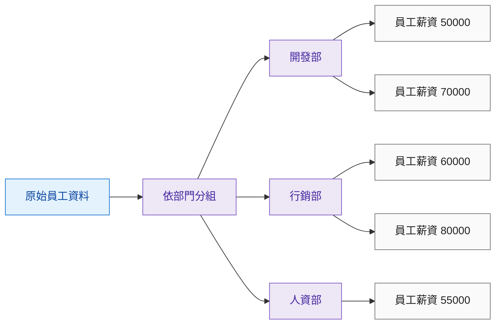
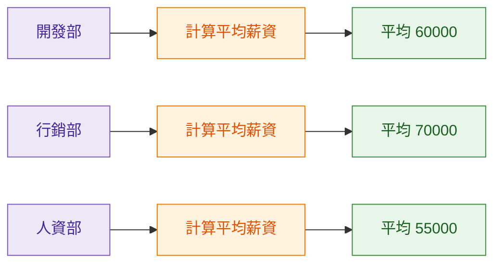
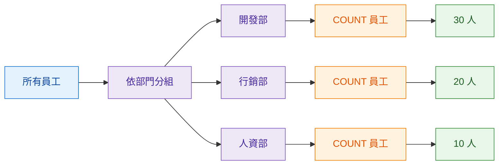
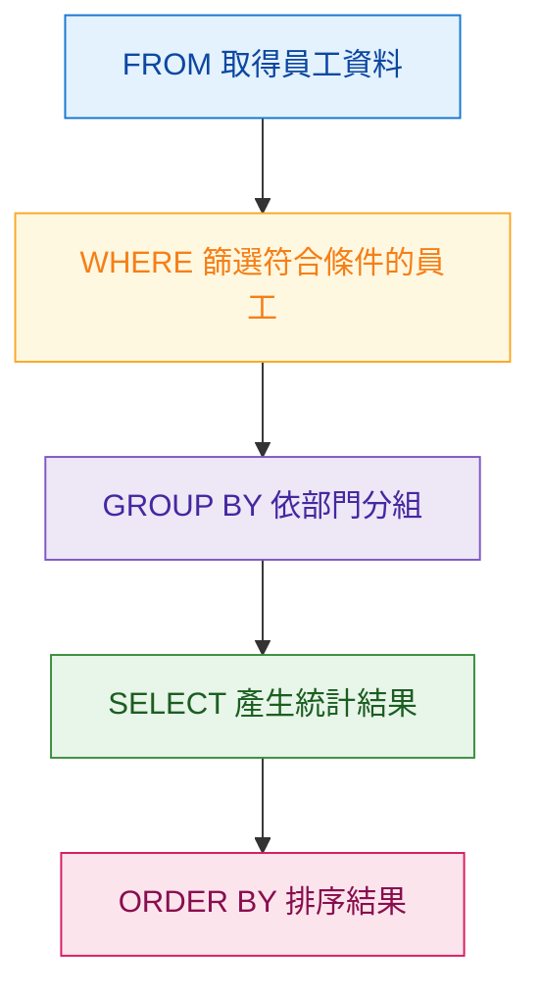

## 本篇觀念

`GROUP BY` 不只是「把資料分組」。

更完整的理解是：

<Highlight>GROUP BY 的處理流程可以想成：Split 分組 → Apply 計算 → Combine 組合結果。</Highlight>

:::info 學習主線

原始員工資料 → 依部門分組 → 每個部門個別統計 → 組成結果表

:::

---

## Split：先把資料分組

假設公司有以下員工薪資資料：

| 部門 | 薪資 |
| --- | ---: |
| 開發部 | 50000 |
| 行銷部 | 60000 |
| 開發部 | 70000 |
| 行銷部 | 80000 |
| 人資部 | 55000 |

如果執行：

```sql
GROUP BY department
```

SQL 會依照「部門」的值，把員工資料分成不同群組。



這個階段只負責：

> **把相同部門的員工放在同一組。**

```text
開發部 → 一組
行銷部 → 一組
人資部 → 一組
```

<Highlight>Split 階段只是分組，還沒有開始做統計。</Highlight>

---

## Apply：每個群組各自計算

假設現在要查：

> 每個部門的平均薪資是多少？

使用：

```sql
AVG(salary)
```

這時不是把全公司的薪資一起平均。

而是：



也就是：

```text
開發部 → AVG
行銷部 → AVG
人資部 → AVG
```

<Highlight>聚合函式會對每一個 Group 分別執行一次。</Highlight>

---

## Combine：把統計結果組成結果表

每個部門算完後，SQL 再把結果組合起來。

| 部門 | 平均薪資 |
| --- | ---: |
| 開發部 | 60000 |
| 行銷部 | 70000 |
| 人資部 | 55000 |

完整流程：


所以可以記：

```text
Split
把員工依部門分組

↓

Apply
每個部門分別做 COUNT、SUM、AVG 等統計

↓

Combine
把每個部門的統計結果組成表格
```

---

## 套回 GROUP BY 題目

假設題目是：

> 每個部門有多少員工？

先不要急著寫 SQL。

可以拆成：

```text
每個部門
→ 依部門分組
→ GROUP BY department

有多少員工
→ 計算每組員工數量
→ COUNT
```

SQL：

```sql
SELECT
    department,
    COUNT(*) AS employee_count
FROM employees
GROUP BY department;
```

Mental Model：



最後：

| 部門 | 員工人數 |
| --- | ---: |
| 開發部 | 30 |
| 行銷部 | 20 |
| 人資部 | 10 |

---

## GROUP BY 在 SQL 執行順序的位置

我們平常寫 SQL：

```sql
SELECT
    department,
    COUNT(*)
FROM employees
WHERE salary > 50000
GROUP BY department
ORDER BY department;
```

但 SQL 的邏輯處理順序，可以先記成：



可以理解成：

```text
FROM
取得全部員工
   ↓
WHERE
先留下符合條件的員工
   ↓
GROUP BY
再依部門分組
   ↓
SELECT
顯示部門與統計結果
   ↓
ORDER BY
最後排序
```

<Highlight>GROUP BY 分組的資料，是 FROM 取得並經過 WHERE 篩選後剩下的資料。</Highlight>

---

## 一句話記住

> **Split 是把員工分類；Apply 是對每個部門做統計；Combine 是把各部門的統計結果組成表格。**

```text
所有員工資料
   ↓
Split
依部門分組
   ↓
開發部｜行銷部｜人資部
   ↓
Apply
每組執行聚合函式
   ↓
Combine
每個部門輸出一列
```

<Highlight>GROUP BY 決定怎麼分組，Aggregate Function 決定每一組要算什麼。</Highlight>
````
