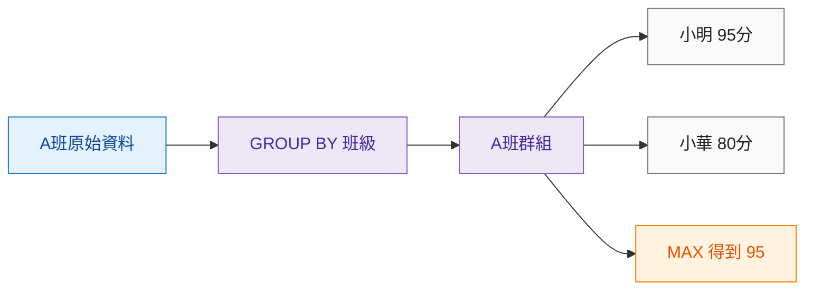
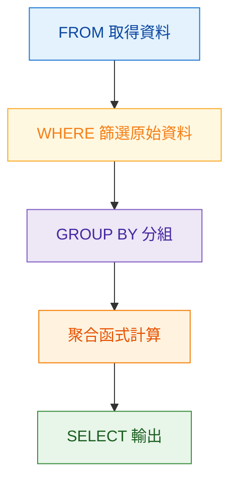
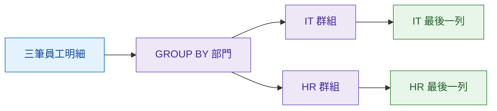
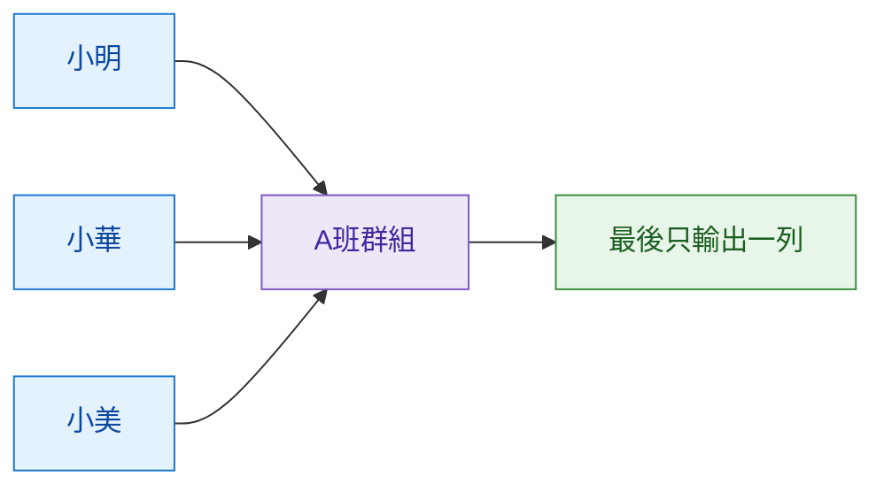

## 本篇觀念要點

學會 `GROUP BY` 之後，很容易產生一個錯覺：

> 既然都已經分組了，那我是不是可以順便把其他欄位一起 `SELECT` 出來？

其實不行。

`GROUP BY` 最大的特色，也是它最大的侷限：

<Highlight>GROUP BY 會把多筆原始資料，壓縮成「每個群組一列」的統計結果。</Highlight>

因此會遇到三個重要限制：

1. [不能直接取得未分組的其他欄位](#limit-column)
2. [WHERE 不能過濾聚合後的結果](#limit-where)
3. [無法同時保留原始明細與群組統計](#limit-detail)
4. [GROUP BY 侷限快速判斷](#quick-check)

:::info 這篇的學習主線

原始多筆資料 → GROUP BY 分組 → 聚合計算 → 每個群組壓縮成一列

:::

---

## 侷限一：不能直接取得未分組的其他欄位 {#limit-column}

假設有一張成績表：

| student_name | class_name | score |
| --- | --- | ---: |
| 小明 | A班 | 95 |
| 小華 | A班 | 80 |
| 小美 | B班 | 88 |

題目：

> 每個班級的最高分是多少？

這可以直接使用：

```sql
SELECT
    class_name,
    MAX(score) AS max_score
FROM scores
GROUP BY class_name;
```

結果：

| class_name | max_score |
| --- | ---: |
| A班 | 95 |
| B班 | 88 |

---

### 但是如果題目多問一句

> 每個班級最高分的學生是誰？

很容易寫成：

```sql
SELECT
    class_name,
    student_name,
    MAX(score)
FROM scores
GROUP BY class_name;
```

問題就出現了。

### GROUP BY 之後發生什麼？



`MAX(score)` 有唯一答案：

```text
95
```

但是 `student_name` 有：

```text
小明
小華
```

一個群組最後只能輸出一列，所以 SQL 不知道：

> `student_name` 到底應該選誰？

<Highlight>MAX 可以告訴你「最高分是多少」，但 GROUP BY 不會自動幫你找到「這個最高分屬於哪一筆原始資料」。</Highlight>

:::warning MySQL 的 ONLY_FULL_GROUP_BY

現代 MySQL 通常預設啟用 `ONLY_FULL_GROUP_BY`。

因此像這種：

```sql
SELECT class_name, student_name, MAX(score)
FROM scores
GROUP BY class_name;
```

`student_name` 沒有被分組，也沒有經過聚合，通常會直接報錯。

這其實是在保護我們，避免查出邏輯不明確的資料。

:::

---

## 侷限二：WHERE 不能過濾聚合後的結果 {#limit-where}

假設有訂單資料：

| order_id | user_id | amount |
| --- | --- | ---: |
| 101 | U001 | 500 |
| 102 | U001 | 600 |
| 103 | U002 | 200 |

現在想找：

> 總消費超過 1000 元的會員。

我們知道可以先：

```sql
GROUP BY user_id
```

再：

```sql
SUM(amount)
```

但是初學時很容易寫：

```sql
SELECT
    user_id,
    SUM(amount) AS total_spend
FROM orders
WHERE SUM(amount) > 1000
GROUP BY user_id;
```

這會出錯。

---

### 為什麼？

因為 SQL 處理資料時：



`WHERE` 執行的時間比 `GROUP BY` 更早。

所以執行到：

```sql
WHERE SUM(amount) > 1000
```

時，

```sql
SUM(amount)
```

根本還沒有被計算出來。

<Highlight>WHERE 負責篩選「分組前的原始資料」，不能直接篩選「分組後的統計結果」。</Highlight>

---

### 那聚合結果怎麼篩選？

後面會學到：

```sql
HAVING
```

它就是拿來處理：

> GROUP BY 完成後，要不要留下這個群組？

目前先記這個差異：

```text
WHERE
→ 篩選原始資料

GROUP BY
→ 分組

HAVING
→ 篩選分組後的統計結果
```

:::info 延伸學習

後面的 **HAVING 筆記**會專門處理這個問題。

完成筆記後，我會在這裡補上文章連結。

:::

---

## 侷限三：無法同時保留原始明細與群組統計 {#limit-detail}

假設員工資料：

| emp_name | department | salary |
| --- | --- | ---: |
| Alex | IT | 70000 |
| Bob | IT | 80000 |
| Cathy | HR | 50000 |

老闆想看：

> 每一位員工的姓名、薪資，以及他的部門總薪資。

也就是結果希望長這樣：

| emp_name | department | salary | dept_total |
| --- | --- | ---: | ---: |
| Alex | IT | 70000 | 150000 |
| Bob | IT | 80000 | 150000 |
| Cathy | HR | 50000 | 50000 |

初學時可能會嘗試：

```sql
SELECT
    emp_name,
    department,
    salary,
    SUM(salary) AS dept_total
FROM employees
GROUP BY department;
```

但是這和 `GROUP BY` 的運作方式衝突。

---

### 原因還是「資料被壓縮」

原始資料：

```text
Alex  → IT
Bob   → IT
Cathy → HR
```

有三列。

執行：

```sql
GROUP BY department
```

之後：



資料粒度從：

```text
一位員工
→ 一列
```

變成：

```text
一個部門
→ 一列
```

Alex 和 Bob 原本是兩筆資料。

但是 `GROUP BY department` 要求：

```text
IT
→ 最後只能變成一個群組結果
```

所以無法同時保留：

```text
Alex 的明細
Bob 的明細
+
IT 部門總薪資
```

<Highlight>GROUP BY 擅長把資料「壓縮成統計結果」，但不擅長「保留每筆明細，同時附上群組統計」。</Highlight>

---

### 這個問題之後會怎麼處理？

後面的 SQL 會學到 **Window Function**。

目前先不要管語法，只留下這個概念：

```text
GROUP BY
→ 原始資料會變成群組粒度

如果需求要求
→ 保留每筆明細
→ 同時又要群組統計

代表 GROUP BY 可能不是最適合的工具
```

:::info 延伸學習

之後完成 **Window Function 筆記**時，再回來把這裡改成文章連結。

現在只需要知道：

> SQL 還有其他工具可以處理「明細 + 統計」的需求。

:::

---

## GROUP BY 到底壓縮了什麼？

這是整篇最重要的 Mental Model。

假設：

```text
A班
├── 小明
├── 小華
└── 小美
```

使用：

```sql
GROUP BY class_name
```

就代表：



因此 `SELECT` 想取得其他欄位時，都要先問：

> 這個群組裡，這個欄位最後有沒有唯一答案？

例如：

```text
A班的班級名稱
→ 唯一
→ A班

A班最高分
→ MAX 後唯一
→ 95

A班學生姓名
→ 多個
→ 小明、小華、小美
→ 沒有唯一答案
```

這就是 `GROUP BY` 欄位限制背後真正的原因。

---

## GROUP BY 侷限快速判斷 {#quick-check}

### 情境一

> 每個部門的平均薪資

```text
每個部門
→ GROUP BY department

平均薪資
→ AVG salary
```

✅ `GROUP BY` 很適合。

---

### 情境二

> 每個班級最高分是多少？

```text
每個班級
→ GROUP BY class_name

最高分
→ MAX score
```

✅ `GROUP BY` 很適合。

---

### 情境三

> 每個班級最高分的學生是誰？

```text
MAX score
→ 可以得到最高分

student_name
→ 一個群組裡有很多人
```

⚠️ 單純 `GROUP BY` 不夠。

---

### 情境四

> 找總消費大於 1000 元的會員

需要先：

```text
GROUP BY
→ SUM
→ 再篩選結果
```

⚠️ 不能直接使用 `WHERE SUM(...)`。

後面想到：

```sql
HAVING
```

---

### 情境五

> 顯示每位員工，同時顯示部門平均薪資

需求同時包含：

```text
保留每位員工明細
+
部門統計
```

⚠️ 這不是普通 `GROUP BY` 最擅長的情境。

後面再學其他 SQL 工具。

---

## Cheat Sheet

| 需求 | GROUP BY 是否適合 |
| --- | --- |
| 每個部門有幾個人 | ✅ |
| 每個部門平均薪資 | ✅ |
| 每個商品總銷售額 | ✅ |
| 每個班級最高分 | ✅ |
| 直接取得最高分學生姓名 | ⚠️ 不能直接取得 |
| 使用 WHERE 篩選 SUM 結果 | ❌ |
| 篩選分組後的結果 | 後面學 `HAVING` |
| 保留所有明細又顯示群組統計 | ⚠️ 後面會學其他工具 |

---

## 結尾：核心觀念整理

`GROUP BY` 最大的優點，也是最大的侷限：

> **它會把多筆資料壓縮成每個群組一列。**

因此：

* `GROUP BY` 適合回答「每個群組的統計結果」
* 聚合函式可以把群組內多筆資料變成唯一結果
* 未分組的普通欄位不一定有唯一答案
* `MAX()` 找到最大值，不代表其他欄位會自動跟著找到同一筆資料
* `WHERE` 發生在分組之前，因此不能直接篩選聚合結果
* 分組後的結果篩選，後面會學 `HAVING`
* 如果需求必須保留原始明細，普通 `GROUP BY` 可能就不適合

<Highlight>看到 GROUP BY，要先問自己：分組之後「一列代表什麼」？其他 SELECT 欄位在這個群組裡，有沒有唯一答案？</Highlight>

```text
原始多筆資料
      ↓
GROUP BY
      ↓
形成群組
      ↓
Aggregate Function
      ↓
每個群組只剩一列
```

**GROUP BY 的世界是「群組統計」；一旦需求需要回頭找原始明細，就要開始思考它的侷限。**

