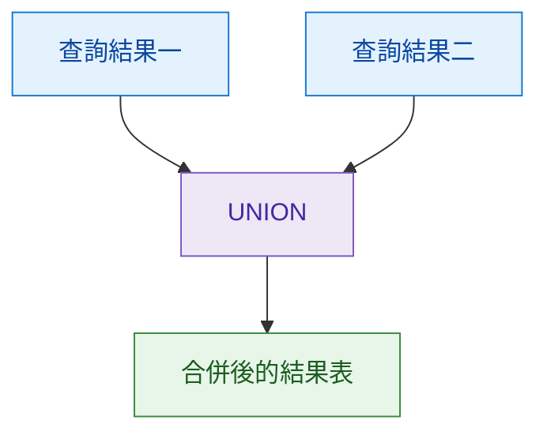
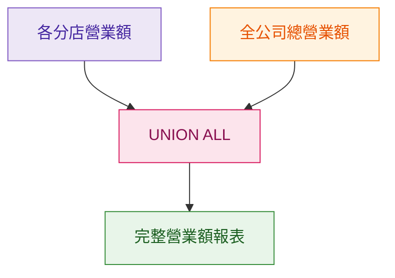
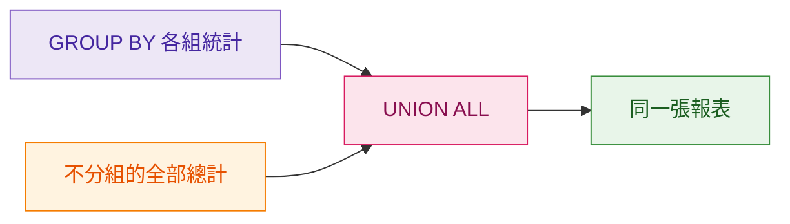
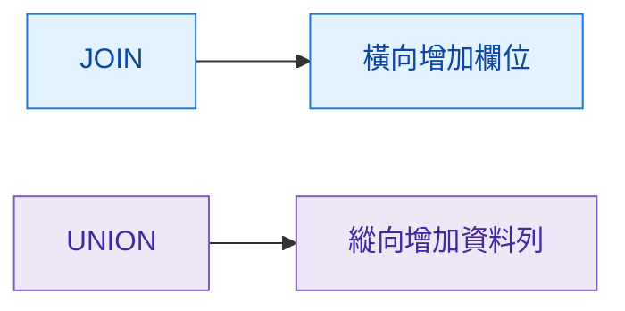

## 本篇觀念要點

當我們有兩個不同的查詢結果，想把它們**上下合併成一張結果表**時，可以使用：

```sql
UNION
```

或：

```sql
UNION ALL
```

<Highlight>UNION / UNION ALL 的核心：把多個 SELECT 查詢結果，垂直上下拼接。</Highlight>

1. [UNION 是什麼](#what-is-union)
2. [生活例子：分店營業額](#store-example)
3. [UNION 與 UNION ALL 差異](#union-vs-union-all)
4. [為什麼會搭配 GROUP BY](#group-by-union)
5. [生活例子：飲料銷售報表](#drink-example)
6. [Cheat Sheet](#cheat-sheet)

:::info 這篇的學習主線

兩個 SELECT 查詢 → 各自產生結果 → UNION 上下拼接 → 變成一張結果表

:::

---

## UNION 是什麼 {#what-is-union}

可以把 `UNION` 想像成：

> 把兩張已經算好的表格，上下黏在一起。



例如：

```sql
SELECT name
FROM taipei_members

UNION

SELECT name
FROM taichung_members;
```

就是把：

```text
台北會員名單
+
台中會員名單
```

上下組成同一張表。

---

## 生活例子：分店營業額 {#store-example}

假設主管要求：

> 幫我列出「台北店、台中店各自的營業額」，最後再加一列「全公司總營業額」。

### 第一步：GROUP BY 算各分店

```sql
SELECT
    store_name,
    SUM(amount) AS total_amount
FROM sales
GROUP BY store_name;
```

得到：

| store_name | total_amount |
| --- | ---: |
| 台北店 | 50000 |
| 台中店 | 30000 |

這只能回答：

> 每間分店各自多少錢？

---

### 第二步：算全公司總額

```sql
SELECT
    '全公司總計' AS store_name,
    SUM(amount) AS total_amount
FROM sales;
```

得到：

| store_name | total_amount |
| --- | ---: |
| 全公司總計 | 80000 |

---

### 第三步：用 UNION ALL 拼起來

```sql
SELECT
    store_name,
    SUM(amount) AS total_amount
FROM sales
GROUP BY store_name

UNION ALL

SELECT
    '全公司總計' AS store_name,
    SUM(amount) AS total_amount
FROM sales;
```

結果：

| store_name | total_amount |
| --- | ---: |
| 台北店 | 50000 |
| 台中店 | 30000 |
| 全公司總計 | 80000 |

視覺化：



<Highlight>GROUP BY 負責算「各組」，UNION 負責把不同查詢結果重新拼成一張表。</Highlight>

---

## UNION 與 UNION ALL 差異 {#union-vs-union-all}

兩者都可以上下拼接資料。

差別只有一個很重要的地方：

### UNION

```sql
UNION
```

會把重複的結果移除。

假設：

```text
台北名單
小明
小美

台中名單
小美
小華
```

使用 `UNION`：

```text
小明
小美
小華
```

`小美` 只保留一次。

---

### UNION ALL

```sql
UNION ALL
```

不會去除重複資料。

結果：

```text
小明
小美
小美
小華
```

所以：

| 語法 | 上下合併 | 去除重複 |
| --- | --- | --- |
| `UNION` | ✅ | ✅ |
| `UNION ALL` | ✅ | ❌ |

<Highlight>UNION 會去重；UNION ALL 會全部保留。</Highlight>

---

## 為什麼會搭配 GROUP BY {#group-by-union}

`GROUP BY` 很適合算：

> 每個群組自己的統計結果。

例如：

```text
台北店 → 50000
台中店 → 30000
```

但如果還想把：

```text
全公司總計 → 80000
```

一起放進報表，就可以：

```text
GROUP BY 結果
+
全部資料總計
↓
UNION ALL
↓
完整報表
```



---

## 生活例子：飲料銷售報表 {#drink-example}

老闆要求：

> 顯示每款飲料賣幾杯，最後再加一列「全部飲料總杯數」。

原始結果：

| 飲料 | 杯數 |
| --- | ---: |
| 黑糖珍珠鮮奶 | 500 |
| 四季春青茶 | 800 |

使用：

```sql
SELECT
    drink_name,
    SUM(quantity) AS total_quantity
FROM sales
GROUP BY drink_name

UNION ALL

SELECT
    '全部飲料總計' AS drink_name,
    SUM(quantity) AS total_quantity
FROM sales;
```

最後：

| 飲料 | 杯數 |
| --- | ---: |
| 黑糖珍珠鮮奶 | 500 |
| 四季春青茶 | 800 |
| 全部飲料總計 | 1300 |

可以想成：

```text
各飲料統計
        ↓
GROUP BY

全部飲料總數
        ↓
SUM

兩份結果
        ↓
UNION ALL

完整銷售報表
```

---

## UNION 的基本規則

`UNION` 上下兩邊的查詢，欄位數量必須一致。

正確：

```sql
SELECT
    store_name,
    SUM(amount)
FROM sales
GROUP BY store_name

UNION ALL

SELECT
    '全公司總計',
    SUM(amount)
FROM sales;
```

兩邊都是：

```text
第一欄 → 名稱
第二欄 → 金額
```

所以可以上下拼接。

---

## JOIN 和 UNION 不一樣

可以簡單記：

```text
JOIN
→ 左右接

UNION
→ 上下接
```



---

## Cheat Sheet {#cheat-sheet}

### UNION

```sql
SELECT column_name
FROM table_a

UNION

SELECT column_name
FROM table_b;
```

用途：

> 上下合併，去除重複。

---

### UNION ALL

```sql
SELECT column_name
FROM table_a

UNION ALL

SELECT column_name
FROM table_b;
```

用途：

> 上下合併，保留所有資料。

---

### GROUP BY 加總計

```sql
SELECT
    group_column,
    SUM(value_column)
FROM table_name
GROUP BY group_column

UNION ALL

SELECT
    '總計',
    SUM(value_column)
FROM table_name;
```

---

## 結尾：核心觀念整理

- `UNION` 與 `UNION ALL` 都是把查詢結果上下拼接
- `UNION` 會移除重複資料
- `UNION ALL` 會保留所有資料
- `GROUP BY` 負責產生每組的統計結果
- `UNION ALL` 可以把「各組統計」和「全部總計」放進同一張報表
- `JOIN` 是左右合併，`UNION` 是上下合併

<Highlight>GROUP BY 負責分組計算；UNION 負責把不同查詢結果上下拼接。</Highlight>

**查詢結果一 + 查詢結果二 → UNION / UNION ALL → 一張完整結果表**
