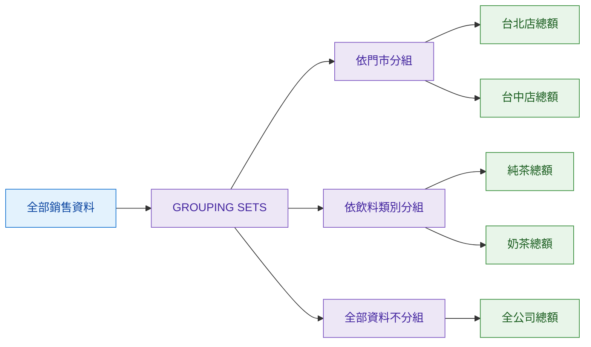

## 本篇觀念要點

當我們想從同一張資料表，同時看到：

- 各門市統計
- 各商品類別統計
- 全部資料總計

如果一直用多段 `GROUP BY` 再搭配 `UNION ALL`，SQL 會變得很長。

這時可以使用：

```sql
GROUPING SETS
````

<Highlight>GROUPING SETS：在同一個 GROUP BY 裡，一次定義多種不同的分組方式。</Highlight>

:::info 學習主線

同一份資料 → 定義多種分組方式 → 每種方式各自統計 → 一次輸出成同一張報表

:::

---

## 為什麼需要 GROUPING SETS

假設你是手搖飲店店長，今天想一次看到：

1. 每間門市的營業額
2. 每種飲料類別的營業額
3. 今天全部門市的總營業額

如果只用一般 `GROUP BY`：

```text
GROUP BY 門市
→ 只能看各門市

GROUP BY 飲料類別
→ 只能看各類別

完全不 GROUP BY
→ 只能看全部總計
```

這其實是三種不同的統計角度。

`GROUPING SETS` 就是把這三種角度一次寫進去。

---

## 生活例子：手搖飲銷售統計

假設資料：

| 門市  | 飲料類別 |  銷售金額 |
| --- | ---- | ----: |
| 台北店 | 純茶   | 10000 |
| 台北店 | 奶茶   | 20000 |
| 台中店 | 純茶   |  5000 |
| 台中店 | 奶茶   | 15000 |

SQL：

```sql
SELECT
    store_name,
    drink_type,
    SUM(amount) AS total_amount
FROM drink_sales
GROUP BY GROUPING SETS (
    (store_name),
    (drink_type),
    ()
);
```

可以把它理解成三種分組：



最後可能得到：

| 門市   | 飲料類別 |  總營業額 |
| ---- | ---- | ----: |
| 台北店  | NULL | 30000 |
| 台中店  | NULL | 20000 |
| NULL | 純茶   | 15000 |
| NULL | 奶茶   | 35000 |
| NULL | NULL | 50000 |

---

## 括號裡到底代表什麼

```sql
GROUP BY GROUPING SETS (
    (store_name),
    (drink_type),
    ()
)
```

可以直接這樣讀：

```text
store_name
→ 按門市分組

drink_type
→ 按飲料類別分組

空括號
→ 完全不分組，全部一起計算
```

所以：

<Highlight>GROUPING SETS 裡的每一組括號，就是一種獨立的分組方式。</Highlight>

---

## 空括號代表什麼

這個：

```sql
()
```

代表：

> 不使用任何欄位分組。

也就是把全部資料當成同一組。


因此：

```sql
()
```

通常會產生：

> 大總計。

---

## 為什麼結果會出現 NULL

這是 `GROUPING SETS` 很容易困惑的地方。

例如：

| 門市  | 飲料類別 |  總營業額 |
| --- | ---- | ----: |
| 台北店 | NULL | 30000 |

代表：

> 這次是「按門市」分組，所以飲料類別沒有參與這次分組。

再例如：

| 門市   | 飲料類別 |  總營業額 |
| ---- | ---- | ----: |
| NULL | 奶茶   | 35000 |

代表：

> 這次是「按飲料類別」分組，所以門市沒有參與。

如果：

| 門市   | 飲料類別 |  總營業額 |
| ---- | ---- | ----: |
| NULL | NULL | 50000 |

代表：

> 兩個欄位都沒有拿來分組，這就是全部資料的大總計。

<Highlight>在 GROUPING SETS 的結果中，NULL 常代表「這一次統計沒有使用這個欄位來分組」。</Highlight>

---

## 多種分組方式

例如：

```sql
GROUP BY GROUPING SETS (
    (),
    (prod_id),
    (orderline_id)
)
```

可以理解成：

```text
()
→ 全部訂單總計

prod_id
→ 每個商品統計

orderline_id
→ 每個訂單明細統計
```

也就是一次產生三種不同層級的統計結果。

---

## GROUP BY 與 GROUPING SETS

### 一般 GROUP BY

```sql
GROUP BY store_name
```

只有一種分組方式：

```text
每間門市
```

### GROUPING SETS

```sql
GROUP BY GROUPING SETS (
    (store_name),
    (drink_type),
    ()
)
```

一次有三種：

```text
每間門市
+
每種飲料
+
全部總計
```

---

## 和 UNION ALL 的關係

之前如果想完成這三種統計，可能需要：

```text
查詢一：按門市
+
查詢二：按飲料類別
+
查詢三：全部總計
+
UNION ALL
```

`GROUPING SETS` 可以把這些分組需求集中寫在同一個查詢中。

```text
多段 GROUP BY + UNION ALL
            ↓
       GROUPING SETS
```

---

## 一句話記住

<Highlight>GROUP BY 是選一種分組方式；GROUPING SETS 是一次指定多種分組方式。</Highlight>

```text
同一份資料
   ↓
GROUPING SETS
   ↓
門市統計
飲料類別統計
全部總計
   ↓
一次輸出成同一張報表
```
