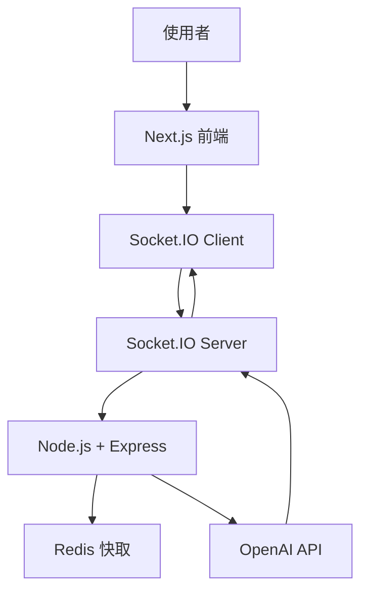

# AI 客服微服務設計(上)

本篇筆記說明如何建構一個可擴充的 AI 客服微服務，整合 Express、WebSocket、OpenAI 與 Redis，實作即時聊天、上下文記憶與活動問答功能。

## 技術架構

- **Express.js**：API 與 WebSocket 路由中介層
- **Socket.IO**：即時聊天室功能
- **Redis**：儲存聊天室上下文與使用者狀態
- **OpenAI GPT API**：回覆客服訊息

## 架構圖（Mermaid）

