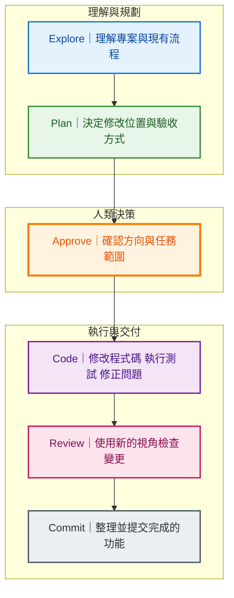

> 預估閱讀時間：約 6 分鐘

## 本篇觀念要點

年初第一次在終端機使用 Claude Code CLI 時，我原本以為只要下一段 Prompt，讓 Agent 自己把事情做完就好。

結果沒過多久，Claude Code 的使用額度就被我耗光了 XD。

後來才發現，Claude Code 雖然能主動讀取檔案、執行指令與修改程式碼，但如果沒有控制任務範圍、上下文與工作流程，它可能會反覆搜尋、讀取大量檔案，甚至在錯誤方向上持續嘗試。

<Highlight>不要一開始就叫 Coding Agent 寫程式。先讓它理解專案，再確認實作方向。</Highlight>

---
:::info 課程來源

本篇為 Anthropic 官方課程 **Claude Code 101** 的學習與實作筆記，內容依照課程觀念重新整理，並加入個人使用經驗與工程實務說明。

[Anthropic — Claude Code 101](https://anthropic.skilljar.com/claude-code-101/469792)

:::

--- 

1. [Explore：探索專案](#explore)
2. [Plan：制定實作計畫](#plan)
3. [Code：依照計畫實作](#code)
4. [將重複規則寫入 CLAUDE.md](#claude-md)
5. [Review：使用獨立視角驗收](#review)
6. [Commit：整理並提交變更](#commit)
7. [完整工作流](#complete-workflow)

---

:::info 學習主線

Claude Code 的基本開發流程：

**Explore → Plan → Code → Commit**

先理解專案、確認方案，再進行實作與提交。

:::

---

## Claude Code 是什麼 {#what-is-claude-code}

Claude Code 是 Anthropic 建立的 Coding Agent，內部整合了：

* Agentic Loop
* Context
* Tools
* Permissions
* Terminal 與檔案操作能力

我們不需要自己從零打造一個程式開發 Agent，而是要理解它的操作規則與能力邊界。

這有點像後端工程師閱讀第三方 API 文件：先理解介面、限制與使用方式，再把它接進自己的開發流程。

如果還沒讓 Coding Agent 理解專案就開始寫程式，常見結果包括：

* 實作方向錯誤
* 修改範圍過大
* 責任切分混亂
* 重複讀取不相關檔案
* 後續花更多時間修正
* 浪費大量 Token

---

## Explore：探索專案 {#explore}

Explore 的目的，是讓 Claude Code 取得完成任務所需要的專案資訊。

它可能會：

* 查看目錄結構
* 搜尋相關檔案
* 追蹤資料流程
* 閱讀既有測試
* 確認目前使用的套件
* 找出功能真正的進入點

例如，我想在圖片上傳流程加入 WebP 轉換：

```text title="Explore Prompt"
我想在圖片上傳流程加入 WebP 轉換。

先分析目前圖片上傳流程經過哪些檔案，
找出最適合加入轉換的位置。

目前不要修改程式碼。
```

Claude Code 可能會整理出類似流程：

```text title="圖片上傳流程"
前端上傳
→ API Route
→ Upload Service
→ Image Processor
→ Object Storage
```

如果沒有先探索，Coding Agent 可能直接在 API Route 加入圖片轉檔，造成 API、圖片處理與儲存責任混在一起。

<Highlight>Explore 不是拖慢開發，而是在避免 Agent 用錯誤理解快速前進。</Highlight>

---

## Plan：制定實作計畫 {#plan}

Explore 完成後，Claude Code 應該先提出實作方案。

一份可以執行的 Plan，至少要說明：

* 要修改哪些檔案
* 每個檔案要修改什麼
* 是否需要新增套件
* 資料流程會如何改變
* 有哪些風險
* 要如何測試
* 完成條件是什麼

在 Claude Code 中，可以透過 `Shift + Tab` 切換到 Plan Mode。


Plan Mode 開啟後，Claude Code 可以閱讀與分析檔案，但不會直接修改程式碼。

```text title="Plan Prompt"
我要在圖片上傳流程加入 WebP 轉換。

請找出轉換應該放在哪個階段，
確認是否需要新增 dependency，
並提出實作與測試計畫。

先不要修改任何檔案。
```

接著，我需要檢查這份 Plan：

* 是否正確理解需求
* 修改範圍是否合理
* 是否出現過度設計
* 是否漏掉測試
* 是否可能破壞既有行為
* 是否新增了不必要的抽象層

:::warning 注意

我在實際使用上，覺得 Codex 特別容易把簡單需求設計得太完整 XD。

Plan 階段要主動限制範圍，不要因為 Agent 能做很多，就讓它一次做完所有「未來可能需要」的功能。

:::

如果方向不對，可以直接修正 Plan：

```text title="縮小實作範圍"
不要新增新的 Service Layer。

請沿用目前的 Image Processor，
重新調整實作計畫。
```

<Highlight>最便宜的修正時間，是程式碼還沒有寫下去之前。</Highlight>

---

## Code：依照計畫實作 {#code}

Plan 確認後，再讓 Claude Code 開始修改程式碼。

此時可以選擇：

* 每次修改檔案前都詢問
* 自動接受檔案修改
* 只允許特定工具或指令

但 Code 階段並不是完全放任 Agent，而是人類與 Claude Code 共同完成任務的過程。

Claude Code 可能會執行：

```text title="Agentic Loop"
修改檔案
→ 執行測試
→ 發現錯誤
→ 閱讀錯誤訊息
→ 修正程式碼
→ 再次測試
```

這就是 Agentic Loop 在軟體開發中的實際應用。

它不是只生成一次答案，而是持續觀察結果、調整行動，再進入下一輪。

### 明確定義成功條件

Coding Agent 必須知道什麼叫做「完成」。

```text title="完成條件"
1. JPG 與 PNG 上傳後轉換成 WebP
2. GIF 不進行轉換
3. 原有檔名規則保持不變
4. 圖片上傳測試全部通過
5. npm run build 成功
6. 不修改前端上傳介面
```

如果沒有成功條件，Agent 很容易把：

```text
程式沒有報錯
```

誤認為：

```text
功能已經符合需求
```

### 提供可驗證的工具

Claude Code 的實作品質，取決於它能不能看到執行結果。

常見的驗證工具包括：

* Test Suite
* Linter
* Build Script
* Browser
* Chrome Extension
* API 測試工具
* Git Diff
* MCP Server

例如開發 UI 時，可以讓 Claude 操作瀏覽器驗證畫面，而不是只閱讀 JSX 與 CSS，再猜測畫面是否正確。

### 測試通過不代表需求正確

Claude Code 可以執行測試，也可以協助撰寫測試，但測試本身仍然需要人類判斷。

需要確認：

* 測試是否真的覆蓋需求
* 是否為了通過測試而修改測試
* 是否漏掉邊界情況
* 是否破壞既有功能
* 測試是否產生 False Positive

<Highlight>Agent 可以執行驗證，但人類仍然要判斷驗證方式是否可信。</Highlight>

---

## 將重複規則寫入 CLAUDE.md {#claude-md}

如果 Claude Code 經常遇到相同問題，可以將穩定的專案規則記錄到 `CLAUDE.md`。

例如，專案執行測試前必須先啟動 PostgreSQL：

```text title="更新 CLAUDE.md"
這個專案執行測試前必須先啟動 PostgreSQL。

請將這項規則整理進 CLAUDE.md，
避免之後再次誤判測試失敗原因。
```

適合寫進 `CLAUDE.md` 的內容包括：

* 專案架構與責任邊界
* 常用測試指令
* Build 與啟動方式
* 禁止修改的檔案
* 命名規則
* 特殊環境需求
* 已知陷阱

但不要把每一次任務的臨時需求全部塞進去。

<Highlight>CLAUDE.md 應該保存穩定的專案規則，而不是成為所有對話紀錄的垃圾桶。</Highlight>

---

## Review：使用獨立視角驗收 {#review}

Claude Code 完成實作，不代表可以立即 Commit。

較完整的驗收流程是：

```text
完成修改
→ 執行測試
→ 功能驗收
→ Code Review
→ 查看 Git Diff
→ Commit
```

在 Commit 前，可以使用獨立的 Code Reviewer Subagent 檢查變更。

Reviewer 使用新的 Context 閱讀程式碼，不會完全沿用主要 Agent 在實作過程中的假設。

這就像找另一位工程師進行 Code Review。

Reviewer 可以檢查：

* 是否符合原始需求
* 是否存在潛在 Bug
* 是否漏掉 Edge Case
* 是否出現過度設計
* 是否有安全問題
* 測試是否足夠
* 修改是否超出範圍
* 是否混入不相關變更

```text title="Code Review Prompt"
請以 Code Reviewer 的角色檢查目前 Git Diff。

確認：
1. 是否符合原始需求
2. 是否存在潛在 Bug
3. 是否漏掉 Edge Case
4. 是否出現過度設計
5. 測試是否足夠
6. 是否包含不相關修改

目前只需要 Review，不要修改任何檔案。
```

<Highlight>實作者負責完成任務，Reviewer 負責懷疑實作結果。</Highlight>

---

## Commit：整理並提交變更 {#commit}

Review 與驗收完成後，可以要求 Claude Code 根據專案規則產生 Commit Message。

```text title="產生 Commit Message"
根據目前的 Git Diff 產生 Commit Message。

使用 Conventional Commits，
只描述這次 WebP 轉換功能，
不要包含其他尚未提交的修改。
```

Commit 前仍然要確認：

* Git Diff 是否只包含本次任務
* 是否混入設定檔或暫存檔
* 是否包含金鑰或敏感資料
* Commit Message 是否描述真正的變更
* 是否需要拆成多個 Commit

---

## 完整工作流 {#complete-workflow}



| 階段      | 主要問題     | 主要產出          |
| ------- | -------- | ------------- |
| Explore | 專案現在怎麼運作 | 相關檔案與現有流程     |
| Plan    | 應該怎麼修改   | 實作與測試計畫       |
| Code    | 如何完成並驗證  | 程式碼與測試結果      |
| Review  | 實作結果是否可信 | 問題清單與驗收結果     |
| Commit  | 是否可以安全提交 | 乾淨的變更與 Commit |

## 我有實作的工作流 {#advanced-workflow}

我之前使用過這套流程：

```text
Claude Code 操作 Pencil
→ 產生 UI 設計稿
→ 整理 UI Spec
→ 拆解 Task Breakdown
→ Codex 負責實作
→ Claude Code 或 Reviewer 驗收
→ Commit
```

這其實就是 `Explore → Plan → Code → Commit` 的應用。

差別在於，我把不同階段交給不同 Agent：

* Claude Code 負責探索、規格與拆解
* Pencil 負責設計畫布
* Codex 負責程式實作
* Reviewer 負責檢查結果
* 人類負責核准方向與最終驗收

真正被交棒的不是完整對話，而是：

* Spec
* Task
* State
* Test Result
* Git Diff

<Highlight>Agent 可以替換，但工作流、規格與驗收標準必須被保留下來。</Highlight>

---

## 複習工作流 {#cheat-sheet}

```text
開始前：
先 Explore，不要修改程式碼

實作前：
要求 Plan、修改檔案、風險、測試與完成條件

執行時：
限制修改範圍，提供可以驗證結果的工具

完成後：
執行測試、查看 Git Diff、交給獨立 Reviewer

提交前：
移除不相關修改，再產生 Commit Message
```

## 總結

Claude Code 的價值不只是快速產生程式碼，而是能參與完整的軟體開發流程。

但要讓它穩定工作，必須先讓它理解專案、確認計畫與成功條件，再開始執行。

<Highlight>不要從 Code 開始。先從 Explore 與 Plan 開始。</Highlight>


---

## 參考資料

- Anthropic, [Claude Code 101](https://anthropic.skilljar.com/claude-code-101/469792)，線上課程，瀏覽日期：2026 年 8 月 5 日。