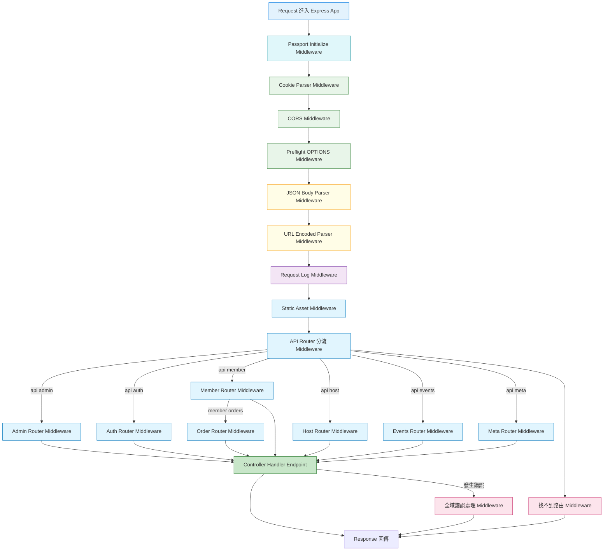

## 🟧 認識express中的app.use()

:::tip
- `app.use()`
- `use` 用的只有兩種東西：
  - `middleware`
  - `router`

:::

- <Highlight>app.use 是「掛 middleware 或 router 的地方」
意思是：符合條件的請求，進來一定會先跑它</Highlight>

### 0️⃣ 最基本的 app.use（全域 middleware）
```bash
app.use(express.json());
```
- 所有進來的請求，都先幫我把 body 解析成 JSON(請求stream只會傳字串格式)

```
任何 request
  ↓
express.json()
  ↓
後面的 route / handler

```

- 👉 不管是 /events 還是 /users 路由，都會跑express.json()

### 1️⃣ app.use('/path', middleware)（指定路徑）
```bash
app.use('/events', authMiddleware);
```
- <Highlight>只要路徑是 /events 開頭的請求，都要先跑 authMiddleware</Highlight>
- 例如以下這些/events 開頭的請求路由，一定會經過authMiddleware驗證
```bash
/events
/events/123
/events/123/plans
```

### 2️⃣ 另外的應用：app.use('/path', router)（掛 Router）
```bash
app.use('/events', eventRouter);

```
- 只要請求路徑是 `/events` 開頭，就交給 eventRouter 處理後續路由，這時候 真正的路由定義在 router 裡。


### 3️⃣ app.use + middleware + router（最常見應用）

```bash
app.use('/events', authMiddleware, eventRouter);
```

- 路徑是 `/events` 開頭
  - 先跑 `authMiddleware`
  - `next()` => 再進 `eventRouter`

- 流程：
```
GET /events/123
  ↓
authMiddleware
  ↓
eventRouter
  ↓
handler
```


| 寫法                      | 意思             |
| ----------------------- | -------------- |
| `app.use(mw)`           | 全部請求都跑         |
| `app.use('/x', mw)`     | `/x` 開頭才跑      |
| `app.use('/x', router)` | `/x` 交給 router |


## 🟦 middleware 中介軟體


- 

- 加入middleware
  - 

- [上述圖皆擷取自ZTM-Node.js Zero to Mastery]


### 0️⃣ next()函式的重要性

- > <Highlight color="#6A1B9A">next() 是一個 function，意思只有一個：</Highlight>

- > <Highlight color="#6A1B9A">「我這一關處理完了，請交給下一關」</Highlight>


- middleware 中的`next()`函式，如果沒有寫上，會發生什麼事？

:::tip 舉我生活家中大樓發生的例子

- 我開車要回大樓的地下室，這時會感測器會感應我車上的etag id比對系統是否有註冊，確認已經註冊比對成功(會亮綠色燈，通行秒數顯示20秒)，但是這時候沒有在比對成功後，寫上`next()`

- 那我比對成功的狀態，就不會被拋到閘門馬達處理，因此我家地下室的閘門常常打不開，即使etag id比對成功，這時後就會出現狀態是轉圈圈處理中ing
:::

- ETag 感應成功（亮綠燈）＝ middleware 條件成立
- 但沒有觸發馬達＝沒有呼叫 next()
- 所以流程被卡住
  - ➡️ request 被攔截
  - ➡️ handler 永遠不會被呼叫


- gpt 幫我整理上面的總結:
> ETag 感應系統在驗證成功後，若未觸發後續馬達控制訊號，整個流程就會停在驗證層；middleware 若未呼叫 next()，請求同樣無法進入後續處理階段


---

## 🟦 以露營專案的app.js middleware來畫圖

- 程式碼：
```jsx title="app.js"
const dotenv = require("dotenv");
const express = require("express");
const cors = require("cors");
const path = require("path");
const pinoHttp = require("pino-http");

const logger = require("./utils/logger")("App");
const authRouter = require("./routes/authRouter");

const adminRouter = require("./routes/adminRouter");
const memberRouter = require("./routes/memberRouter");
const hostRouter = require("./routes/hostRouter");
const eventsRouter = require("./routes/eventsRouter");
const metaRouter = require("./routes/metaRouter");
const orderRouter = require("./routes/orderRouter");

const cookieParser = require("cookie-parser");
const setupSwagger = require("./swagger");
const passport = require("./config/passport");

require("./cron/updateEventStatus");

if (process.env.NODE_ENV !== "production") {
  dotenv.config({
    path: path.resolve(process.cwd(), ".env"),
  });
}

const app = express();

//  router 註冊之前
setupSwagger(app);

//middleware 
app.use(passport.initialize());
//=> 這裡再進階處理cookie 允許前端請求帶入cookie (裡面夾帶token)

const allowedOrigins = [
  "https://camping-project-one.vercel.app", // 前端
  "https://campingproject.retool.com", // Retool 網域
  "http://localhost:3000", // 本地測試用
  "https://everforest-backend.zeabur.app", // 後端打給後端做票券核銷用"
];

const corsOptions = {
  origin: function (origin, callback) {
    if (!origin || allowedOrigins.includes(origin)) {
      callback(null, true);
    } else {
      callback(new Error("Not allowed by CORS"));
    }
  },

  credentials: true, //允許帶上cookie
};

//middleware 
app.use(cookieParser()); //允許讀取cookie

//*** 第 1 階段：基礎安全與跨域設定 ***
//middleware 
app.use(cors(corsOptions)); // 處理跨域 //允許前端請求帶上cookie
app.options("*", cors(corsOptions)); //額外處理 preflight 預請求（OPTIONS）避免 fetch POST 報 CORS 錯

//middleware 
//*** 第 2 階段：解析請求內容 ***
// 限制傳過來的 JSON 大小
app.use(express.json({ limit: "10kb" })); // 限制 JSON 請求大小
app.use(express.urlencoded({ extended: false }));

// *** 第 3 階段：記錄請求紀錄（Log middleware） ***
app.use(
  pinoHttp({
    logger,
    serializers: {
      req(req) {
        req.body = req.raw.body;
        return req;
      },
    },
  })
);

//middleware 
app.use(express.static(path.join(__dirname, "public")));

//*** 第 4 階段：路由註冊 ***
app.get("/", (req, res) => {
  res.send("北十四 test test");
});

app.use("/api/v1/admin", adminRouter);

// /api/v1/auth (登入註冊)
app.use("/api/v1/auth", authRouter);

// /api/v1/member (會員)
app.use("/api/v1/member", memberRouter);

// /api/v1/host (主辦方)
app.use("/api/v1/host", hostRouter);

// /api/v1/events (露營活動事件 |複數命名(資源集合)| 路由也對應api)
app.use("/api/v1/events", eventsRouter);

// /api/v1/meta (==>跟 EventTag（活動標籤主表）路由也對應api)
app.use("/api/v1/meta", metaRouter);

app.use("/api/v1/member/orders", orderRouter);

//*** 第 5 階段：健康檢查 ***
app.get("/healthcheck", (req, res) => {
  res.status(200).send("OK 你容器裡的後端 與 容器裡的資料庫都很健康");
});

//***  第 6 階段：處理找不到的路由（404）***
app.use((req, res, _next) => {
  return res.status(404).json({
    status: "error",
    message: "找不到此路由",
  });
});

//***  第 7 階段：錯誤處理 middleware（終站）***
app.use((err, req, res, _next) => {
  console.error("全域錯誤處理器:", err);

  res.status(err.statusCode || 500).json({
    status: "error",
    message: err.message || "伺服器錯誤，請稍後再試",
  });
});

module.exports = app;
```

- 單就上述程式碼的middleware做流程畫圖

