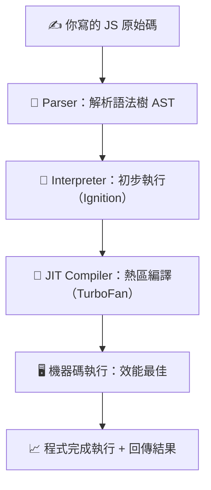
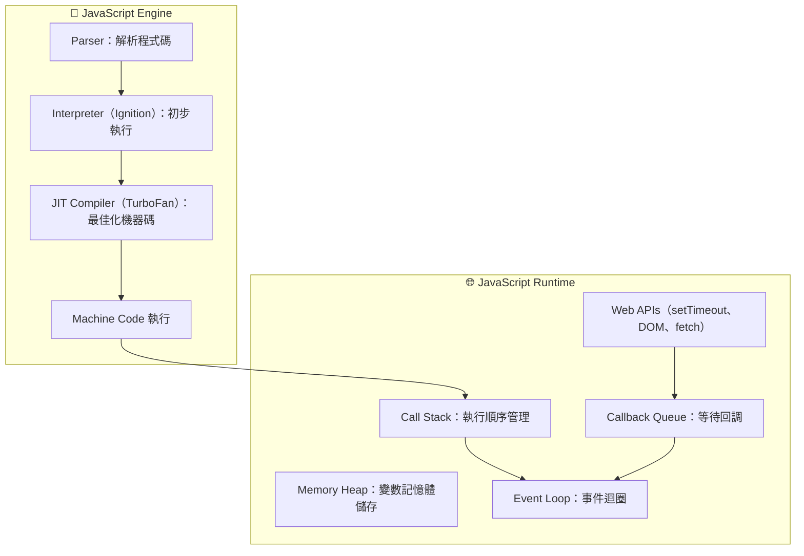

import Highlight from '@site/src/components/ui/Highlight.jsx';

<!-- export const Highlight = ({ children, color }) => (
<span
style={{
      backgroundColor: color,
      borderRadius: "20px",
      color: "#fff",
      padding: "10px",
      cursor: "pointer",
    }}
onClick={() => {
alert(`You clicked the color ${color} with label ${children}`);
}}

>

    {children}

  </span>
); -->

# JavaScript 基礎(上)

:::note
雖然有 GPT 這個好同事，但總是對自己學習觀念碎片化不太滿意，所以透過 zeromaster.io 平台課程學習好好的把 JS 觀念透過 output 筆記梳理起來！
:::

---

## 0️⃣ 開場

學習需要『儀式感』，這陣子了解自己的動能起伏，那個起伏是有一陣很熱血沸騰，有一陣很凍僵，但透過了解自己的特質是恆毅力滿強的，那就從儀式感(前置 5 分鐘)帶入：

> - <Highlight color="#f97316">泡好一杯咖啡 ☕</Highlight>

> - <Highlight color="#fda4af">打開 VS Code</Highlight>

> - <Highlight color="#60a5fa">新增一個 md 筆記</Highlight>

### 用一張圖片來概覽這篇章要複習的主題：

> 

這邊筆記主要以右側的基礎觀念為主，

這是 zerotomaster.io 提供的總覽心智圖

> [JS 高級觀念](https://coggle.it/diagram/XE3ZoVj-rtA5hcxj/t/advanced-javascript)

---

## 1️⃣ JS Engin | JS 引擎(V8 or SpiderMonkey)

:::info
JS 引擎內部做了什麼？

> JavaScript 引擎負責<Highlight color="#25c2a0">讀取、解析、編譯、執行</Highlight> JS 原始碼，變成機器碼，使電腦設備能夠讀懂並且執行的語言

:::

> 

引擎內部運作如下：

> 

程式碼如何被 JS 引擎執行?



圖 2：JS 執行環境（Runtime）架構



:::success
<Highlight color="#25c2a0">ECMAScript</Highlight>

> 每個人都可以創建 JS 引擎，但必須遵照 ECMAScript 的標準（管理機構），一致化 JS 語言的標準以及定義如何運作，至於引擎要怎麼構建可以自己決定(只要符合 ECMAScript 下都可以)

:::

---

## 2️⃣ Interpreter / Compiler / JIT Compiler ｜解譯器 / 編譯器 / 即時編譯器

最初時，Brendan Eich 創建的 SpiderMonkey 引擎將 JS 程式碼解譯為 Bytecode(位元組碼)，SpiderMonkey 引擎可以在瀏覽器中運行，來告訴電腦這些程式碼是什麼

:::info

> 在程式設計中，通常有兩種方法可以將程式碼轉換成『機器碼 0 或 1』(CPU 可以懂的語言)

:::

<Highlight color="#25c2a0">解譯器 與 編譯器</Highlight>

> 

前面有提到 V8 引擎有使用了混合形編譯(JIT)使得兩個直譯與編譯的方式讓運行 JS 碼變得非常快

對比一下不同的程式語言


<Highlight color="#25c2a0">JIT Compiler 即時編譯</Highlight>


> 現在的 JS 是**混合型（Interpreter and Compiler）** 語言

---

## 3️⃣ Writing Optimized Code

IC

hidden classes

---

## 4️⃣ Call Stack and Memory Heap 呼叫堆疊 和 記憶堆疊

---

## 5️⃣ Stack Overflow 堆疊溢位

---

## 6️⃣ Memory Leaks 記憶體洩漏

---

## 7️⃣ MGarbage Collection ｜垃圾回收機制

---

## 8️⃣ Single Threaded Model ｜單執行緒模型（事件迴圈）

---

## 9️⃣ JavaScript 執行時環境(JS Runtime)

---

## 🔟 Node.js 執行環境

- `src/pages/index.js` → `localhost:3000/`
- `src/pages/foo.md` → `localhost:3000/foo`
- `src/pages/foo/bar.js` → `localhost:3000/foo/bar`

## Create your first React Page

Create a file at `src/pages/my-react-page.js`:

```jsx title="src/pages/my-react-page.js"
import React from "react";
import Layout from "@theme/Layout";

export default function MyReactPage() {
  return (
    <Layout>
      <h1>My React page</h1>
      <p>This is a React page</p>
    </Layout>
  );
}
```

A new page is now available at [http://localhost:3000/my-react-page](http://localhost:3000/my-react-page).

## Create your first Markdown Page

Create a file at `src/pages/my-markdown-page.md`:

```mdx title="src/pages/my-markdown-page.md"
# My Markdown page

This is a Markdown page
```

A new page is now available at [http://localhost:3000/my-markdown-page](http://localhost:3000/my-markdown-page).

---
